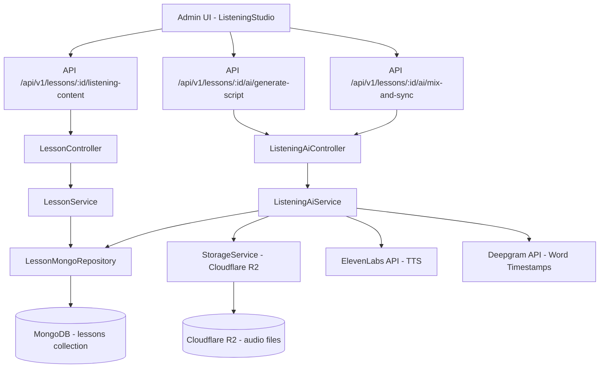
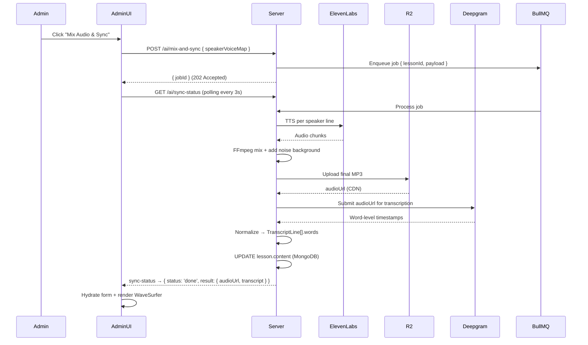

# Implementation Plan: Listening Studio (Admin Panel)

> **Scope**: Quản lý bài học dạng `LISTENING` trong Admin CMS  
> **Target App**: `/admin` (Tailwind CSS + Shadcn/UI)  
> **Pattern**: Service-Repository + Controller (3-layer backend)  
> **Status**: Draft — Feb 24, 2026

---

## 1. Architecture Overview



### Phân tầng dữ liệu

| Dữ liệu | Store | Lý do |
|---|---|---|
| Lesson document (transcript, config) | **MongoDB** | Source of Truth — structured, relational với Unit |
| Audio file (mixed MP3) | **Cloudflare R2** | Zero egress, large binary asset |
| Audio URL (CDN link) | **MongoDB** (trong `content.media.audioUrl`) | Stored after R2 upload |

> **Không dùng Pinecone** cho module này. Vector search không liên quan đến Listening content management. Pinecone chỉ được dùng khi cần semantic recommendation.

---

## 2. Data Models & Zod Schemas

### 2.1. TypeScript Interfaces (Listening Content)

**Vị trí**: `server/src/types/listening.types.ts` (new file)

```typescript
export interface AudioWord {
  word: string;
  start: number;       // seconds (e.g. 0.50)
  end: number;         // seconds (e.g. 0.83)
  conceptId?: string;  // ObjectId ref — auto-mapped to taughtConcepts
  isTargetVocab: boolean; // true → Gap-fill candidate
}

export interface TranscriptLine {
  id: string;          // UUID (client-generated)
  speaker: string;     // e.g. "Adam"
  role: string;        // e.g. "Airport Staff"
  text: string;        // Full dialogue line
  startTime: number;   // Set after AI sync
  endTime: number;     // Set after AI sync
  words: AudioWord[];  // Populated after Deepgram sync
}

export interface ListeningMedia {
  audioUrl?: string;   // Cloudflare R2 signed URL
  duration?: number;   // seconds
  accent: 'en-US' | 'en-UK' | 'mixed';
  noiseLevel: 'none' | 'low' | 'medium' | 'high';
  speed: number;       // default 1.0
}

export interface InteractiveConfig {
  mode: 'GAP_FILL' | 'SHADOWING';
  hidePercentage: number; // 0–100, default 20
  allowSlowSpeed: boolean;
}

// Root content shape stored in lesson.content (MongoDB Mixed field)
export interface ListeningContent {
  media: ListeningMedia;
  transcript: TranscriptLine[];
  interactiveConfig: InteractiveConfig;
}
```

### 2.2. Zod Validation Schemas

**Vị trí**: `server/src/validations/listening.validation.ts` (new file)

```
audioWordSchema
transcriptLineSchema
listeningMediaSchema
interactiveConfigSchema

// Exported schemas:
saveListeningContentSchema   → PUT /lessons/:id/listening-content
generateScriptSchema         → POST /lessons/:id/ai/generate-script
mixAndSyncSchema             → POST /lessons/:id/ai/mix-and-sync
```

---

## 3. Backend Implementation

### Sprint 1 — Core CRUD (3 ngày)

#### Step 1: Validation Schema
**File**: `server/src/validations/listening.validation.ts`
- Tạo full Zod schema cho `ListeningContent`
- Export `saveListeningContentSchema`, `generateScriptSchema`, `mixAndSyncSchema`

#### Step 2: Repository — không cần file mới
- `LessonMongoRepository.updateById()` **đã sẵn có** — đủ để persist `content`
- Thêm method `findByIdWithContent(lessonId)` nếu chưa có `.select('content practiceConfig taughtConcepts')`

#### Step 3: Service
**File**: `server/src/services/listening.service.ts` (new)

```typescript
export class ListeningService {
  constructor(private readonly lessonRepo: LessonMongoRepository) {}

  async getContent(lessonId: string): Promise<ListeningContent>
  async saveContent(lessonId: string, content: ListeningContent): Promise<ILesson>
}
```

**Quy tắc**:
- `saveContent` phải validate `lesson.type === 'LISTENING'` → throw `AppError` nếu không đúng.
- Không persist raw Deepgram/ElevenLabs response lên DB — chỉ persist dữ liệu đã được normalized.

#### Step 4: Controller
**File**: `server/src/controllers/listening.controller.ts` (new)

```typescript
// ALL wrapped in catchAsync
getListeningContent   → GET    /api/v1/lessons/:lessonId/listening-content
saveListeningContent  → PUT    /api/v1/lessons/:lessonId/listening-content
```

#### Step 5: Routes
**File**: `server/src/routes/listening.routes.ts` (new)
- Mount vào `app.ts`: `app.use('/api/v1/lessons', listeningRoutes)`
- Auth middleware: `protect`, `restrictTo('admin')`
- Validate middleware: Zod schemas từ Step 1

---

### Sprint 2 — AI Pipeline (5 ngày)

#### Step 6: Service — AI Orchestration
**File**: `server/src/services/listening-ai.service.ts` (new)

```typescript
export class ListeningAiService {
  constructor(
    private readonly lessonRepo: LessonMongoRepository,
    private readonly storageService: StorageService,
  ) {}

  // Phase 1: GPT → script text (TranscriptLine[] without words/timestamps)
  async generateScript(lessonId: string, payload: GenerateScriptDto): Promise<TranscriptLine[]>

  // Phase 2: ElevenLabs → TTS per speaker → FFmpeg mix → R2 upload → Deepgram → word timestamps
  async mixAndSync(lessonId: string, payload: MixAndSyncDto): Promise<MixAndSyncResult>
    // Returns: { audioUrl, duration, transcript: TranscriptLine[] (with words populated) }
}
```

**Quy tắc nội bộ**:
- `generateScript`: Gọi OpenAI Chat Completion. Trả về JSON mảng `TranscriptLine[]` (chưa có audio/words). **Không** tự động persist — để Admin review trước.
- `mixAndSync` thực hiện tuần tự theo 3 step (ElevenLabs → FFmpeg → Deepgram). Nếu bất kỳ step nào fail → throw `AppError` với message cụ thể từng step. Dọn dẹp file tạm trên R2 nếu lỗi.
- Speaker mapping: `speakerVoiceMap` (dict `{ [speaker]: elevenLabsVoiceId }`) được truyền vào từ payload hoặc dùng default mapping (male/female alternating).

#### Step 7: BullMQ Job (nếu `mixAndSync` > 30s)
**File**: `server/src/jobs/queues/listening-sync.queue.ts`
**File**: `server/src/jobs/workers/listening-sync.worker.ts`
- Queue: `listening-sync`
- Job data: `{ lessonId, payload }`
- On complete: cập nhật `lesson.content.media` + `lesson.content.transcript` vào MongoDB
- Frontend polling: `GET /api/v1/lessons/:id/ai/sync-status` trả về `{ status: 'pending'|'done'|'failed', progress: 0-100 }`

#### Step 8: Controller — AI Endpoints
**File**: `server/src/controllers/listening-ai.controller.ts` (new)

```typescript
generateScript  → POST /api/v1/lessons/:lessonId/ai/generate-script
mixAndSync      → POST /api/v1/lessons/:lessonId/ai/mix-and-sync
getSyncStatus   → GET  /api/v1/lessons/:lessonId/ai/sync-status
```

---

## 4. Admin Frontend Implementation

### 4.1. Types & Zod (shared)

**File**: `admin/src/features/curriculum/courses/types/course.types.ts` — **MỞ RỘNG**

Thêm vào file hiện có:

```typescript
// ─── Listening Types ─────────────────────────────────────────────────────────
export interface AudioWord { ... }
export interface TranscriptLine { ... }
export interface ListeningMedia { ... }
export interface InteractiveConfig { ... }
export interface ListeningContent { ... }
export interface ListeningLessonFormValues {
  _id: string;
  unitId: string;
  title: string;
  type: 'LISTENING';
  content: ListeningContent;
  practiceConfig: PracticeConfig;
  taughtConcepts: string[];
}
```

### 4.2. API Service

**File**: `admin/src/features/curriculum/courses/api/listeningService.ts` (new)

```typescript
export const listeningApi = {
  getContent:       (lessonId) => axios.get(...)    // → ListeningContent
  saveContent:      (lessonId, data) => axios.put(...)
  generateScript:   (lessonId, payload) => axios.post(...)  // → TranscriptLine[]
  mixAndSync:       (lessonId, payload) => axios.post(...)
  getSyncStatus:    (lessonId) => axios.get(...)
}
```

### 4.3. TanStack Query Hooks

**File**: `admin/src/features/curriculum/courses/hooks/useListeningContent.ts` (new)

```typescript
export const useListeningContent = (lessonId: string) =>
  useQuery({ queryKey: ['listening-content', lessonId], queryFn: ... })
```

**File**: `admin/src/features/curriculum/courses/hooks/useListeningMutations.ts` (new)

```typescript
export const useSaveListeningContent = (lessonId: string) => useMutation(...)
export const useGenerateScript = (lessonId: string) => useMutation(...)
export const useMixAndSync = (lessonId: string) => useMutation(...)
```

**BẮT BUỘC**: `useEffect` **không được dùng** để fetch. Chỉ dùng `useQuery` / `useMutation`.

### 4.4. Component Tree (Tách file bắt buộc)

```
admin/src/features/curriculum/courses/components/ListeningStudio/
├── ListeningStudio.tsx                  # Root: FormProvider + 3-pane layout
├── hooks/
│   └── useListeningStudioState.ts       # activeSection, modal states
└── components/
    ├── ListeningTopBar/
    │   └── ListeningTopBar.tsx          # Header: title + 3 action buttons
    │
    ├── ListeningNavigator/
    │   └── ListeningNavigator.tsx       # Pane 2: 3 nav items + validation dots
    │
    ├── ScriptEditor/
    │   ├── ScriptEditor.tsx             # Section 1: Media settings + useFieldArray transcript
    │   ├── MediaSettingsPanel.tsx       # accent, noiseLevel dropdowns
    │   └── TranscriptLineItem.tsx       # 1 dòng thoại (speaker, role, text inputs)
    │
    ├── KaraokeSyncEditor/
    │   ├── KaraokeSyncEditor.tsx        # Section 2: Waveform + Interactive Transcript
    │   ├── WaveformPlayer.tsx           # wavesurfer.js integration (cleanup on unmount)
    │   └── InteractiveTranscript.tsx    # Render words as clickable <span> tags
    │
    ├── InteractiveConfigEditor/
    │   ├── InteractiveConfigEditor.tsx  # Section 3: mode radio, hidePercentage slider
    │   └── PracticeQuestionsPanel.tsx   # Comprehension questions management
    │
    └── AiPipelineOverlay/
        └── AiPipelineOverlay.tsx        # Loading overlay — 3-step progress display
```

#### Chi tiết từng component quan trọng

**`ListeningStudio.tsx`**
- `useForm<ListeningLessonFormValues>({ resolver: zodResolver(...) })`
- Wrap toàn bộ với `<FormProvider>` → sub-components dùng `useFormContext()`
- 3-pane layout: `h-screen overflow-hidden flex` (Tailwind)
- Pane widths: `w-[20%]` | `w-[25%]` | `w-[55%]`

**`TranscriptLineItem.tsx`**
- Nhận `index` từ `useFieldArray`
- Input fields: `register('content.transcript.${index}.speaker')`, v.v.
- **Không dùng** controlled `<Controller>` cho text inputs thông thường → tránh re-render

**`WaveformPlayer.tsx`**
- `useEffect(() => { const ws = WaveSurfer.create(...); return () => ws.destroy(); }, [audioUrl])`
- Expose `wsRef` lên `KaraokeSyncEditor` để sync với transcript highlight
- **Không** store WaveSurfer instance trong component state (dùng `useRef`)

**`InteractiveTranscript.tsx`**
- Nhận `transcriptFields` từ `useFieldArray` (nested words)
- Mỗi `word` render: `<span onClick={() => toggleTargetVocab(lineIdx, wordIdx)}>word.word</span>`
- Highlight dòng hiện tại: so sánh `currentTime` (từ WaveSurfer) với `line.startTime` / `line.endTime`
- **Performance**: `React.memo` cho từng `TranscriptLineItem`, `useCallback` cho `toggleTargetVocab`
- **Anti-pattern**: KHÔNG dùng `useFieldArray` cho `words` bên trong mỗi dòng — thay vào đó `setValue('content.transcript.${lineIdx}.words', updatedWords)` trực tiếp để tránh nested re-render

**`AiPipelineOverlay.tsx`**
- Props: `{ step: 1 | 2 | 3; isVisible: boolean }`
- Render modal overlay với 3 step descriptions
- Dùng Shadcn `<Dialog>` hoặc custom overlay với Tailwind backdrop

### 4.5. Tích hợp vào `LessonEditor.tsx`

**File**: `admin/src/features/curriculum/courses/components/LessonEditor/LessonEditor.tsx` — **SỬA ĐỔI**

```typescript
// Thêm vào switch-case render theo lesson.type:
case 'LISTENING':
  return <ListeningStudio lesson={lesson} courseLevel={courseLevel} />;
```

---

## 5. Dependencies cần cài đặt

### Admin (`/admin`)
```bash
npm install wavesurfer.js
npm install @types/uuid uuid
```
> Không cần cài thêm UI library — Shadcn/UI đã có sẵn.

### Server (`/server`)
```bash
npm install @deepgram/sdk
npm install elevenlabs
# FFmpeg: sử dụng system binary hoặc fluent-ffmpeg
npm install fluent-ffmpeg @types/fluent-ffmpeg
```

---

## 6. API Contract Summary

**Base URL**: `/api/v1/lessons`

| Method | Endpoint | Auth | Body / Query | Response |
|---|---|---|---|---|
| `GET` | `/:id/listening-content` | admin | — | `ListeningContent` |
| `PUT` | `/:id/listening-content` | admin | `ListeningContent` | `ILesson` |
| `POST` | `/:id/ai/generate-script` | admin | `{ contextSeed, targetVocabIds, lineCount }` | `TranscriptLine[]` |
| `POST` | `/:id/ai/mix-and-sync` | admin | `{ speakerVoiceMap? }` | `{ jobId }` |
| `GET` | `/:id/ai/sync-status` | admin | — | `{ status, progress, result? }` |

---

## 7. Step-by-Step Execution Order

```
PHASE 1 — Backend Foundation (3 ngày)
─────────────────────────────────────
[ ] 1. Tạo server/src/types/listening.types.ts
[ ] 2. Tạo server/src/validations/listening.validation.ts
[ ] 3. Tạo server/src/services/listening.service.ts
[ ] 4. Tạo server/src/controllers/listening.controller.ts
[ ] 5. Tạo server/src/routes/listening.routes.ts
[ ] 6. Mount routes vào app.ts

PHASE 2 — Admin Frontend Core (4 ngày)
───────────────────────────────────────
[ ] 7.  Mở rộng course.types.ts với Listening types
[ ] 8.  Tạo listeningService.ts (API layer)
[ ] 9.  Tạo useListeningContent.ts (TanStack Query)
[ ] 10. Tạo useListeningMutations.ts
[ ] 11. Tạo useListeningStudioState.ts (local UI state)
[ ] 12. Tạo ListeningTopBar.tsx
[ ] 13. Tạo ListeningNavigator.tsx
[ ] 14. Tạo ScriptEditor (MediaSettingsPanel + TranscriptLineItem)
[ ] 15. Tạo KaraokeSyncEditor (WaveformPlayer + InteractiveTranscript)
[ ] 16. Tạo InteractiveConfigEditor + PracticeQuestionsPanel
[ ] 17. Tạo ListeningStudio.tsx (root, compose tất cả)
[ ] 18. Wire ListeningStudio vào LessonEditor.tsx

PHASE 3 — AI Pipeline (5 ngày)
────────────────────────────────
[ ] 19. Tạo listing-ai.service.ts (generateScript + mixAndSync)
[ ] 20. Tạo listening-sync BullMQ queue + worker
[ ] 21. Tạo listening-ai.controller.ts
[ ] 22. Mount AI routes
[ ] 23. Tạo AiPipelineOverlay.tsx
[ ] 24. Wire AI mutations vào ListeningTopBar

PHASE 4 — Polish & Hardening (2 ngày)
───────────────────────────────────────
[ ] 25. Validation dots (red dots) trên Navigator khi form invalid
[ ] 26. Polling hook cho sync-status (useInterval / TanStack Query refetchInterval)
[ ] 27. Error boundary cho WaveformPlayer
[ ] 28. Kiểm tra memory leak: WaveSurfer cleanup, removeEventListener
[ ] 29. Performance audit: React DevTools Profiler — không có re-render cascade khi toggle isTargetVocab
```

---

## 8. Security & Constraints

| Rule | Implementation |
|---|---|
| Chỉ admin mới access | `restrictTo('admin')` middleware trên tất cả routes |
| File audio chỉ lưu R2 | `audioUrl` là CDN link — không bao giờ serve binary qua Express |
| Rate limit AI endpoints | 10 req/min/user cho `/ai/*` routes (Redis rate-limit middleware) |
| Input validation | Zod middleware bắt tất cả body trước khi vào controller |
| Logging | `logger.info/warn/error` — cấm `console.log` |
| ElevenLabs / OpenAI keys | Chỉ đọc từ `config/env.ts` (validated on startup) |

---

## 9. Sequence Diagram — AI Mix & Sync Pipeline



---

## 10. File Checklist (mới hoàn toàn)

### Server
```
server/src/types/listening.types.ts
server/src/validations/listening.validation.ts
server/src/services/listening.service.ts
server/src/services/listening-ai.service.ts
server/src/controllers/listening.controller.ts
server/src/controllers/listening-ai.controller.ts
server/src/routes/listening.routes.ts
server/src/jobs/queues/listening-sync.queue.ts
server/src/jobs/workers/listening-sync.worker.ts
```

### Admin
```
admin/src/features/curriculum/courses/api/listeningService.ts
admin/src/features/curriculum/courses/hooks/useListeningContent.ts
admin/src/features/curriculum/courses/hooks/useListeningMutations.ts
admin/src/features/curriculum/courses/components/ListeningStudio/ListeningStudio.tsx
admin/src/features/curriculum/courses/components/ListeningStudio/hooks/useListeningStudioState.ts
admin/src/features/curriculum/courses/components/ListeningStudio/components/ListeningTopBar/ListeningTopBar.tsx
admin/src/features/curriculum/courses/components/ListeningStudio/components/ListeningNavigator/ListeningNavigator.tsx
admin/src/features/curriculum/courses/components/ListeningStudio/components/ScriptEditor/ScriptEditor.tsx
admin/src/features/curriculum/courses/components/ListeningStudio/components/ScriptEditor/MediaSettingsPanel.tsx
admin/src/features/curriculum/courses/components/ListeningStudio/components/ScriptEditor/TranscriptLineItem.tsx
admin/src/features/curriculum/courses/components/ListeningStudio/components/KaraokeSyncEditor/KaraokeSyncEditor.tsx
admin/src/features/curriculum/courses/components/ListeningStudio/components/KaraokeSyncEditor/WaveformPlayer.tsx
admin/src/features/curriculum/courses/components/ListeningStudio/components/KaraokeSyncEditor/InteractiveTranscript.tsx
admin/src/features/curriculum/courses/components/ListeningStudio/components/InteractiveConfigEditor/InteractiveConfigEditor.tsx
admin/src/features/curriculum/courses/components/ListeningStudio/components/InteractiveConfigEditor/PracticeQuestionsPanel.tsx
admin/src/features/curriculum/courses/components/ListeningStudio/components/AiPipelineOverlay/AiPipelineOverlay.tsx
```

### Modified (sửa đổi file hiện có)
```
server/src/app.ts                                                        → Mount listening.routes
admin/src/features/curriculum/courses/types/course.types.ts              → Thêm Listening types
admin/src/features/curriculum/courses/components/LessonEditor/LessonEditor.tsx → case 'LISTENING'
server/src/config/env.ts                                                 → Thêm ELEVENLABS_API_KEY, DEEPGRAM_API_KEY, OPENAI_API_KEY
```
