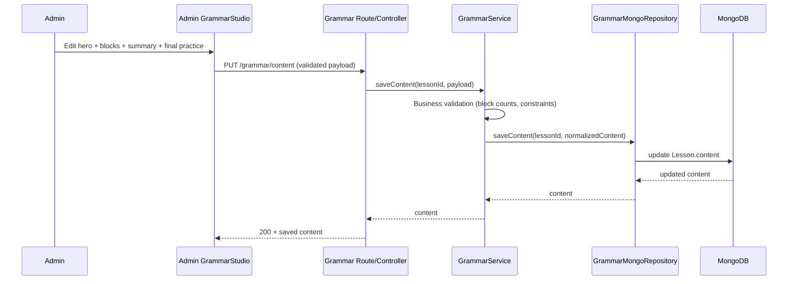
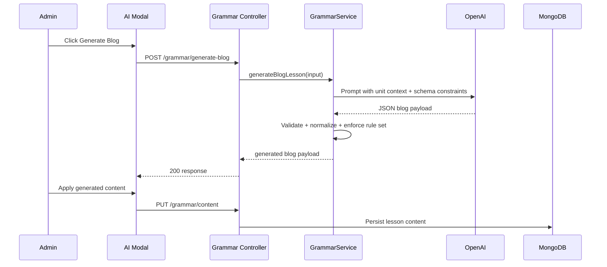

# GRAMMAR LESSON BLOG REFACTOR PLAN (ENTERPRISE)

## 1) Executive Summary

Mục tiêu refactor: chuyển Grammar Lesson từ mô hình Stepper 3 phần (`story` / `rules` / `practice`) sang mô hình **Blog-style Block Editor** như mô tả trong `mota.md`, đồng thời giữ chuẩn kiến trúc Unilish:

- Admin app: Tailwind + Shadcn/UI.
- Frontend: TypeScript strict, không `any`, form typed rõ ràng.
- Backend: Controller mỏng, Service orchestration, Repository data access.
- Validation: Zod ở biên API.
- Data store: MongoDB (lesson source-of-truth), Pinecone cho semantic/recommendation (nếu cần enrich), Redis/BullMQ cho queue.

Kết quả kỳ vọng:

1. Admin soạn bài ngữ pháp dạng blog block linh hoạt, reorder/duplicate/delete block.
2. Hỗ trợ inline quiz và final practice (3 loại câu hỏi) theo schema mới.
3. Có migration strategy an toàn từ dữ liệu cũ sang dữ liệu mới.
4. API contract rõ ràng để frontend/backend có thể triển khai song song.

---

## 2) Current-State Audit (Codebase hiện tại)

## 2.1 UI/State hiện tại trong GrammarStudio

### Root composition
- `admin/src/features/curriculum/courses/components/GrammarStudio/GrammarStudio.tsx`
  - Dùng `react-hook-form` với `GrammarLessonFormValues` dạng cũ.
  - Chia 2 pane: `GrammarNavigator` + `GrammarEditor`.
  - `activeSection` chỉ có 3 giá trị: `story`, `rules`, `practice`.

### Editor sections hiện tại
- `StoryEditor`: chỉnh `context_story` + highlights.
- `RuleEditor`: chỉnh `grammar_rule` + formulas + irregular verbs.
- `PracticeEditor`: chỉnh passing score + review/swap/edit/delete câu hỏi.

### Auxiliary flows
- `AiStoryModal`: sinh `context_story + grammar_rule` kiểu cũ.
- `GenerateQuestionsModal`: sinh question theo count/types kiểu cũ.
- `GrammarPracticeSheet`: làm thử câu hỏi hiện có.

## 2.2 Data model/API hiện tại

### Frontend types
- `admin/src/features/curriculum/courses/types/course.types.ts`
  - `GrammarContent` cũ:
    - `context_story`
    - `grammar_rule`
    - `practiceConfig`
    - `taughtConcepts`

### Backend types/validation/service
- `server/src/types/lesson-content.types.ts`
- `server/src/validations/grammar.validation.ts`
- `server/src/repositories/mongo/grammar.mongo.repository.ts`
- `server/src/services/grammar.service.ts`

Luồng hiện tại đang hard-code vào schema cũ và prompt AI cũ (story + rule), chưa có `content.hero`, `content.blocks[]`, `summaryTable`, `INLINE_QUIZ`, `CALLOUT`, `UNIT_CONTEXT_BLOCK`.

## 2.3 Gap với target `mota.md`

1. Chưa có block engine (array block, render theo thứ tự).
2. Chưa có block list + drag-drop + duplicate/delete.
3. Chưa có schema blog (`level`, `readingTime`, `conceptName`, `hero`, `blocks`, `summaryTable`).
4. Inline quiz chưa là block độc lập trong body.
5. Final practice chưa đủ 3 loại (`MULTIPLE_CHOICE`, `FILL_IN_BLANK`, `ERROR_CORRECTION`).
6. AI generation prompt/validation chưa bám blog schema.

---

## 3) Target Architecture (Refactor Blueprint)

## 3.1 Domain model mới (Grammar Blog)

Lesson `type: GRAMMAR` giữ nguyên ở mức lesson type, nhưng `content` chuyển sang cấu trúc blog:

- `meta`: `level`, `readingTime`, `conceptName`
- `hero`: `hook`, `contextSentences[]`
- `blocks[]` (discriminated union theo `type`)
  - `EXPLANATION`
  - `INLINE_QUIZ`
  - `CALLOUT`
  - `UNIT_CONTEXT_BLOCK`
- `summaryTable`
- `practiceConfig` (final practice config)
- `taughtConcepts`

## 3.2 Frontend design (Admin)

Chuyển từ section-based editor sang block-based editor:

- Left pane: **Block List**
  - Hiển thị thứ tự block.
  - Drag & drop reorder.
  - Duplicate/Delete từng block.
- Center pane: **Block Editor**
  - Form theo block type (dynamic renderer).
- Top bar:
  - Save, Publish, AI Generate Blog, Generate Final Questions, Preview.

Giữ nguyên phong cách component-based của admin feature hiện tại, tách nhỏ theo block type để dễ mở rộng.

## 3.3 Backend design

- Validation Zod theo blog schema mới.
- Repository vẫn lưu `Lesson.content` trong MongoDB (source-of-truth).
- Service chịu trách nhiệm:
  - validate business rule cho block counts,
  - gọi AI generate blog JSON,
  - generate final practice questions 3 loại,
  - map taughtConcepts.
- Không đưa business logic vào controller.

---

## 4) Refactor Principles (Clean + Enterprise)

1. **Schema-first**: khóa contract dữ liệu trước khi sửa UI.
2. **Backward-compatible rollout**: không big-bang; hỗ trợ dữ liệu cũ trong giai đoạn chuyển đổi.
3. **Incremental vertical slices**: mỗi phase deploy được độc lập.
4. **Strict typing**: discriminated unions cho block/question types.
5. **Single responsibility**:
   - UI component chỉ render + interaction,
   - hooks xử lý data flow,
   - service xử lý nghiệp vụ.
6. **Observability**: logging qua `logger`, không `console.log`.

---

## 5) Implementation Plan (Phased)

## Phase 0 — Contract & RFC Freeze

### Tasks
1. Chốt `GrammarBlogContent` type (frontend + backend) và naming conventions.
2. Chốt danh sách block types + required fields + min/max constraints.
3. Chốt question schema cho final practice (3 loại).
4. Chốt API response examples cho frontend mock.

### Deliverables
- RFC markdown + JSON examples + migration notes.

### Exit criteria
- FE/BE/Content thống nhất contract, không còn field mơ hồ.

---

## Phase 1 — Backend Schema & Validation Refactor

### Tasks
1. Cập nhật `server/src/types/lesson-content.types.ts` với `GrammarBlogContent`.
2. Refactor `server/src/validations/grammar.validation.ts`:
   - Zod discriminated union cho `blocks[]`.
   - Zod cho `summaryTable`.
   - Zod cho final practice question generation params mới.
3. Cập nhật `grammar.mongo.repository.ts`:
   - `_emptyContent()` theo schema blog mới.
   - Helper patch path cho fields mới.

### Deliverables
- Type + validation + repository compile pass.

### Exit criteria
- `GET/PUT grammar/content` chạy với schema mới.

---

## Phase 2 — Service Layer Refactor (Business Logic)

### Tasks
1. Refactor `grammar.service.ts`:
   - `saveContent()` validate business constraints:
     - tối thiểu 4 `EXPLANATION` blocks,
     - ít nhất 1 `INLINE_QUIZ`,
     - ít nhất 1 `UNIT_CONTEXT_BLOCK`.
2. Refactor `generateStory` thành `generateBlogLesson`:
   - Prompt buộc output JSON theo `GrammarBlogLessonSchema`.
   - Inject unit vocab/context.
3. Refactor question generation:
   - hỗ trợ `ERROR_CORRECTION`.
   - enforce 10 câu mặc định cho final practice (theo spec).
4. Bảo toàn queue audio nếu còn dùng cho các block có audio trong tương lai.

### Deliverables
- Service methods mới + unit-level validation logic.

### Exit criteria
- API AI generation trả đúng schema blog đã chốt.

---

## Phase 3 — API Contract Migration Strategy

### Option khuyến nghị: versioned endpoints

- `GET /:lessonId/grammar/content` (v2 response shape)
- `PUT /:lessonId/grammar/content` (v2 payload)
- `POST /:lessonId/grammar/generate-blog`
- `POST /:lessonId/grammar/generate-final-practice`

Nếu chưa muốn đổi route ngay: giữ route cũ, đổi payload + thêm compatibility mapper trong service.

### Tasks
1. Cập nhật `grammar.route.ts` + controller signatures.
2. Thêm response metadata `schemaVersion` để hỗ trợ migration.
3. Thêm compatibility transformer:
   - Old schema -> New blog schema (read path).
   - Chặn ghi old schema ở write path sau cutover.

### Exit criteria
- Frontend có thể chạy song song trong giai đoạn migrate.

---

## Phase 4 — Frontend Types/Hooks Refactor

### Tasks
1. Refactor `admin/src/features/curriculum/courses/types/course.types.ts`:
   - thêm discriminated union cho blocks và final practice questions.
2. Refactor hooks:
   - `useGrammarContent`, `useSaveGrammarContent`, `useGenerateGrammarStory`, `useGenerateGrammarQuestions` theo contract mới.
3. Cache keys giữ ổn định hoặc tạo namespace mới để tránh dirty cache.

### Exit criteria
- TypeScript strict pass toàn bộ feature grammar.

---

## Phase 5 — GrammarStudio UI Refactor (Block Editor)

### Tasks
1. Refactor `GrammarStudio.tsx`:
   - thay `activeSection` logic bằng `activeBlockId` + `activePanelMode` (`hero` / `block` / `summary` / `finalPractice`).
2. Thay `GrammarNavigator` bằng `BlockListNavigator`:
   - drag-drop reorder,
   - duplicate/delete,
   - add block menu.
3. Thay `GrammarEditor` bằng dynamic block editor renderer.
4. Tách editor theo block:
   - `explanation-block-editor`
   - `inline-quiz-block-editor`
   - `callout-block-editor`
   - `unit-context-block-editor`
   - `summary-table-editor`
5. Giữ UX tối giản theo spec, không thêm feature ngoài phạm vi.

### Exit criteria
- Admin có thể tạo/chỉnh/reorder toàn bộ blog lesson blocks end-to-end.

---

## Phase 6 — AI Workflow Refactor (Admin)

### Tasks
1. Refactor `AiStoryModal` thành `AiGrammarBlogModal`:
   - input: unit + concept + vocab constraints.
   - output preview: hero + blocks + summary + final practice summary.
2. Thêm validation pre-save cho nội dung AI-generated.
3. Cho phép apply toàn bộ hoặc apply từng phần (nếu cần, phase sau).

### Exit criteria
- 1-click generate đúng format blog, áp dụng vào form ổn định.

---

## Phase 7 — Final Practice UX + Question Ops

### Tasks
1. Refactor `PracticeEditor` để hỗ trợ 3 loại câu hỏi cuối bài.
2. Cập nhật review card renderer cho `ERROR_CORRECTION`.
3. Cập nhật CRUD logic (swap/edit/delete) tương thích type mới.
4. Cập nhật `GrammarPracticeSheet` để preview chính xác final practice.

### Exit criteria
- Final practice phản ánh đúng schema và behavior mới.

---

## Phase 8 — Data Migration, QA, Hardening

### Tasks
1. Viết migration script:
   - map `context_story + grammar_rule` cũ -> `hero + EXPLANATION blocks` tạm.
   - sinh `summaryTable` mặc định nếu thiếu.
2. Backfill `readingTime` từ word count.
3. Regression tests + manual UAT checklist.
4. Feature flag rollout:
   - `GRAMMAR_BLOG_EDITOR_ENABLED`.

### Exit criteria
- Toàn bộ lesson grammar hiện hữu đọc/sửa được trên editor mới.

---

## 6) Proposed File Structure (Admin)

```text
admin/src/features/curriculum/courses/components/GrammarStudio/
├── grammar-studio.tsx
├── hooks/
│   ├── use-grammar-studio-state.ts
│   ├── use-grammar-block-operations.ts
│   └── use-grammar-blog-validation.ts
├── components/
│   ├── grammar-top-bar/
│   │   └── grammar-top-bar.tsx
│   ├── block-list-navigator/
│   │   └── block-list-navigator.tsx
│   ├── grammar-editor/
│   │   ├── grammar-editor.tsx
│   │   ├── hero-editor.tsx
│   │   ├── summary-table-editor.tsx
│   │   ├── final-practice-editor.tsx
│   │   └── block-editors/
│   │       ├── explanation-block-editor.tsx
│   │       ├── inline-quiz-block-editor.tsx
│   │       ├── callout-block-editor.tsx
│   │       └── unit-context-block-editor.tsx
│   ├── ai-grammar-blog-modal/
│   │   └── ai-grammar-blog-modal.tsx
│   └── generate-practice-modal/
│       └── generate-practice-modal.tsx
```

Ghi chú: tên file theo `kebab-case`, component theo `PascalCase`.

---

## 7) API & Validation Contract (High-level)

## 7.1 Save Grammar Blog Content

- `PUT /curriculum/lessons/:lessonId/grammar/content`
- Body:
  - `content.level`
  - `content.readingTime`
  - `content.conceptName`
  - `content.hero`
  - `content.blocks[]`
  - `content.summaryTable`
  - `practiceConfig`
  - `taughtConcepts`

## 7.2 Generate Grammar Blog

- `POST /curriculum/lessons/:lessonId/grammar/generate-blog`
- Input: unit context + grammar concept + vocab constraints + desired block mix.
- Output: full blog JSON theo schema mới.

## 7.3 Generate Final Practice

- `POST /curriculum/lessons/:lessonId/grammar/generate-final-practice`
- Input: count + allowed types (`MULTIPLE_CHOICE|FILL_IN_BLANK|ERROR_CORRECTION`).
- Output: `questionIds`, `count`.

---

## 8) Sequence Diagrams

## 8.1 Authoring Save Flow



## 8.2 AI Generation Flow



---

## 9) Risk Register & Mitigation

1. **Schema drift FE/BE**
   - Mitigation: shared schema reference + contract test snapshots.

2. **Migration làm mất dữ liệu cũ**
   - Mitigation: backup + reversible migration + dry-run report.

3. **AI output lệch format**
   - Mitigation: strict JSON schema validation + sanitize mapper + retry policy.

4. **UI complexity tăng mạnh khi block type mở rộng**
   - Mitigation: plugin-like block editor registry (discriminated renderer map).

5. **Performance khi bài dài nhiều block**
   - Mitigation: memoized block rows + virtualization cho block list lớn.

---

## 10) Quality Gates (Definition of Done)

1. TypeScript strict pass (admin + server liên quan grammar).
2. Zod validation pass cho toàn bộ endpoints grammar mới.
3. Không dùng `any`, không `console.log`.
4. Happy-path e2e:
   - Generate blog bằng AI -> Apply -> Save -> Generate final practice -> Preview.
5. Migration verified trên sample lessons cũ.
6. QA sign-off bởi Content team + Tech lead.

---

## 11) Suggested Delivery Timeline (5 Milestones)

- **M1 (Day 1):** Contract freeze + backend type/validation scaffold.
- **M2 (Day 2):** Service + API migration path hoàn chỉnh.
- **M3 (Day 3):** Frontend types/hooks + block navigator/editor skeleton.
- **M4 (Day 4):** AI modal + final practice editor + preview integration.
- **M5 (Day 5):** Migration script + QA + feature-flag rollout.

---

## 12) Immediate Next Actions

1. Chốt RFC schema mới với BE/FE/Content trong 1 buổi review.
2. Tạo ticket theo phase (0→8), mỗi ticket có acceptance criteria rõ ràng.
3. Bật triển khai theo feature flag để tránh ảnh hưởng lesson grammar đang chạy production.
