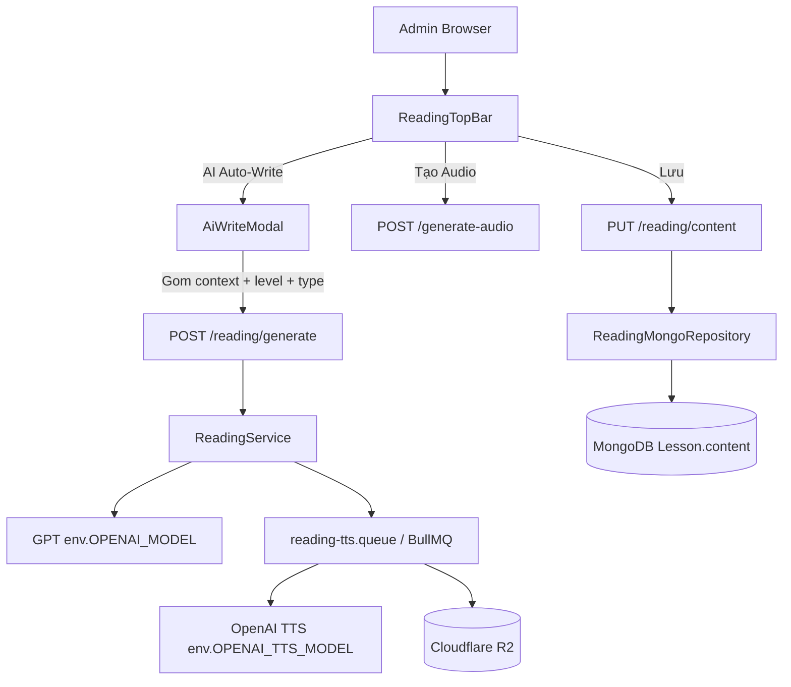
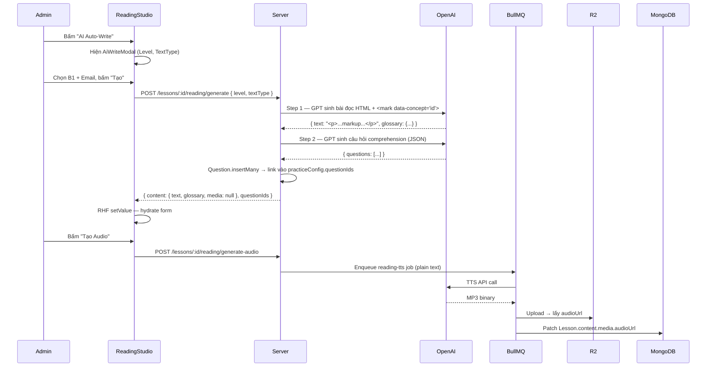

# Implementation Plan: Reading Studio (Admin)

**Ngày lập:** 2026-02-23
**Người lập:** Technical Architect
**Scope:** Quản lý bài học Đọc hiểu (READING) tích hợp AI — Reading Studio cho Admin Panel.
**Phương pháp:** Tuân thủ Service-Repository Pattern, Polyglot Persistence, và các coding standards của dự án Unilish.

---

## 1. Tổng quan Kiến trúc

### Luồng dữ liệu tổng quát



### Sequence: AI Auto-Write + Glossary + Audio



---

## 2. Cấu trúc Dữ liệu (Source of Truth)

### 2.1 TypeScript Types (Server — `server/src/types/lesson-content.types.ts`)

Thêm vào file hiện có (append, không xoá):

```typescript
// ─── Reading Content Types ────────────────────────────────────────────────────

export interface ReadingGlossaryItem {
    word: string;               // Từ gốc xuất hiện trong <mark>
    definition: string;         // Nghĩa khớp với ngữ cảnh bài đọc (Tiếng Việt)
    type: 'noun' | 'verb' | 'adjective' | 'adverb' | 'phrase';
    ipa: string;
}

export interface ReadingMedia {
    audioUrl: string | null;
    duration: number | null;
    speed: number;              // Mặc định 1.0
}

export interface ReadingContent {
    type: 'READING';
    text: string;               // HTML với <mark data-concept="id">word</mark>
    media: ReadingMedia;
    // Key = data-concept attribute value (gen_id hoặc concept ObjectId string)
    glossary: Record<string, ReadingGlossaryItem>;
    generationStatus: 'IDLE' | 'GENERATING' | 'GENERATING_AUDIO' | 'DONE' | 'ERROR';
}
```

### 2.2 Zod Validation Types (Server — `server/src/validations/reading.validation.ts`)

```typescript
// Schemas cần khai báo:
// getReadingContentSchema        — GET  /:lessonId/reading/content
// saveReadingContentSchema       — PUT  /:lessonId/reading/content
// generateReadingSchema          — POST /:lessonId/reading/generate
// generateReadingAudioSchema     — POST /:lessonId/reading/generate-audio
// generateReadingQuestionsSchema — POST /:lessonId/reading/generate-questions
// getReadingQuestionsSchema      — GET  /:lessonId/reading/questions
// swapReadingQuestionSchema      — POST /:lessonId/reading/questions/:questionId/swap
// updateReadingQuestionSchema    — PUT  /:lessonId/reading/questions/:questionId
// deleteReadingQuestionSchema    — DELETE /:lessonId/reading/questions/:questionId
// fillGlossarySchema             — POST /:lessonId/reading/fill-glossary
```

---

## 3. API Contract

**Base prefix:** `/api/curriculum/lessons`
**Auth:** `protect + restrictTo('admin', 'content_creator')` trên toàn bộ router.

| Method | Endpoint | Mô tả |
|--------|----------|-------|
| GET | `/:lessonId/reading/content` | Lấy ReadingContent (lean + select) |
| PUT | `/:lessonId/reading/content` | Lưu toàn bộ ReadingContent |
| POST | `/:lessonId/reading/generate` | AI sinh bài đọc + glossary + câu hỏi |
| POST | `/:lessonId/reading/generate-audio` | Enqueue TTS job cho `text` đã strip HTML |
| POST | `/:lessonId/reading/fill-glossary` | AI điền hàng loạt definition cho glossary |
| POST | `/:lessonId/reading/generate-questions` | AI tái sinh câu hỏi comprehension |
| GET | `/:lessonId/reading/questions` | Lấy Question cards đã hydrate |
| PUT | `/:lessonId/reading/questions/:questionId` | Cập nhật 1 câu hỏi |
| DELETE | `/:lessonId/reading/questions/:questionId` | Xoá 1 câu hỏi |
| POST | `/:lessonId/reading/questions/:questionId/swap` | Đổi 1 câu hỏi bằng AI |

---

## 4. Kế hoạch Triển khai

### Phase 1 — Backend Foundation

#### Bước 1: Types & Validation

**File:** `server/src/types/lesson-content.types.ts`
- Append `ReadingGlossaryItem`, `ReadingMedia`, `ReadingContent` (xem §2.1).

**File (mới):** `server/src/validations/reading.validation.ts`
- Khai báo tất cả 9 Zod schemas (xem §2.2).
- `saveReadingContentSchema.body` dùng `z.object({ text: z.string(), glossary: z.record(z.string(), glossaryItemSchema), ... })`.
- `generateReadingSchema.body` dùng `z.object({ level: z.enum(['A1','A2','B1','B2','C1','C2']), textType: z.enum(['email','report','news','story']).default('story') })`.
- `generateReadingQuestionsSchema.body` dùng `z.object({ count: z.number().int().min(1).max(10).default(5), types: z.array(...).optional() })`.

---

#### Bước 2: Repository

**File (mới):** `server/src/repositories/mongo/reading.mongo.repository.ts`

Pattern mirror của `GrammarMongoRepository`. Implement:

```typescript
export class ReadingMongoRepository {
    async getContent(lessonId: string): Promise<ReadingContent>
    async saveContent(lessonId: string, content: ReadingContent): Promise<ReadingContent>
    async patchMediaUrl(lessonId: string, audioUrl: string, duration: number): Promise<void>
    async setQuestionIds(lessonId: string, ids: string[]): Promise<void>
    async setGenerationStatus(lessonId: string, status: ReadingContent['generationStatus']): Promise<void>
    private _emptyContent(): ReadingContent
}
```

Tất cả reads đều dùng `.lean().select('type content')`. Validate `lesson.type === 'READING'`.

---

#### Bước 3: BullMQ Queue

**File (mới):** `server/src/jobs/queues/reading-tts.queue.ts`

```typescript
export interface ReadingTTSJobPayload {
    lessonId: string;
    plainText: string;     // HTML đã strip tags
    voice: string;         // 'onyx' | 'nova' (từ env hoặc default)
    type: 'reading_narration';
}

export const readingTtsQueue = new Queue<ReadingTTSJobPayload>('reading-tts-generation', {
    connection: { url: env.REDIS_URI || 'redis://localhost:6379' },
    defaultJobOptions: { attempts: 3, backoff: { type: 'exponential', delay: 5000 } },
});
```

**File (mới):** `server/src/jobs/workers/reading-tts.worker.ts`

Worker nhận job, gọi `env.OPENAI_TTS_MODEL`, upload MP3 lên R2, gọi `readingRepo.patchMediaUrl`.

---

#### Bước 4: Service

**File (mới):** `server/src/services/reading.service.ts`

Đây là lớp duy nhất chứa business logic. Không để logic trong controller.

```typescript
export class ReadingService {
    // Reads via ReadingMongoRepository
    static async getContent(lessonId: string): Promise<ReadingContent>

    // Persists full content — Admin manual save
    static async saveContent(lessonId: string, body: SaveReadingContentBody): Promise<ReadingContent>

    // AI pipeline: Text Gen (GPT) → Glossary Gen (GPT) → Question Gen (GPT)
    // → Question.insertMany → setQuestionIds → enqueue TTS
    static async generateContent(lessonId: string, body: GenerateReadingBody): Promise<ReadingContent>

    // AI batch-fill glossary definitions for existing <mark> entries
    static async fillGlossary(lessonId: string): Promise<ReadingContent>

    // Enqueue TTS job (strips HTML tags before sending to TTS)
    static async generateAudio(lessonId: string): Promise<void>

    // AI regenerate comprehension questions (delete old → insertMany → update IDs)
    static async generateQuestions(lessonId: string, body: GenerateReadingQuestionsBody): Promise<{ count: number }>

    // Get hydrated question cards
    static async getQuestions(lessonId: string): Promise<ReadingQuestionCard[]>

    // Swap single question via AI
    static async swapQuestion(lessonId: string, questionId: string): Promise<void>

    // Update single question
    static async updateQuestion(lessonId: string, questionId: string, payload: UpdateQuestionPayload): Promise<void>

    // Delete single question
    static async deleteQuestion(lessonId: string, questionId: string): Promise<void>

    // ── Private AI Helpers ────────────────────────────────────────────────────
    private static async _generateTextAndGlossary(ctx, body): Promise<{ text: string; glossary: Record<string, ReadingGlossaryItem> }>
    private static async _generateQuestionsWithAI(content, count, types?): Promise<AIQuestion[]>
    private static _stripHtmlTags(html: string): string
}
```

**AI Prompt contract cho `_generateTextAndGlossary`:**
- GPT nhận: `unit.contextSeed.scenario`, target vocab list, level, textType.
- GPT trả: JSON `{ text: "<HTML với <mark data-concept='gen_{n}'>...</mark>>", glossary: { "gen_1": { word, definition, type, ipa }, ... } }`.
- Key của glossary **phải khớp 100%** với `data-concept` trong `text`.
- Dùng `response_format: { type: 'json_object' }` + `model: env.OPENAI_MODEL`.

---

#### Bước 5: Controller

**File (mới):** `server/src/controllers/reading.controller.ts`

```typescript
// Tất cả export functions:
export const getReadingContent = catchAsync(...)
export const saveReadingContent = catchAsync(...)
export const generateReadingContent = catchAsync(...)
export const fillGlossary = catchAsync(...)
export const generateReadingAudio = catchAsync(...)
export const generateReadingQuestions = catchAsync(...)
export const getReadingQuestions = catchAsync(...)
export const updateReadingQuestion = catchAsync(...)
export const deleteReadingQuestion = catchAsync(...)
export const swapReadingQuestion = catchAsync(...)
```

Mỗi function: validate (đã qua Zod middleware) → gọi `ReadingService` → `sendResponse`.

---

#### Bước 6: Route

**File (mới):** `server/src/routes/reading.route.ts`

```typescript
router.route('/:lessonId/reading/content')
    .get(validate(getReadingContentSchema), getReadingContent)
    .put(validate(saveReadingContentSchema), saveReadingContent);

router.post('/:lessonId/reading/generate', validate(generateReadingSchema), generateReadingContent);
router.post('/:lessonId/reading/generate-audio', validate(generateReadingAudioSchema), generateReadingAudio);
router.post('/:lessonId/reading/fill-glossary', validate(fillGlossarySchema), fillGlossary);
router.post('/:lessonId/reading/generate-questions', validate(generateReadingQuestionsSchema), generateReadingQuestions);

router.route('/:lessonId/reading/questions')
    .get(validate(getReadingQuestionsSchema), getReadingQuestions);

router.route('/:lessonId/reading/questions/:questionId')
    .put(validate(updateReadingQuestionSchema), updateReadingQuestion)
    .delete(validate(deleteReadingQuestionSchema), deleteReadingQuestion);

router.post('/:lessonId/reading/questions/:questionId/swap', validate(swapReadingQuestionSchema), swapReadingQuestion);
```

Mount vào `lesson.route.ts` (hoặc file router chính): `app.use('/api/curriculum/lessons', readingRouter)`.

---

### Phase 2 — Admin UI

**Tech stack:** React 19 + TypeScript + TailwindCSS + Shadcn/UI + TanStack Query v5 + React Hook Form + Zod.

#### Bước 7: Types (Admin)

**File:** `admin/src/features/curriculum/courses/types/course.types.ts` (append)

```typescript
export interface ReadingGlossaryItem {
    word: string;
    definition: string;
    type: 'noun' | 'verb' | 'adjective' | 'adverb' | 'phrase';
    ipa: string;
}

export interface ReadingMedia {
    audioUrl: string | null;
    duration: number | null;
    speed: number;
}

export interface ReadingContent {
    type: 'READING';
    text: string;
    media: ReadingMedia;
    glossary: Record<string, ReadingGlossaryItem>;
    generationStatus: 'IDLE' | 'GENERATING' | 'GENERATING_AUDIO' | 'DONE' | 'ERROR';
}

export interface ReadingLessonFormValues {
    _id: string;
    title: string;
    type: 'READING';
    content: {
        text: string;
        media: ReadingMedia;
        glossary: Record<string, ReadingGlossaryItem>;
    };
    practiceConfig: {
        mode: 'FIXED';
        questionIds: string[];
        passingScore: number;
    };
}

export type ReadingGenerationPayload = {
    level: 'A1' | 'A2' | 'B1' | 'B2' | 'C1' | 'C2';
    textType: 'email' | 'report' | 'news' | 'story';
};

export type ReadingQuestionCard = GrammarQuestionCard; // Tái sử dụng GrammarQuestionCard
```

---

#### Bước 8: Query Keys

**File:** `admin/src/features/curriculum/courses/constants/query-keys.ts` (append)

```typescript
readingContent: (lessonId: string) => [...LESSON_QUERY_KEYS.all, 'reading-content', lessonId],
readingQuestions: (lessonId: string) => [...LESSON_QUERY_KEYS.all, 'reading-questions', lessonId],
```

---

#### Bước 9: API Layer

**File (mới):** `admin/src/features/curriculum/courses/api/reading.api.ts`

```typescript
export const readingApi = {
    getContent: (lessonId: string): Promise<ReadingContent>
    saveContent: (lessonId: string, body: Partial<ReadingContent>): Promise<ReadingContent>
    generateContent: (lessonId: string, payload: ReadingGenerationPayload): Promise<ReadingContent>
    fillGlossary: (lessonId: string): Promise<ReadingContent>
    generateAudio: (lessonId: string): Promise<void>
    generateQuestions: (lessonId: string, count: number, types?: string[]): Promise<{ count: number }>
    getQuestions: (lessonId: string): Promise<ReadingQuestionCard[]>
    updateQuestion: (lessonId: string, questionId: string, payload: UpdateGrammarQuestionPayload): Promise<ReadingQuestionCard>
    deleteQuestion: (lessonId: string, questionId: string): Promise<void>
    swapQuestion: (lessonId: string, questionId: string): Promise<ReadingQuestionCard>
};
```

---

#### Bước 10: Hooks (TanStack Query)

**File (mới):** `admin/src/features/curriculum/courses/hooks/useReadingContent.ts`

```typescript
export const useReadingContent = (lessonId: string) =>
    useQuery<ReadingContent>({
        queryKey: LESSON_QUERY_KEYS.readingContent(lessonId),
        queryFn: () => readingApi.getContent(lessonId),
        enabled: !!lessonId,
        staleTime: 60_000,
    });
```

**File (mới):** `admin/src/features/curriculum/courses/hooks/useReadingMutations.ts`

Exports: `useSaveReadingContent`, `useGenerateReadingContent`, `useFillGlossary`, `useGenerateReadingAudio`, `useGenerateReadingQuestions`.

`useGenerateReadingContent.onSuccess`: `setQueryData(readingContent key)` + `invalidateQueries(readingQuestions key)`.

**File (mới):** `admin/src/features/curriculum/courses/hooks/useReadingQuestions.ts`

Mirror của `useGrammarQuestions` — `enabled: !!lessonId && questionIds.length > 0`.

---

#### Bước 11: UI Components (ReadingStudio)

**Cây thư mục:**

```
admin/src/features/curriculum/courses/components/ReadingStudio/
├── ReadingStudio.tsx                          # Root orchestrator (mirror GrammarStudio)
├── hooks/
│   └── useReadingStudioState.ts               # activeSection state
└── components/
    ├── ReadingTopBar/
    │   └── ReadingTopBar.tsx                  # Header: title + action buttons
    ├── ReadingNavigator/
    │   └── ReadingNavigator.tsx               # 3-item nav (Text, Glossary, Practice)
    ├── AiWriteModal/
    │   └── AiWriteModal.tsx                   # Modal chọn Level + TextType
    ├── GenerateQuestionsModal/
    │   └── GenerateQuestionsModal.tsx         # Tái dụng pattern từ Grammar
    ├── ReadingEditor/
    │   ├── ReadingEditor.tsx                  # Switch activeSection → render section
    │   └── sections/
    │       ├── TextSection.tsx                # Tiptap editor + AudioPlayer
    │       ├── GlossarySection.tsx            # Card list glossary (RHF watch + setValue)
    │       └── PracticeSection.tsx            # Question cards (mirror GrammarStudio PracticeEditor)
    └── ReadingPracticeSheet/
        └── ReadingPracticeSheet.tsx           # "Làm thử" Sheet (tái dụng TryTab)
```

**Nguyên tắc component quan trọng:**

1. `ReadingStudio.tsx` — `FormProvider` bao ngoài (RHF). Không dùng `useEffect` để fetch, dùng `useReadingContent`.
2. `TextSection.tsx` — Dùng **Tiptap** (`@tiptap/react`). Custom extension `MarkConceptExtension` để:
   - Cho phép bôi đen text → click nút "Đánh dấu từ vựng" → wrap trong `<mark data-concept="gen_{uuid}">`.
   - Parse `content.text` HTML an toàn qua `DOMParser`.
3. `GlossarySection.tsx` — **Không dùng `useFieldArray`** (glossary là Record, không phải Array). Render với `Object.entries(watch('content.glossary'))`. Mỗi entry render 1 card với 3 input (definition, type, ipa).
4. `PracticeSection.tsx` — Mirror `GrammarStudio/PracticeEditor.tsx`. Dùng `useReadingQuestions`.

---

#### Bước 12: Tích hợp vào CourseStudioPage

**File:** `admin/src/features/curriculum/courses/pages/CourseStudioPage/CourseStudioPage.tsx`

```tsx
// Thêm case READING:
if (lesson.type === 'READING') {
    return <ReadingStudio lesson={lesson} />;
}
```

---

## 5. Dependency Mới (Cần cài)

| Package | App | Mục đích |
|---------|-----|----------|
| `@tiptap/react` | admin | Rich Text editor core |
| `@tiptap/starter-kit` | admin | Extensions bundle (Bold, Italic, ...) |
| `@tiptap/extension-highlight` | admin | Render `<mark>` tag natively |
| `strip-html` hoặc `striptags` | server | Strip HTML tags trước khi gửi TTS |

---

## 6. Thứ tự Triển khai (Sprint Breakdown)

| Sprint | Tasks | Output có thể test |
|--------|-------|-------------------|
| **Sprint 1** | Bước 1 → 3 (Types, Validation, Repository, Queue) | Unit test Repository |
| **Sprint 2** | Bước 4 → 6 (Service, Controller, Route) | API test via curl/Postman |
| **Sprint 3** | Bước 7 → 10 (Admin types, API, Hooks) | TanStack Query dev tools |
| **Sprint 4** | Bước 11 (TextSection + GlossarySection) | Tiptap editor + Glossary auto-sync |
| **Sprint 5** | Bước 11 (PracticeSection + ReadingPracticeSheet) + Bước 12 | Full end-to-end flow |

---

## 7. Checklist Kiểm tra Chất lượng (QA Gates)

Trước khi merge mỗi Sprint:

- [ ] `npx tsc --noEmit` → 0 errors trên cả `server/` và `admin/`
- [ ] Không có `any` trong code mới
- [ ] Tất cả MongoDB reads có `.lean().select()`
- [ ] Tất cả async controllers bọc trong `catchAsync`
- [ ] Tất cả API inputs qua Zod middleware trước controller
- [ ] Không có `console.log` — dùng `logger.info/warn/error`
- [ ] Secrets không hardcode — dùng `env.OPENAI_MODEL`, `env.OPENAI_TTS_MODEL`
- [ ] Glossary key sync: `data-concept` attribute trong HTML **bắt buộc** khớp key trong `glossary` Record
- [ ] TTS chỉ nhận plain text (HTML đã strip tags)
- [ ] Admin: Không có `useEffect` cho data fetching — chỉ dùng TanStack Query
- [ ] Admin: Không có Tailwind trong `/client`, không có CSS Modules trong `/admin`

---

## 8. Rủi ro & Phương án Dự phòng

| Rủi ro | Xác suất | Phương án |
|--------|---------|-----------|
| GPT không giữ format `data-concept` nhất quán | Cao | Parser regex backup: tự sinh key từ index nếu thiếu attribute |
| Tiptap extension conflict với Shadcn styles | Trung bình | Scope Tiptap CSS trong `.tiptap-editor` wrapper, không pollute global |
| TTS timeout với bài đọc dài (>500 chữ) | Trung bình | Split text theo câu → nhiều TTS chunks → ghép client-side |
| Glossary desync khi Admin tay edit HTML trong Tiptap | Cao | Tiptap `onUpdate` callback → re-parse `<mark>` → diff với glossary hiện tại → xoá key thừa, giữ key mới |
