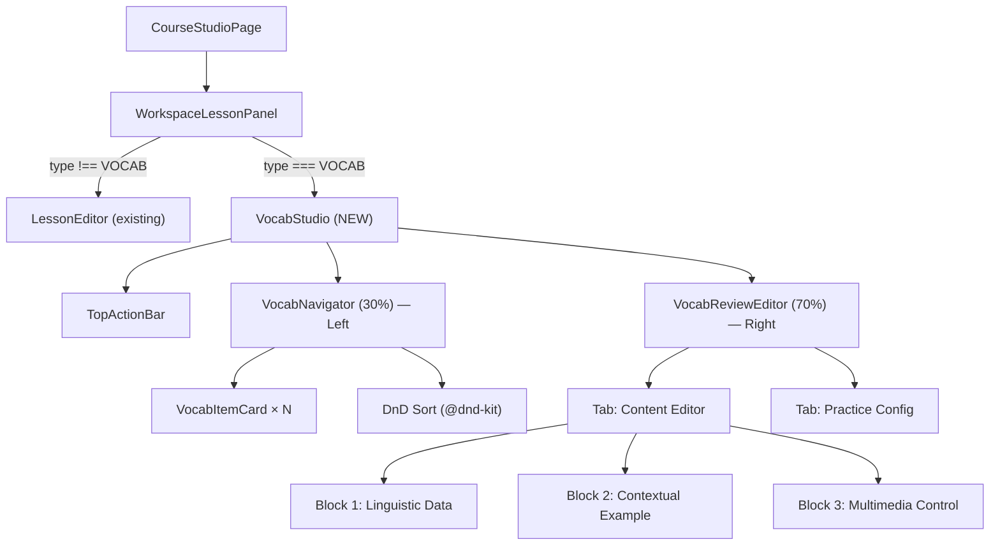
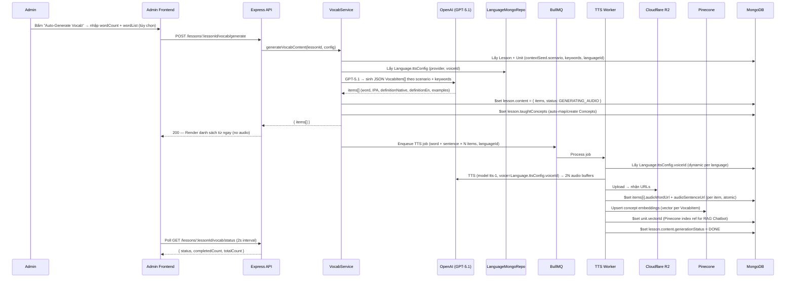

# IMPLEMENTATION PLAN: VOCAB STUDIO (Admin — Quản lý Bài học Từ vựng)

> **Scope:** Tính năng "Vocab Lesson Manager" cho Admin CMS — giao diện Split-Pane "Vocab Studio" với AI One-Click Generation, TTS Audio, Media Management và Practice Auto-Gen.
> **Nguyên tắc:** Service-Repository Pattern · Polyglot Persistence (Mongo + Pinecone + Redis/BullMQ + R2) · Admin = Tailwind + Shadcn/UI · No GraphDB.
> **Tài liệu tham chiếu:** `mota.md` (UI/UX spec) · `baihoc.md` (Pedagogical modules) · `khoahoc.md` (DB Design V2.0).

---

## 1. PHÂN TÍCH CODEBASE HIỆN TẠI

### Những gì đã có (Foundation)
| Layer | Trạng thái |
|---|---|
| `Lesson` Mongoose model (`content: Mixed`, `practiceConfig`) | ✅ Tồn tại |
| `LessonService` CRUD cơ bản | ✅ Tồn tại |
| `LessonMongoRepository` + `BaseMongoRepository` | ✅ Tồn tại |
| `LessonController` + Routes `/api/v1/lessons` | ✅ Tồn tại |
| `lesson.validation.ts` (Zod) — CRUD schema | ✅ Tồn tại |
| Admin `CourseStudioPage` (Split-Pane: Tree + Panel) | ✅ Tồn tại |
| Admin `LessonEditor` — chỉ edit `title`, `type`, `practiceConfig` | ✅ Tồn tại |
| `Question` model + BullMQ jobs folder | ✅ Model tồn tại, Jobs **RỖNG** |
| `Concept` model (key, name, type, languageId) | ✅ Tồn tại |
| `Language` model (`code`, `name`, `ttsConfig.provider`, `ttsConfig.voiceId`) | ✅ Tồn tại |
| `KnowledgeVectorRepo` / Pinecone | ✅ Config tồn tại |
| Cloudflare R2 / `upload.service.ts` | ✅ Tồn tại |
| `Unit.contextSeed.keywords` + `Unit.vectorId` | ✅ Schema tồn tại |

### Những gì còn thiếu (Gap)
| Gap | Phải xây |
|---|---|
| Vocab JSON schema cho `lesson.content` (incl. `definitionNative`) | Schema TypeScript + Zod |
| API endpoint AI generation & save vocab content | Controller + Service extension |
| BullMQ TTS audio queue & worker (Language-aware voice) | Jobs module |
| Auto-map `lesson.taughtConcepts` sau khi sinh từ vựng | VocabGenerationService |
| Auto-map `unit.vectorId` sau khi upsert Pinecone | VocabGenerationService + UnitRepo |
| `UserConceptState` update hook (SRS) sau khi user trả lời | QuestionGenerationService (Sprint 3) |
| `VocabStudio` admin component (Split-Pane mới) | Admin frontend |
| Hooks, API service cho vocab | Admin frontend |
| Luồng `WorkspaceLessonPanel` routing theo `lesson.type` | Admin frontend |

---

## 2. DATA SCHEMA DESIGN

### 2.1 Vocab Content JSON Schema (stored in `lesson.content`)
Lưu trong `Lesson.content` (Schema.Types.Mixed). Theo chuẩn `khoahoc.md` và `baihoc.md` — cần define TypeScript interface nghiêm ngặt.

```typescript
// server/src/types/lesson-content.types.ts

export interface VocabItem {
  id: string;                       // nanoid() — stable client key
  word: string;
  partOfSpeech: 'noun' | 'verb' | 'adjective' | 'adverb' | 'phrase' | 'other';
  ipa: string;                      // /ˈlʌɡ.ɪdʒ/
  definitionNative: string;         // Ngôn ngữ mẹ theo Language (VD: tiếng Việt, tiếng Nhật)
  definitionEn: string;             // Định nghĩa tiếng Anh
  exampleSentence: string;          // Bắt buộc khớp Unit.contextSeed.scenario
  exampleTranslation: string;
  audioWordUrl: string | null;      // R2 URL — TTS của word
  audioSentenceUrl: string | null;  // R2 URL — TTS của exampleSentence
  imageUrl: string | null;          // Cloudinary hoặc R2
  conceptId: string | null;         // ObjectId → Concept collection (auto-mapped)
}

export type VocabGenerationStatus =
  | 'IDLE'
  | 'GENERATING'       // GPT-5.1 đang sinh JSON
  | 'GENERATING_AUDIO' // BullMQ TTS đang xử lý
  | 'DONE'
  | 'ERROR';

export interface VocabContent {
  type: 'VOCAB';
  scenario: string;                 // Copied from Unit.contextSeed.scenario
  generationStatus: VocabGenerationStatus;
  items: VocabItem[];
}

// Union type — mở rộng cho các module sau (GRAMMAR, READING...)
export type LessonContent = VocabContent; // | GrammarContent | ...
```

> **Lý do tách `definitionNative` + `definitionEn`:** Theo `baihoc.md`, khóa học cho người Nhật sẽ sinh `definitionNative` bằng tiếng Nhật, người Việt bằng tiếng Việt. Ngôn ngữ native lấy từ `Language.code` của Unit's Course.

### 2.2 Vocab Content Zod Schema (server validation)
```typescript
// server/src/validations/vocab-content.validation.ts

// vocabItemSchema — validate từng item
const vocabItemSchema = z.object({
  id: z.string().min(1),
  word: z.string().min(1).max(100).trim(),
  partOfSpeech: z.enum(['noun', 'verb', 'adjective', 'adverb', 'phrase', 'other']),
  ipa: z.string().max(100).default(''),
  definitionNative: z.string().min(1).max(300).trim(),
  definitionEn: z.string().min(1).max(300).trim(),
  exampleSentence: z.string().min(5).max(500).trim(),
  exampleTranslation: z.string().min(1).max(500).trim(),
  audioWordUrl: z.string().url().nullable().default(null),
  audioSentenceUrl: z.string().url().nullable().default(null),
  imageUrl: z.string().url().nullable().default(null),
  conceptId: z.string().regex(/^[a-f\d]{24}$/i).nullable().default(null),
});

// saveVocabContentSchema — PUT /lessons/:lessonId/vocab/content
export const saveVocabContentSchema = z.object({
  params: z.object({ lessonId: objectIdSchema }),
  body: z.object({ items: z.array(vocabItemSchema).min(1).max(50) }),
});

// generateVocabSchema — POST /lessons/:lessonId/vocab/generate
export const generateVocabSchema = z.object({
  params: z.object({ lessonId: objectIdSchema }),
  body: z.object({
    wordCount: z.number().int().min(3).max(20),
    wordList: z.array(z.string().min(1).max(100)).max(20).optional(),
  }),
});

// regenerateAudioSchema — POST /lessons/:lessonId/vocab/items/:itemId/regenerate-audio
export const regenerateAudioSchema = z.object({
  params: z.object({ lessonId: objectIdSchema, itemId: z.string().min(1) }),
  body: z.object({ target: z.enum(['word', 'sentence']) }),
});
```

---

## 3. ARCHITECTURE DIAGRAM

### 3.1 Admin Frontend — Routing theo Lesson Type


### 3.2 Backend — AI Generation Pipeline


> **AI Model:** GPT-5.1 (vocab generation) theo `baihoc.md`. TTS voice lấy động từ `Language.ttsConfig.voiceId` (alloy/echo/onyx...) theo `khoahoc.md` — **không hardcode**.

---

## 4. SPRINT BREAKDOWN

---

### ▶ SPRINT 1 — Schema & API Foundation (Backend only)
**Mục tiêu:** Xây nền tảng dữ liệu và API endpoints đủ để frontend tích hợp.

#### 4.1.1 [Server] Định nghĩa TypeScript Types
**File:** `server/src/types/lesson-content.types.ts`
- Export `VocabItem`, `VocabContent` interfaces như design ở mục 2.1.
- Export union type `LessonContent = VocabContent | GrammarContent | ...` để mở rộng sau.

#### 4.1.2 [Server] Zod Validation cho Vocab Content
**File:** `server/src/validations/vocab-content.validation.ts`
- `vocabItemSchema` — validate từng item (word required, ipa optional, audioUrl nullable, etc.)
- `saveVocabContentSchema` — validate `PUT /lessons/:lessonId/vocab/content`
- `generateVocabSchema` — validate `POST /lessons/:lessonId/vocab/generate`
  ```
  body: { wordCount: z.number().min(3).max(20), wordList: z.array(z.string()).optional() }
  ```
- `regenerateAudioSchema` — validate `POST /lessons/:lessonId/vocab/items/:itemId/regenerate-audio`
  ```
  body: { target: z.enum(['word', 'sentence']) }
  ```

#### 4.1.3 [Server] Mở rộng LessonMongoRepository
**File:** `server/src/repositories/mongo/lesson.mongo.repository.ts` (thêm methods)
```typescript
// Lấy vocab content (full)
async findVocabContent(lessonId: string): Promise<VocabContent | null>

// Save toàn bộ content (atomic replace)
async saveVocabContent(lessonId: string, content: VocabContent): Promise<ILesson>

// Cập nhật audio URL của 1 item (partial update, không replace toàn bộ)
async updateVocabItemAudio(
  lessonId: string,
  itemId: string,
  target: 'word' | 'sentence',
  url: string,
): Promise<void>

// Cập nhật status của generation job
async updateVocabGenerationStatus(
  lessonId: string,
  status: 'IDLE' | 'GENERATING' | 'GENERATING_AUDIO' | 'DONE' | 'ERROR',
): Promise<void>
```
> **Lưu ý:** Tất cả reads dùng `.lean().select()` bắt buộc.

#### 4.1.4 [Server] BullMQ — TTS Audio Queue
**Files mới:**
```
server/src/jobs/queues/tts.queue.ts        # Queue definition
server/src/jobs/workers/tts.worker.ts      # Job processor
server/src/jobs/processors/tts.processor.ts
```
- **Queue name:** `tts-generation`
- **Job payload:**
  ```typescript
  interface TTSJobPayload {
    lessonId: string;
    languageId: string;   // để lấy Language.ttsConfig.voiceId + provider
    items: Array<{
      itemId: string;
      word: string;
      sentence: string;
    }>;
  }
  ```
- **Worker processor logic:**
  1. Lấy `Language.ttsConfig` từ MongoDB → xác định `provider` (OPENAI/AZURE) và `voiceId` (alloy/echo)
  2. Với mỗi item: gọi `openai.audio.speech` (model `tts-1`, voice=`Language.ttsConfig.voiceId`) → mp3 buffer
  3. Upload 2 files lên R2 (`/audio/vocab/{lessonId}/{itemId}-word.mp3`, `…-sentence.mp3`)
  4. Gọi `lessonRepo.updateVocabItemAudio(...)` cập nhật từng URL ngay khi xong (atomic `$set`)
  5. Sau khi tất cả xong: upsert Pinecone embeddings → cập nhật `unit.vectorId`
  6. Gọi `updateVocabGenerationStatus(lessonId, 'DONE')`
  7. Xử lý retry tối đa 3 lần với exponential backoff
- **Khởi động worker:** đăng ký trong `server/src/app.ts` hoặc file init riêng

#### 4.1.5 [Server] VocabGenerationService
**File:** `server/src/services/vocab-generation.service.ts`

```typescript
export class VocabGenerationService {
  constructor(
    private lessonRepo: LessonMongoRepository,
    private unitRepo: UnitMongoRepository,
    private conceptRepo: ConceptMongoRepository,
    private languageRepo: LanguageMongoRepository,
    private ttsQueue: TTSQueue,
    private vectorRepo: KnowledgeVectorRepo,
  ) {}

  // Step 1: GPT-5.1 generation — trả về ngay
  async generateVocabItems(lessonId: string, config: GenerateVocabConfig): Promise<VocabItem[]>

  // Step 2: Auto-map concept IDs và $set lesson.taughtConcepts
  // Tạo mới Concept nếu chưa tồn tại (idempotent upsert)
  async autoMapTaughtConcepts(lessonId: string, items: VocabItem[], languageId: string): Promise<void>

  // Step 3: Enqueue TTS jobs — async background
  async enqueueTtsJobs(lessonId: string, languageId: string, items: VocabItem[]): Promise<void>

  // Step 4: Upsert Pinecone embeddings + cập nhật unit.vectorId (gọi trong TTS worker sau khi hoàn tất)
  async upsertConceptEmbeddingsAndSetVectorId(lessonId: string, items: VocabItem[]): Promise<void>

  // Single item audio regenerate
  async regenerateAudio(lessonId: string, itemId: string, target: 'word' | 'sentence'): Promise<string>

  // Get generation status
  async getGenerationStatus(lessonId: string): Promise<GenerationStatus>
}
```

**GPT-5.1 Prompt Template (Contextual Constraint — theo `baihoc.md`):**
```
System: You are a professional English vocabulary curriculum designer.
Generate vocabulary items strictly within the provided scenario context.
Never produce example sentences outside the scenario.

User: Scenario: "{unit.contextSeed.scenario}"
Context keywords (MUST reference): {unit.contextSeed.keywords.join(', ')}
{config.wordList
  ? "Use EXACTLY these words: " + config.wordList.join(', ')
  : "Generate " + config.wordCount + " most relevant vocabulary words for this scenario."}
Native language for definitionNative: {language.code} (e.g., Vietnamese for 'vi')

Return a strict JSON array matching this TypeScript interface:
[VocabItem interface — include id(nanoid), word, partOfSpeech, ipa,
 definitionNative, definitionEn, exampleSentence (MUST match scenario),
 exampleTranslation. Leave audioWordUrl/audioSentenceUrl/imageUrl/conceptId as null.]
```

> **Constraint `baihoc.md`:** Câu ví dụ (exampleSentence) bắt buộc phải thuộc ngữ cảnh scenario. VD: Unit "Airport" → câu ví dụ dùng từ "check-in" phải là **sân bay**, không được là **khách sạn**.

#### 4.1.6 [Server] VocabController + Routes
**File:** `server/src/controllers/vocab.controller.ts` (mới)

| Method | Endpoint | Mô tả |
|---|---|---|
| `GET` | `/lessons/:lessonId/vocab/content` | Lấy toàn bộ VocabContent |
| `PUT` | `/lessons/:lessonId/vocab/content` | Save toàn bộ VocabContent (Admin review xong bấm Lưu) |
| `POST` | `/lessons/:lessonId/vocab/generate` | Trigger AI generation + enqueue TTS |
| `GET` | `/lessons/:lessonId/vocab/status` | Poll generation status (jobs done) |
| `POST` | `/lessons/:lessonId/vocab/items/:itemId/regenerate-audio` | Regenerate audio 1 item |

**Route:** Thêm vào `server/src/routes/lesson.route.ts` (hoặc tách file `vocab.route.ts` riêng mount vào `app.ts`)

Tất cả routes: `protect` + `restrictTo('admin', 'content_creator')` + `validate(zodSchema)`

---

### ▶ SPRINT 2 — Admin Frontend: VocabStudio Component
**Mục tiêu:** Xây dựng toàn bộ UI/UX "Vocab Studio" theo mô tả trong mota.md.

#### 4.2.1 Routing theo Lesson Type trong WorkspaceLessonPanel
**File:** `admin/src/features/curriculum/courses/pages/CourseStudioPage/CourseStudioPage.tsx`

Sửa hàm `WorkspaceLessonPanel`:
```tsx
if (lesson.type === 'VOCAB') {
  return <VocabStudio lesson={lesson} courseId={courseId} />;
}
return <LessonEditor lesson={lesson} courseId={courseId} />;  // existing
```

#### 4.2.2 VocabStudio — Root Component (Split-Pane Layout)
**File:** `admin/src/features/curriculum/courses/components/VocabStudio/VocabStudio.tsx`

```
VocabStudio/
├── VocabStudio.tsx                  # Root: layout + state orchestration
├── components/
│   ├── VocabTopBar/
│   │   └── VocabTopBar.tsx          # Title, Generate button, Save Draft, Publish
│   ├── VocabNavigator/
│   │   ├── VocabNavigator.tsx       # Left panel 30%: DnD list
│   │   └── VocabItemCard.tsx        # Thẻ item: word, validation dot
│   ├── VocabReviewEditor/
│   │   ├── VocabReviewEditor.tsx    # Right panel 70%: switched by selected item
│   │   ├── tabs/
│   │   │   ├── ContentTab.tsx       # Tab "Nội dung"
│   │   │   └── PracticeTab.tsx      # Tab "Cấu hình Bài tập"
│   │   └── blocks/
│   │       ├── LinguisticBlock.tsx  # word, PoS, IPA, definitions
│   │       ├── ContextBlock.tsx     # exampleSentence, exampleTranslation
│   │       └── MultimediaBlock.tsx  # audioWordPlayer, audioSentencePlayer, imagePreview
│   ├── AutoGenerateModal/
│   │   └── AutoGenerateModal.tsx    # config wordCount, wordList textarea, trigger
│   ├── GenerationProgress/
│   │   └── GenerationProgress.tsx  # Steps progress bar (polling status API)
│   └── AudioPlayerMini/
│       └── AudioPlayerMini.tsx     # Play/Pause + Regenerate button
└── hooks/
    ├── useVocabContent.ts           # GET vocab content query
    ├── useVocabMutations.ts         # save, generate, regenerateAudio mutations
    ├── useVocabStudioState.ts       # Zustand slice hoặc local useState cho selectedItemId, dirtyItems
    └── useGenerationStatus.ts       # Polling GET /vocab/status mỗi 2s khi đang generate
```

#### 4.2.3 Types cho Admin
**File:** `admin/src/features/curriculum/courses/types/course.types.ts` (mở rộng)

```typescript
export interface VocabItem {
  id: string;
  word: string;
  partOfSpeech: 'noun' | 'verb' | 'adjective' | 'adverb' | 'phrase' | 'other';
  ipa: string;
  definitionNative: string;          // Ngôn ngữ mẹ (vi, ja...) theo Language của Course
  definitionEn: string;              // Định nghĩa tiếng Anh
  exampleSentence: string;
  exampleTranslation: string;
  audioWordUrl: string | null;
  audioSentenceUrl: string | null;
  imageUrl: string | null;
  conceptId: string | null;
}

export type VocabGenerationStatus = 'IDLE' | 'GENERATING' | 'GENERATING_AUDIO' | 'DONE' | 'ERROR';

export interface VocabContent {
  type: 'VOCAB';
  scenario: string;
  generationStatus: VocabGenerationStatus;
  items: VocabItem[];
}

export interface VocabGenerationConfig {
  wordCount: number;
  wordList?: string[];   // Tùy chọn: Admin dán danh sách từ → AI tự điền thông tin
}

export interface VocabStatusResponse {
  status: VocabGenerationStatus;
  completedCount: number;
  totalCount: number;
}
```

#### 4.2.4 API Service cho Admin
**File:** `admin/src/features/curriculum/courses/api/vocab.api.ts`

```typescript
vocabApi.getVocabContent(lessonId)
vocabApi.saveVocabContent(lessonId, content)
vocabApi.generateVocab(lessonId, config)
vocabApi.getGenerationStatus(lessonId)
vocabApi.regenerateAudio(lessonId, itemId, target)
```

#### 4.2.5 TanStack Query Hooks
**File:** `admin/src/features/curriculum/courses/hooks/useVocabContent.ts`
```typescript
export const useVocabContent = (lessonId: string) =>
  useQuery({ queryKey: LESSON_QUERY_KEYS.vocabContent(lessonId), queryFn: () => vocabApi.getVocabContent(lessonId) });
```

**File:** `admin/src/features/curriculum/courses/hooks/useVocabMutations.ts`
- `useSaveVocabContent(lessonId)` — invalidates vocabContent query
- `useGenerateVocab(lessonId)` — onSuccess: invalidates content, starts polling status
- `useRegenerateAudio(lessonId)` — onSuccess: invalidates single item audio URL

**File:** `admin/src/features/curriculum/courses/hooks/useGenerationStatus.ts`
```typescript
// Polling hook — enabled chỉ khi status là GENERATING | GENERATING_AUDIO
export const useGenerationStatus = (lessonId: string, enabled: boolean) =>
  useQuery({
    queryKey: LESSON_QUERY_KEYS.vocabStatus(lessonId),
    queryFn: () => vocabApi.getGenerationStatus(lessonId),
    refetchInterval: enabled ? 2000 : false,
    enabled,
  });
```

#### 4.2.6 DnD Sort (VocabNavigator)
- Dùng `@dnd-kit/core` + `@dnd-kit/sortable` (đã follow Shadcn ecosystem)
- `onDragEnd`: cập nhật local `items` array order → debounce 500ms → gọi `saveDraft`
- **Không** gọi BE reorder riêng — thứ tự lưu ngay trong `lesson.content.items[]`

#### 4.2.7 Validation UX (Error Dots trong VocabNavigator)
- Tính `isItemInvalid(item)`: `!item.word || !item.exampleSentence || (!item.audioWordUrl && generationDone)`
- Hiển thị `●` đỏ trên `VocabItemCard` khi `isItemInvalid === true`
- Count tổng số lỗi ở thanh Top Bar dạng badge

---

### ▶ SPRINT 3 — Practice Auto-Gen (Tab "Cấu hình Bài tập")
**Mục tiêu:** Tự động sinh câu hỏi từ vocab items và cho Admin review/swap.

#### 4.3.1 [Server] QuestionGenerationService
**File:** `server/src/services/question-generation.service.ts`

```typescript
export class QuestionGenerationService {
  // Sinh câu hỏi từ VocabItems thông qua GPT-5.1
  async generateQuestionsFromVocab(
    lessonId: string,
    items: VocabItem[],
    quantity: number,
  ): Promise<IQuestion[]>

  // Swap 1 câu hỏi bằng câu khác từ Question Bank cùng testedConceptId
  async swapQuestion(questionId: string, testedConceptId: string): Promise<IQuestion>
}
```

**3 Question types được sinh (theo `baihoc.md`):**
| Type | Mô tả | Stem |
|---|---|---|
| `MULTIPLE_CHOICE` | 🔊 Nghe Audio → Chọn từ đúng | `stem.audioUrl` = `item.audioWordUrl` |
| `FILL_IN_BLANK` | Điền từ vào ngữ cảnh | `stem.text` = câu ví dụ có blank |
| `MATCHING` | Nối từ với định nghĩa | `stem.text` = danh sách word cần nối |

#### 4.3.2 [Server] API Endpoints Practice
Thêm vào `vocab.route.ts`:
| Method | Endpoint | Mô tả |
|---|---|---|
| `POST` | `/lessons/:lessonId/vocab/generate-questions` | Sinh câu hỏi từ vocab items hiện tại |
| `POST` | `/lessons/:lessonId/vocab/questions/:questionId/swap` | Swap 1 câu |
| `PUT` | `/lessons/:lessonId/vocab/questions/:questionId` | Sửa câu hỏi trực tiếp |

#### 4.3.3 [Admin] PracticeTab Component
**File:** `VocabStudio/components/VocabReviewEditor/tabs/PracticeTab.tsx`

- Danh sách câu hỏi đã sinh: dạng accordion
- Mỗi câu: text preview + nút ✏️ Edit (inline) + nút 🔄 Swap
- **3 dạng câu hỏi hiển thị (theo `baihoc.md`):**
  - 🔊 *Audio Matching:* [Play Audio] → Chọn từ đúng trong 4 đáp án
  - ✏️ *Context Fill:* `Please put your _____ on the scale.` → [Luggage]
  - 🔗 *Matching:* Nối từ với định nghĩa
- Slider `passingScore` (0-100, default 80)
- Nút 🪴 "Tự động sinh câu hỏi" → gọi endpoint `generate-questions`

> **Liên kết SRS (`khoahoc.md`):** Sau khi Admin xuất bản lesson, từng câu hỏi đã gắn `testedConcept`. Khi User làm sai câu này, hệ thống sẽ push `conceptId` vào `UserConceptState.weakConceptsDetected` → kích hoạt `DailyReviewSession` sáng hôm sau.

---

## 5. FILE MAP TỔNG HỢP

### Server — Files mới/sửa
```
server/src/
├── types/
│   └── lesson-content.types.ts                        [MỚI]
├── validations/
│   └── vocab-content.validation.ts                    [MỚI]
├── repositories/mongo/
│   └── lesson.mongo.repository.ts                     [SỬA — thêm vocab methods]
├── jobs/
│   ├── queues/
│   │   └── tts.queue.ts                               [MỚI]
│   └── workers/
│       └── tts.worker.ts                              [MỚI]
├── services/
│   ├── vocab-generation.service.ts                    [MỚI]
│   └── question-generation.service.ts                 [MỚI — Sprint 3]
├── controllers/
│   └── vocab.controller.ts                            [MỚI]
└── routes/
    └── vocab.route.ts                                 [MỚI — mount vào app.ts]
```

### Admin — Files mới/sửa
```
admin/src/features/curriculum/courses/
├── types/
│   └── course.types.ts                                [SỬA — thêm Vocab types]
├── api/
│   └── vocab.api.ts                                   [MỚI]
├── hooks/
│   ├── useVocabContent.ts                             [MỚI]
│   ├── useVocabMutations.ts                           [MỚI]
│   └── useGenerationStatus.ts                         [MỚI]
├── constants/
│   └── query-keys.ts                                  [SỬA — thêm vocabContent, vocabStatus]
├── components/
│   └── VocabStudio/                                   [MỚI — toàn bộ folder]
│       ├── VocabStudio.tsx
│       ├── components/
│       │   ├── VocabTopBar/VocabTopBar.tsx
│       │   ├── VocabNavigator/
│       │   │   ├── VocabNavigator.tsx
│       │   │   └── VocabItemCard.tsx
│       │   ├── VocabReviewEditor/
│       │   │   ├── VocabReviewEditor.tsx
│       │   │   ├── tabs/ContentTab.tsx
│       │   │   ├── tabs/PracticeTab.tsx
│       │   │   └── blocks/LinguisticBlock.tsx
│       │   │   └── blocks/ContextBlock.tsx
│       │   │   └── blocks/MultimediaBlock.tsx
│       │   ├── AutoGenerateModal/AutoGenerateModal.tsx
│       │   ├── GenerationProgress/GenerationProgress.tsx
│       │   └── AudioPlayerMini/AudioPlayerMini.tsx
│       └── hooks/useVocabStudioState.ts
└── pages/CourseStudioPage/CourseStudioPage.tsx        [SỬA — route to VocabStudio]
```

---

## 6. API CONTRACT (Tóm tắt)

**Base:** `/api/v1/lessons/:lessonId/vocab`

| Method | Path | Auth | Request Body (Zod) | Response |
|---|---|---|---|---|
| `GET` | `/content` | admin/cc | — | `{ data: VocabContent }` |
| `PUT` | `/content` | admin/cc | `{ items: VocabItem[] }` | `{ data: ILesson }` |
| `POST` | `/generate` | admin/cc | `{ wordCount: number, wordList?: string[] }` | `{ data: { items: VocabItem[], jobId: string } }` |
| `GET` | `/status` | admin/cc | — | `{ data: VocabStatusResponse }` |
| `POST` | `/items/:itemId/regenerate-audio` | admin/cc | `{ target: 'word' \| 'sentence' }` | `{ data: { url: string } }` |
| `POST` | `/generate-questions` | admin/cc | `{ quantity: number }` | `{ data: IQuestion[] }` |
| `POST` | `/questions/:questionId/swap` | admin/cc | — | `{ data: IQuestion }` |
| `PUT` | `/questions/:questionId` | admin/cc | `Partial<IQuestion>` | `{ data: IQuestion }` |

> **Lưu ý `POST /generate`:** Server tự lấy `Unit.contextSeed.scenario` và `keywords` từ DB. `wordList` chỉ là override tùy chọn của Admin. Client không cần gửi scenario trong body.

---

## 7. SECURITY & PERFORMANCE CHECKLIST

| Hạng mục | Giải pháp |
|---|---|
| **Validate input** | Tất cả body/params qua Zod middleware trước khi vào Controller |
| **Auth guard** | `protect` + `restrictTo('admin', 'content_creator')` trên tất cả vocab routes |
| **Rate limit AI endpoint** | Redis rate-limiter riêng cho `/vocab/generate`: 5 req/min/user |
| **Lean + Select** | Tất cả MongoDB reads trong VocabRepository dùng `.lean().select()` |
| **BullMQ retry** | `attempts: 3, backoff: { type: 'exponential', delay: 2000 }` |
| **Atomic update** | Dùng `$set` trên từng `items.$.audioWordUrl` thay vì replace toàn bộ document |
| **Language-aware TTS** | Lấy `Language.ttsConfig.voiceId` từ DB trước khi enqueue — **không hardcode** voice |
| **Contextual constraint** | GPT prompt phải trích dẫn `Unit.contextSeed.scenario` + `keywords` — validate câu ví dụ sau khi sinh |
| **Auto-taughtConcepts** | Sau generation, `$set lesson.taughtConcepts` ngay. Tạo Concept nếu chưa tồn tại (upsert idempotent) |
| **VectorId sự nhất quán** | Sau Pinecone upsert, `$set unit.vectorId` — đảm bảo RAG chatbot luôn có vector mới nhất |
| **Logging** | `Logger.info/error` (Winston) — không dùng console.log |
| **No `any`** | Tất cả method dùng strict types. VocabItem/VocabContent exported từ types file |
| **Timeout GPT** | Axios timeout 30s cho OpenAI call, BullMQ job timeout 120s |

---

## 8. DEPENDENCY REQUIREMENTS

```json
// server — cần thêm (nếu chưa có)
"bullmq": "^5.x",
"openai": "^4.x",
"nanoid": "^5.x"

// admin — cần thêm
"@dnd-kit/core": "^6.x",
"@dnd-kit/sortable": "^8.x",
"@dnd-kit/utilities": "^3.x"
```

---

## 9. CHÚ THÍCH KIẾN TRÚC QUAN TRỌNG

### 9.1 `targetVocab` = `Unit.contextSeed.keywords`
Theo `baihoc.md`: "AI phải xử lý danh sách `targetVocab` được định nghĩa trong `Unit.context`."
Đối chiếu `khoahoc.md` — `Unit.contextSeed` có field `keywords: [String]`.
→ **`Unit.contextSeed.keywords` chính là `targetVocab`**. Khi Admin chưa nhập `wordList`, GPT-5.1 PHẢI ưu tiên sinh từ danh sách `keywords` này thay vì tự suy luận tự do.

### 9.2 Vị trí của Vocab trong Hệ sinh thái Học tập
Vocab là **Module đầu tiên** của mỗi Unit. Toàn bộ các module sau đều tái sử dụng từ vựng từ `lesson.content.items[]` của Vocab Lesson (theo `baihoc.md`):

| Thứ tự | Module | Cách tái sử dụng Vocab |
|---|---|---|
| 1 | **Vocab (module này)** | Học từ qua Flashcard + Audio |
| 2 | **Reading** | Gặp lại từ trong email/bài đọc ngữ cảnh |
| 3 | **Grammar** | AI inject từ vựng Unit vào câu ví dụ ngữ pháp |
| 4 | **Listening** | Nghe hội thoại có chứa từ vựng Unit |
| 5 | **Speaking** | Roleplay dùng từ vựng để giải quyết tình huống |
| 6 | **Writing** | Viết văn bản bắt buộc dùng từ vựng đã học |

→ Trường `taughtConcepts` trên Lesson và `testedConcept` trên Question là **sợi chỉ đỏ** kết nối toàn bộ hệ sinh thái này cho AI Adaptive Engine.

### 9.3 Language.ttsConfig — Dynamic Voice
Theo `khoahoc.md`, mỗi `Language` có `ttsConfig: { provider: 'OPENAI' | 'AZURE', voiceId: String }`.
- Khóa Tiếng Anh Mỹ → `{ provider: 'OPENAI', voiceId: 'alloy' }` (giọng trung tính)
- Khóa luyện thi IELTS → `{ provider: 'OPENAI', voiceId: 'echo' }` (giọng Anh)
- TTS Worker phải tra bảng `Language` trước khi gọi API — không được hardcode.

---

## 10. THỰC HIỆN THEO THỨ TỰ

```
Sprint 1 (Backend):
  1. types/lesson-content.types.ts             # VocabItem, VocabContent, VocabGenerationStatus
  2. validations/vocab-content.validation.ts   # vocabItemSchema, saveVocabContent, generate, regenerate
  3. language.mongo.repository.ts              # thêm findById để lấy ttsConfig
  4. concept.mongo.repository.ts               # thêm upsertByKey (idempotent)
  5. jobs/queues/tts.queue.ts + workers/tts.worker.ts
  6. services/vocab-generation.service.ts      # GPT-5.1 + autoMapTaughtConcepts + enqueueTts
  7. repositories/mongo/lesson.mongo.repository.ts (thêm vocab methods)
  8. controllers/vocab.controller.ts + routes/vocab.route.ts
  9. Đăng ký TTS worker + vocab route trong app.ts

Sprint 2 (Admin Frontend):
  10. types/course.types.ts                    # thêm VocabItem (definitionNative/En), VocabContent
  11. constants/query-keys.ts                  # thêm vocabContent, vocabStatus keys
  12. api/vocab.api.ts
  13. hooks/useVocabContent.ts + useVocabMutations.ts + useGenerationStatus.ts
  14. VocabStudio root component
  15. VocabTopBar
  16. VocabNavigator + VocabItemCard + DnD (@dnd-kit)
  17. AutoGenerateModal + GenerationProgress
  18. VocabReviewEditor: tabs + blocks (LinguisticBlock, ContextBlock, MultimediaBlock)
  19. AudioPlayerMini
  20. CourseStudioPage: route VOCAB → VocabStudio

Sprint 3 (Practice + SRS linkage):
  21. services/question-generation.service.ts  # 3 types: MULTIPLE_CHOICE, FILL_IN_BLANK, MATCHING
  22. vocab.controller.ts + route (thêm question endpoints)
  23. Admin PracticeTab component (3 dạng preview + swap + slider)
```
