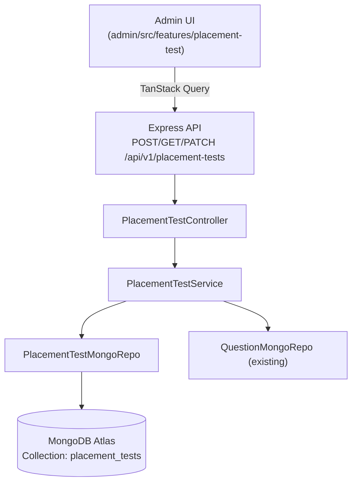

# IMPLEMENTATION PLAN: PLACEMENT TEST MANAGEMENT

> **Feature:** Quản lý Bài Kiểm tra Đầu vào (Placement Test) — Admin UI  
> **Phân loại:** Full-stack feature (Backend API + Admin UI)  
> **Vị trí Admin:** `Đào tạo → Ngân hàng Câu hỏi → [Tab] Bài Kiểm tra Đầu vào`  
> **Cập nhật:** 04/03/2026

---

## 1. Architecture Overview



**Nguyên tắc phân tầng (bắt buộc):**
- **Controller** → Validate input (Zod) + gọi Service + `sendResponse`. Không có business logic.
- **Service** → Toàn bộ logic nghiệp vụ: versioning, pool validation, CEFR mapping. Là tầng duy nhất gọi nhiều repo.
- **Repository** → Chỉ thao tác Mongoose. Extend `BaseMongoRepository`.
- **Admin Feature** → Tailwind CSS + Shadcn/UI. TanStack Query cho server state. Không dùng CSS Modules.

---

## 2. Data Model

### MongoDB Collection: `placement_tests`

**File:** `server/src/models/mongo/placement-test.model.ts`

```typescript
// Enums
EPlacementTestStatus: 'draft' | 'active' | 'paused' | 'archived'
EModuleType: 'mcq' | 'essay' | 'speaking'
ECEFRLevel: 'A1' | 'A2' | 'B1' | 'B2' | 'C1' | 'C2'

// Schema chính
IPlacementTest {
  // Identity
  languageId: ObjectId               // ref: Language
  language: string                   // "en", "ja", "ko" — snapshot, không join
  name: string
  standard: string                   // "TOEIC", "JLPT", "TOPIK"...
  outputFramework: string            // "CEFR", "JF-Standard"...
  description?: string

  // Config
  status: EPlacementTestStatus
  version: number                    // auto-increment mỗi lần publish
  settings: {
    targetAudience: ('new_user' | 'retake' | 'invitation')[]
    allowRetake: boolean
    retakeCooldownDays: number
  }

  // Cấu trúc bài thi (polymorphic)
  modules: IPlacementTestModule[]    // theo thứ tự

  // Mapping điểm → CEFR
  cefrMapping: {
    weights: { mcq: number; writing: number; speaking: number }
    thresholds: {
      level: ECEFRLevel
      mcqMin: number; mcqMax: number
      writingMin: number; writingMax: number
      speakingMin: number; speakingMax: number
    }[]
  }

  // Audit
  createdBy: ObjectId
  updatedBy: ObjectId
  createdAt: Date
  updatedAt: Date
}

// Module MCQ
IModuleMCQ {
  order: number
  type: 'mcq'
  name: string
  timeLimitMinutes: number
  showCountdown: boolean
  allowBackNavigation: boolean
  adaptive: boolean
  samplingMode: 'random' | 'fixed'
  parts: {
    part: number
    name: string
    questionsCount: number        // số câu cần lấy
    poolTag: string               // VD: "toeic_p1" — match field `part` trong Question model
    difficultyDistribution: {     // object key = EQuestionDifficulty
      A1?: number; A2?: number; B1?: number; B2?: number; C1?: number; C2?: number
    }
    excludeRecentDays: number     // tránh trùng câu
    topicFilter?: string[]
  }[]
}

// Module Essay
IModuleEssay {
  order: number
  type: 'essay'
  name: string
  timeLimitMinutes: number
  aiModel: string                  // "gpt-5-mini"
  criteria: string[]               // ["TR", "CC", "LR", "GRA"]
  wordLimits: { low: number; mid: number; high: number }
  topicsByLevel: { low: string[]; mid: string[]; high: string[] }
  secureMode: { disablePaste: boolean; disableSpellcheck: boolean }
  promptSource: 'ai_generated' | 'library'
}

// Module Speaking
IModuleSpeaking {
  order: number
  type: 'speaking'
  name: string
  totalMinutes: number
  conversationModel: string        // "gpt-4.1-mini"
  ttsModel: string
  ttsVoice: string
  gradingModel: string
  speechAnalytics: string         // "azure-ai-speech"
  silenceThresholdSeconds: number
  criteria: string[]
  parts: {
    warmupMinutes: number
    part1: { minutes: number; questionsRange: [number, number]; topics: string[] }
    part2: { minutes: number; prepSeconds: number; cueCards: { level: 'low'|'mid'|'high'; text: string }[] }
    part3: { minutes: number; questionsRange: [number, number] }
  }
}
```

**Index cần tạo:**
- `{ languageId: 1, status: 1 }` — list + filter
- `{ language: 1, status: 1 }` — quick lookup khi user đăng ký
- `{ version: -1 }` — version history

---

## 3. API Specification

**Base URL:** `/api/v1/placement-tests`

| Method | Endpoint | Mô tả | Auth |
|---|---|---|---|
| `GET` | `/` | Danh sách, filter theo `language`, `status` | Admin |
| `GET` | `/:id` | Chi tiết 1 bài thi | Admin |
| `POST` | `/` | Tạo mới (draft, `version = 1`) | Admin |
| `PUT` | `/:id` | Cập nhật (tạo version mới nếu publish) | Admin |
| `PATCH` | `/:id/status` | Đổi trạng thái (active/paused/archived) | Admin |
| `GET` | `/:id/versions` | Lịch sử phiên bản | Admin |
| `POST` | `/:id/rollback/:version` | Rollback về phiên bản cũ | Admin |
| `GET` | `/:id/pool-validation` | Kiểm tra pool câu hỏi có đủ không | Admin |
| `GET` | `/:id/analytics` | Thống kê lượt thi | Admin |

**Version Strategy:**
- `status = draft/paused`: PUT trực tiếp overwrite, version không đổi.
- `status = active` (publish): Service tạo document mới với `version + 1`, document cũ chuyển sang `archived`.

---

## 4. Zod Validation Schemas

**File:** `server/src/validations/placement-test.validation.ts`

```
createPlacementTestSchema — Validate toàn bộ payload tạo mới
updatePlacementTestSchema — Partial, dùng cho PUT /:id
updateStatusSchema — { status: enum } cho PATCH /:id/status
poolValidationQuerySchema — Query params: moduleIndex
analyticsQuerySchema — { range: '7d'|'30d'|'custom', from?, to? }
```

---

## 5. Triển Khai Backend — Thứ Tự Thực Hiện

### Step 1 — Model
- **File:** `server/src/models/mongo/placement-test.model.ts`
- Định nghĩa sub-schemas cho MCQ part, Essay, Speaking theo cấu trúc ở mục 2.
- Thêm `{ timestamps: true }`.
- Export `PlacementTestModel` và interface `IPlacementTest`.

### Step 2 — Repository
- **File:** `server/src/repositories/mongo/placement-test.mongo.repo.ts`
- Extend `BaseMongoRepository<IPlacementTest>`.
- Methods cần thêm:
  ```
  findAllWithFilters(filters)   → .lean().select(...)
  findVersionHistory(testId)    → Lấy tất cả version của 1 language/name
  findPoolStats(poolTag, languageId) → count published questions theo part tag
  ```

### Step 3 — Service
- **File:** `server/src/services/placement-test.service.ts`
- **Logic cốt lõi:**
  - `create(dto)` → Tạo draft `version = 1`.
  - `update(id, dto)` → Nếu test đang `active`: archive bản cũ, tạo bản mới `version + 1`. Ngược lại: overwrite.
  - `updateStatus(id, status)` → Khi chuyển sang `active`, gọi `validatePool()` trước — nếu fail thì throw `AppError`.
  - `validatePool(testId)` → Gọi `QuestionMongoRepo` để đếm câu published theo từng `poolTag`, so sánh với `questionsCount` × buffer ratio (tối thiểu × 2).
  - `getVersionHistory(testId)` → Truy vấn theo `language + name` group.
  - `rollback(id, version)` → Lấy archived version, duplicate thành draft mới.

### Step 4 — Controller
- **File:** `server/src/controllers/placement-test.controller.ts`
- Wrap tất cả methods bằng `catchAsync`.
- Chỉ validate, gọi service, `sendResponse`.

### Step 5 — Routes + Middleware
- **File:** `server/src/routes/placement-test.route.ts`
- Mount tại `app.ts`: `/api/v1/placement-tests`.
- Middleware chain: `authenticate → requireAdmin → validate(schema) → controller`.

---

## 6. Triển Khai Admin Frontend — Cấu Trúc Thư Mục

```
admin/src/features/placement-test/
├── api/
│   └── placement-test.api.ts         # Axios calls — mirror API spec
├── hooks/
│   ├── usePlacementTests.ts          # useQuery: danh sách
│   ├── usePlacementTest.ts           # useQuery: chi tiết theo id
│   ├── useCreatePlacementTest.ts     # useMutation: tạo mới
│   ├── useUpdatePlacementTest.ts     # useMutation: cập nhật
│   ├── useUpdateStatus.ts            # useMutation: đổi trạng thái
│   ├── usePoolValidation.ts          # useQuery: kiểm tra pool
│   ├── useVersionHistory.ts          # useQuery: lịch sử version
│   └── useAnalytics.ts               # useQuery: thống kê
├── components/
│   ├── PlacementTestTable/
│   │   └── PlacementTestTable.tsx    # Shadcn Table + filter bar
│   ├── StatusBadge/
│   │   └── StatusBadge.tsx           # Badge hiển thị active/draft/paused/archived
│   ├── wizard/
│   │   ├── WizardStepper.tsx         # Thanh bước 1-2-3-4 (Stepper Shadcn)
│   │   ├── Step1GeneralInfo.tsx      # React Hook Form + Zod
│   │   ├── Step2Structure/
│   │   │   ├── Step2Structure.tsx    # Container + DnD modules
│   │   │   ├── ModuleCard.tsx        # Wrapper draggable cho mỗi module
│   │   │   ├── MCQModuleForm.tsx     # Cấu hình MCQ + parts table
│   │   │   ├── EssayModuleForm.tsx   # Cấu hình Essay
│   │   │   └── SpeakingModuleForm.tsx # Cấu hình Speaking
│   │   ├── Step3QuestionBank.tsx     # Pool validation + topic config
│   │   └── Step4Preview/
│   │       ├── Step4Preview.tsx      # Summary + live preview
│   │       ├── PreviewSummary.tsx    # Checklist + validation status
│   │       ├── PreviewFrame.tsx      # Mock student UI
│   │       └── CEFRMappingModal.tsx  # Modal cấu hình trọng số + thresholds
│   ├── VersionHistoryModal/
│   │   └── VersionHistoryModal.tsx   # Table + rollback action
│   └── AnalyticsModal/
│       └── AnalyticsModal.tsx        # Stats: CEFR distribution, skill scores
├── pages/
│   ├── PlacementTestListPage/
│   │   └── PlacementTestListPage.tsx
│   └── PlacementTestWizardPage/
│       └── PlacementTestWizardPage.tsx
├── types/
│   └── index.ts                      # IPlacementTest, IModuleMCQ, IModuleEssay... (mirror server types)
├── constants/
│   └── index.ts                      # STANDARD_OPTIONS, CEFR_LEVELS, TTS_VOICES...
└── index.ts                          # Public API (export pages)
```

---

## 7. Triển Khai Frontend — Chi Tiết Từng Component

### 7.1 Type Definitions
**File:** `admin/src/features/placement-test/types/index.ts`
- Mirror đầy đủ các interface từ server: `IPlacementTest`, `IModuleMCQ`, `IModuleEssay`, `IModuleSpeaking`, `IPartConfig`, `ICEFRMapping`, v.v.
- Thêm types frontend-only: `IPlacementTestFilters`, `WizardFormState`.

### 7.2 API Layer
**File:** `admin/src/features/placement-test/api/placement-test.api.ts`
```typescript
// Các method cần implement:
placementTestApi.getAll(filters)
placementTestApi.getById(id)
placementTestApi.create(payload)
placementTestApi.update(id, payload)
placementTestApi.updateStatus(id, status)
placementTestApi.getVersionHistory(id)
placementTestApi.rollback(id, version)
placementTestApi.validatePool(id)
placementTestApi.getAnalytics(id, query)
```

### 7.3 TanStack Query Hooks
- `queryKey` convention: `['placement-tests', filters]`, `['placement-test', id]`, `['placement-test', id, 'versions']`.
- Mutation hooks dùng `onSuccess` để `invalidateQueries` đúng key.
- `usePoolValidation` có `enabled: !!testId && currentStep === 2` để chỉ gọi khi ở Step 3.

### 7.4 PlacementTestListPage
- **Header:** `PageHeader` component (Breadcrumb: Ngân hàng Câu hỏi / Bài Kiểm tra Đầu vào) + nút `[+ Tạo bài kiểm tra]`.
- **Filters:** `Input` tìm kiếm + `Select` ngôn ngữ + `Select` trạng thái — debounce 300ms.
- **Table:** Shadcn `DataTable` với columns: Ngôn ngữ (flag + code), Tên bài thi, `StatusBadge`, Phiên bản, Actions.
- **Actions:** Nút [Sửa] → navigate `/placement-tests/:id/edit`, [Xem] → analytics modal, DropdownMenu `[⋯]` → Version History / Duplicate / Archive.

### 7.5 PlacementTestWizardPage (4-Step Wizard)
**State Management:** `useState<WizardFormState>` local, persist to `localStorage` để không mất khi F5.

**Bước 1 — Step1GeneralInfo:**
- `react-hook-form` + `zodResolver`.
- Select ngôn ngữ (disabled nếu `status !== 'draft'`).
- Khi chọn ngôn ngữ → auto-suggest các chuẩn phổ biến.
- Checkboxes cho `targetAudience`, input `retakeCooldownDays`.

**Bước 2 — Step2Structure:**
- Drag-and-drop modules: dùng `@dnd-kit/core` (đã có trong admin deps hoặc cần install).
- Nút `[+ Thêm module]` mở `Dialog` chọn loại: MCQ / Essay / Speaking.
- Mỗi module render component form tương ứng:
  - `MCQModuleForm`: Bảng parts với inline edit cho `questionsCount`, nút [+] thêm part, [×] xóa.
  - `EssayModuleForm`: AI model select, criteria checkboxes, word limits, topic editor.
  - `SpeakingModuleForm`: TTS voice select + preview audio button, part duration inputs, cue card manager.

**Bước 3 — Step3QuestionBank:**
- Gọi `usePoolValidation` để hiển thị trạng thái pool cho từng part.
- Hiển thị warning badge đỏ nếu pool thiếu câu (dưới 2× questionsCount).
- `[Vào ngân hàng câu hỏi →]` mở tab mới tới trang Question Bank filter theo poolTag.
- Writing/Speaking topics: editable list per level.

**Bước 4 — Step4Preview:**
- **Cột trái:** `PreviewSummary` — checklist validation từng module, CEFR mapping weights.
- **Cột phải:** `PreviewFrame` — mock UI thí sinh, switcher giữa các module.
- `[Chỉnh sửa mapping]` mở `CEFRMappingModal` với bảng editable thresholds.
- Footer actions: `[Lưu nháp]` → save draft, `[Chạy thử]` → TODO Phase 2, `[🚀 Publish]` → gọi `updateStatus(active)`.

### 7.6 Version History Modal
- Table: version, timestamp, updatedBy, notes.
- `[Rollback về vX]` → confirm Dialog → gọi `rollback` mutation → toast success → navigate về wizard.

### 7.7 Analytics Modal
- Sử dụng `recharts` (đã có trong admin) để vẽ:
  - Bar chart: CEFR distribution.
  - Radar chart: điểm TB per skill.
- Summary cards: Tổng lượt / Hoàn thành / Tỉ lệ bỏ / Thời gian TB.
- Warning nếu dropout rate module Speaking cao.

---

## 8. Tích Hợp Navigation

**File cần sửa:** `admin/src/config/sidebar.config.ts`
- Thêm item `Bài Kiểm tra Đầu vào` dưới nhóm `Ngân hàng Câu hỏi`.

**File cần sửa:** `admin/src/app/router.tsx`
```typescript
// Thêm lazy routes:
const PlacementTestListPage = lazy(() => import('@/features/placement-test/pages/PlacementTestListPage/PlacementTestListPage'))
const PlacementTestWizardPage = lazy(() => import('@/features/placement-test/pages/PlacementTestWizardPage/PlacementTestWizardPage'))

// Routes:
{ path: '/placement-tests', element: <PlacementTestListPage /> }
{ path: '/placement-tests/create', element: <PlacementTestWizardPage mode="create" /> }
{ path: '/placement-tests/:id/edit', element: <PlacementTestWizardPage mode="edit" /> }
```

---

## 9. Thứ Tự Triển Khai (Execution Order)

```
PHASE 1 — Backend Foundation
─────────────────────────────
[ ] 1. Model: placement-test.model.ts
[ ] 2. Repository: placement-test.mongo.repo.ts
[ ] 3. Validation: placement-test.validation.ts (Zod schemas)
[ ] 4. Service: placement-test.service.ts
[ ] 5. Controller: placement-test.controller.ts
[ ] 6. Route: placement-test.route.ts + mount trong app.ts

PHASE 2 — Admin Frontend Core
──────────────────────────────
[ ] 7. Types: placement-test/types/index.ts
[ ] 8. API: placement-test.api.ts
[ ] 9. Hooks: tất cả useQuery/useMutation hooks
[ ] 10. Route + sidebar config

PHASE 3 — List Page
────────────────────
[ ] 11. StatusBadge component
[ ] 12. PlacementTestTable component
[ ] 13. PlacementTestListPage (filter + table + action dropdown)

PHASE 4 — Wizard (4 bước)
──────────────────────────
[ ] 14. WizardStepper + WizardFormState local state
[ ] 15. Step1GeneralInfo
[ ] 16. MCQModuleForm + EssayModuleForm + SpeakingModuleForm
[ ] 17. Step2Structure (DnD container)
[ ] 18. Step3QuestionBank (pool validation display)
[ ] 19. CEFRMappingModal
[ ] 20. PreviewFrame + PreviewSummary
[ ] 21. Step4Preview (full layout)
[ ] 22. PlacementTestWizardPage (kết nối 4 bước)

PHASE 5 — Modals & Polish
──────────────────────────
[ ] 23. VersionHistoryModal
[ ] 24. AnalyticsModal
[ ] 25. End-to-end test: tạo → publish → rollback → analytics
```

---

## 10. Dependencies Cần Kiểm Tra / Cài Thêm

| Package | Dùng cho | Có sẵn? |
|---|---|---|
| `@dnd-kit/core` + `@dnd-kit/sortable` | Drag-and-drop modules trong Step 2 | Cần kiểm tra |
| `recharts` | Analytics charts | Cần kiểm tra |
| `react-hook-form` | Form Steps 1-3 | Có sẵn (admin) |
| `zod` | Schema validation frontend | Có sẵn |
| `@tanstack/react-query` | Server state | Có sẵn |
| `shadcn/ui` (Dialog, Table, Badge, Select, Checkbox, Tabs) | UI components | Có sẵn |

---

## 11. Checklist Kiểm Tra Code (Pre-PR)

- [ ] Tất cả controller methods wrap trong `catchAsync`
- [ ] Tất cả GET query dùng `.lean()` và `.select()`
- [ ] Không có `any` trong TypeScript
- [ ] Zod schema validate trước khi vào controller
- [ ] Không dùng `console.log` — dùng `Logger.*`
- [ ] Secrets truy cập qua `config/env.ts`
- [ ] Admin routes lazy-loaded với `React.lazy`
- [ ] TanStack Query cho tất cả data fetching (không dùng `useEffect`)
- [ ] Không có Tailwind trong `/client`, không có CSS Modules trong `/admin`
- [ ] Interface `Props` explicit trên tất cả React components
