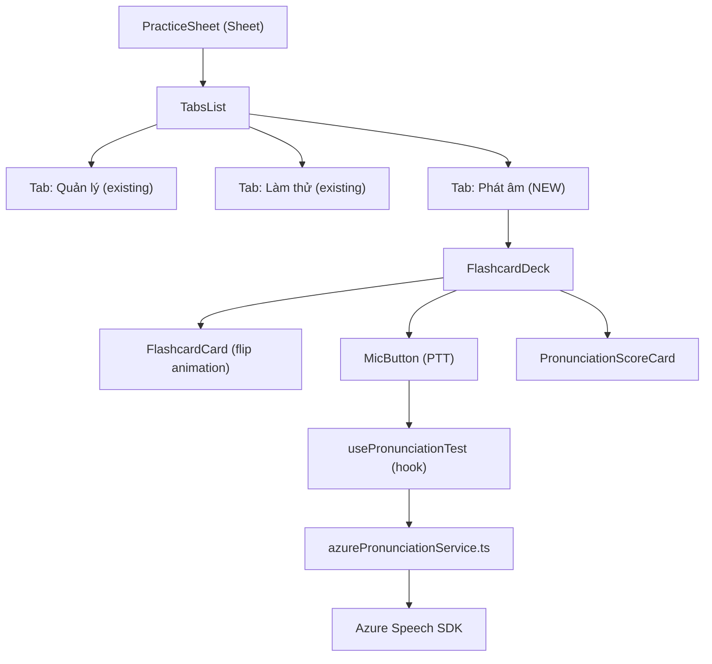
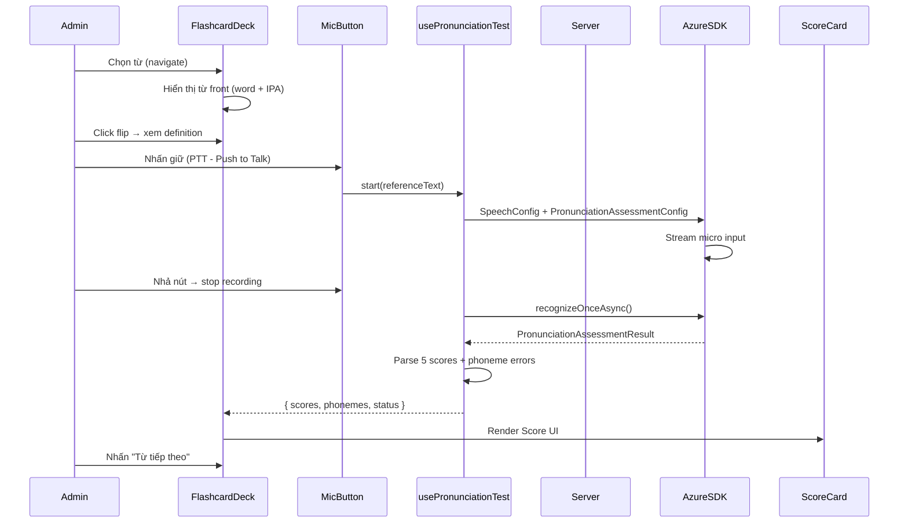

# Implementation Plan: Vocab Flashcard Pronunciation Test (Admin)

> **Vai trò:** Technical Architect & Planner (Unilish)
> **Feature:** Chức năng test đọc — chấm điểm phát âm từng từ vựng (Flashcard mode) trong VocabStudio
> **Ngày lập:** 2026-03-18
> **Tech Stack:** Azure Speech SDK (Pronunciation Assessment) + Admin React (Tailwind + Shadcn/UI)

---

## 1. Functional Overview

### Mục tiêu
Admin cần kiểm tra chất lượng từng từ vựng trong bài học trước khi publish. Chức năng cho phép:
1. **Flip từng flashcard** để xem thông tin từ vựng (word, IPA, definition, audio)
2. **Nhấn mic → Đọc từ** → Hệ thống chấm điểm phát âm theo 5 chỉ số của Azure Speech SDK
3. **Xem kết quả ngay lập tức** trên Score Card với từng phoneme được tô màu theo độ chính xác

### User Personas
- **Admin / Content Creator** — Người tạo và review nội dung từ vựng
- **Academic Lead** — Người verify chất lượng trước khi học sinh học

### Tích hợp vào codebase hiện tại
- Mount trong **`PracticeSheet.tsx`** — Tab mới `"Đọc"` (pronunciation test)
- Hoặc mở từ **`VocabReviewEditor`** — Nút "Test phát âm" trên từng VocabItem
- **Quyết định:** Thêm Tab `"Phát âm"` vào `PracticeSheet.tsx` (nhất quán với UX hiện tại)

---

## 2. Architecture & Sequence Diagrams

### Component Architecture



### Sequence Diagram — Pronunciation Test Flow



---

## 3. Data Models

### Frontend Types (Thêm vào `course.types.ts`)

```typescript
// ─── Pronunciation Assessment Types ──────────────────────────────────────────

export interface PhonemeScore {
    phoneme: string;       // IPA phoneme symbol: /æ/, /t/, /ɪ/
    accuracyScore: number; // 0–100
    errorType: 'None' | 'Omission' | 'Insertion' | 'Mispronunciation';
}

export interface WordPronunciationScore {
    word: string;
    accuracyScore: number;
    errorType: 'None' | 'Omission' | 'Insertion' | 'Mispronunciation' | 'UnexpectedBreak' | 'MissingBreak';
    phonemes: PhonemeScore[];
}

export interface PronunciationAssessmentResult {
    accuracyScore: number;      // 0–100 — phoneme accuracy
    fluencyScore: number;       // 0–100 — natural flow
    prosodyScore: number;       // 0–100 — stress & intonation
    completenessScore: number;  // 0–100 — % of words spoken
    pronunciationScore: number; // Weighted overall
    words: WordPronunciationScore[];
    recognizedText: string;
}

export type PronunciationTestStatus =
    | 'idle'
    | 'recording'
    | 'processing'
    | 'done'
    | 'error';
```

### Server — Azure Token Endpoint

```typescript
// server/src/controllers/azure-speech.controller.ts

// Response shape:
interface AzureSpeechTokenResponse {
    token: string;      // Azure cognitive services token
    region: string;     // e.g. "eastus"
    expiresInSeconds: number; // 600 (10 min)
}
```

---

## 4. API Specification

### 4.1 GET /api/v1/azure-speech/token

> Admin cần lấy Azure token từ server để gọi Azure SDK phía client (không expose key).

- **Method:** `GET`
- **Auth:** Bearer JWT (Admin only)
- **Rate Limit:** 30 req/min per user (Redis)
- **Response:**
```json
{
  "token": "aHR0cHM6...",
  "region": "eastasia",
  "expiresInSeconds": 600
}
```
- **Zod schema (server validation):** N/A (no body, query validated at middleware)

### Note về Azure Auth Strategy

```
Client (Admin Browser)
    ↓ GET /api/v1/azure-speech/token (JWT protected)
Server (Node.js)
    ↓ POST https://eastasia.api.cognitive.microsoft.com/sts/v1.0/issueToken
    ↓  Header: Ocp-Apim-Subscription-Key: ${AZURE_SPEECH_KEY}
Azure Cognitive Services
    → Returns: Bearer Token (TTL 10 min)
Client receives token → uses with Azure Speech SDK directly
```

---

## 5. Implementation Workflow — Step by Step

### Phase 1: Backend — Azure Token Proxy (2 files)

#### Step 1.1 — Thêm ENV vars vào `config/env.ts`

```typescript
// Thêm vào Zod schema validation:
AZURE_SPEECH_KEY: z.string().min(1),
AZURE_SPEECH_REGION: z.string().min(1),
```

#### Step 1.2 — Tạo `controllers/azure-speech.controller.ts`

```typescript
import { catchAsync } from '../utils/catch-async';
import { AppError } from '../utils/app-error';
import axios from 'axios';
import { env } from '../config/env';

export const getAzureSpeechToken = catchAsync(async (req, res) => {
    const tokenUrl = `https://${env.AZURE_SPEECH_REGION}.api.cognitive.microsoft.com/sts/v1.0/issueToken`;

    const { data: token } = await axios.post<string>(tokenUrl, null, {
        headers: { 'Ocp-Apim-Subscription-Key': env.AZURE_SPEECH_KEY },
    });

    if (!token) throw new AppError('Could not fetch Azure Speech token', 502);

    res.json({
        token,
        region: env.AZURE_SPEECH_REGION,
        expiresInSeconds: 600,
    });
});
```

#### Step 1.3 — Thêm route vào `routes/azure-speech.routes.ts`

```typescript
import { Router } from 'express';
import { authMiddleware } from '../middlewares/auth.middleware';
import { adminGuard } from '../middlewares/admin.middleware';
import { getAzureSpeechToken } from '../controllers/azure-speech.controller';

const router = Router();
router.use(authMiddleware, adminGuard);
router.get('/token', getAzureSpeechToken);

export default router;
```

*Mount trong `app.ts`: `app.use('/api/v1/azure-speech', azureSpeechRouter)`*

---

### Phase 2: Admin — Service Layer

#### Step 2.1 — Tạo `lib/azure-speech.ts` (Admin)

```typescript
// admin/src/lib/azure-speech.ts
// Wrapper khởi tạo Azure SpeechSDK với token từ server

import * as SpeechSDK from 'microsoft-cognitiveservices-speech-sdk';

export interface AzureTokenResponse {
    token: string;
    region: string;
}

export function createSpeechConfigFromToken(
    { token, region }: AzureTokenResponse
): SpeechSDK.SpeechConfig {
    const config = SpeechSDK.SpeechConfig.fromAuthorizationToken(token, region);
    config.speechRecognitionLanguage = 'en-US';
    return config;
}

export function createPronunciationConfig(referenceText: string): SpeechSDK.PronunciationAssessmentConfig {
    return new SpeechSDK.PronunciationAssessmentConfig(
        referenceText,
        SpeechSDK.PronunciationAssessmentGradingSystem.HundredMark,
        SpeechSDK.PronunciationAssessmentGranularity.Phoneme,
        true, // enableMiscue
    );
}
```

#### Step 2.2 — Tạo `api/azure-speech.api.ts` (Admin)

```typescript
// admin/src/features/curriculum/courses/api/azure-speech.api.ts

import { adminApi } from '@/lib/axios'; // Axios instance với JWT

export const fetchAzureSpeechToken = async (): Promise<AzureTokenResponse> => {
    const { data } = await adminApi.get<AzureTokenResponse>('/azure-speech/token');
    return data;
};
```

---

### Phase 3: Admin — Hook

#### Step 3.1 — Tạo `hooks/usePronunciationTest.ts`

```typescript
// PracticeSheet/hooks/usePronunciationTest.ts

import { useState, useRef, useCallback } from 'react';
import * as SpeechSDK from 'microsoft-cognitiveservices-speech-sdk';
import { useQuery } from '@tanstack/react-query';
import { fetchAzureSpeechToken } from '../../../../api/azure-speech.api';
import { createSpeechConfigFromToken, createPronunciationConfig } from '@/lib/azure-speech';
import type { PronunciationAssessmentResult, PronunciationTestStatus } from '../../../../types/course.types';

const AZURE_TOKEN_QUERY_KEY = ['azure-speech', 'token'] as const;

export function usePronunciationTest() {
    const [status, setStatus] = useState<PronunciationTestStatus>('idle');
    const [result, setResult] = useState<PronunciationAssessmentResult | null>(null);
    const [error, setError] = useState<string | null>(null);
    const recognizerRef = useRef<SpeechSDK.SpeechRecognizer | null>(null);

    // Token fetched via TanStack Query → cached 9 min (Azure TTL = 10 min)
    const { data: tokenData, refetch: refetchToken } = useQuery({
        queryKey: AZURE_TOKEN_QUERY_KEY,
        queryFn: fetchAzureSpeechToken,
        staleTime: 9 * 60 * 1000,
        retry: 1,
        enabled: false, // lazy — only fetch when test starts
    });

    const startTest = useCallback(async (referenceText: string) => {
        setStatus('recording');
        setResult(null);
        setError(null);

        try {
            // Ensure token is fresh
            const token = tokenData ?? (await refetchToken()).data;
            if (!token) throw new Error('Cannot get Azure token');

            const speechConfig = createSpeechConfigFromToken(token);
            const pronunciationConfig = createPronunciationConfig(referenceText);
            const audioConfig = SpeechSDK.AudioConfig.fromDefaultMicrophoneInput();

            const recognizer = new SpeechSDK.SpeechRecognizer(speechConfig, audioConfig);
            pronunciationConfig.applyTo(recognizer);
            recognizerRef.current = recognizer;

            recognizer.recognizeOnceAsync((recognitionResult) => {
                setStatus('processing');

                const assessment = SpeechSDK.PronunciationAssessmentResult.fromResult(recognitionResult);

                const mapped: PronunciationAssessmentResult = {
                    accuracyScore: assessment.accuracyScore,
                    fluencyScore: assessment.fluencyScore,
                    prosodyScore: assessment.prosodyScore,
                    completenessScore: assessment.completenessScore,
                    pronunciationScore: assessment.pronunciationScore,
                    recognizedText: recognitionResult.text,
                    words: (assessment.detailResult?.Words ?? []).map((w) => ({
                        word: w.Word,
                        accuracyScore: w.PronunciationAssessment?.AccuracyScore ?? 0,
                        errorType: w.PronunciationAssessment?.ErrorType ?? 'None',
                        phonemes: (w.Phonemes ?? []).map((p) => ({
                            phoneme: p.Phoneme,
                            accuracyScore: p.PronunciationAssessment?.AccuracyScore ?? 0,
                            errorType: p.PronunciationAssessment?.ErrorType ?? 'None',
                        })),
                    })),
                };

                setResult(mapped);
                setStatus('done');
                recognizer.close();
            });
        } catch (err) {
            setError(err instanceof Error ? err.message : 'Lỗi không xác định');
            setStatus('error');
        }
    }, [tokenData, refetchToken]);

    const stopTest = useCallback(() => {
        recognizerRef.current?.stopContinuousRecognitionAsync();
    }, []);

    const reset = useCallback(() => {
        setStatus('idle');
        setResult(null);
        setError(null);
    }, []);

    return { status, result, error, startTest, stopTest, reset };
}
```

---

### Phase 4: Admin — UI Components

#### Step 4.1 — Cấu trúc thư mục mới

```
PracticeSheet/
├── ManageTab.tsx              (existing)
├── TryTab.tsx                 (existing)
├── PracticeSheet.tsx          (update — thêm tab "Phát âm")
├── hooks/
│   ├── usePracticeQuiz.ts     (existing)
│   └── usePronunciationTest.ts  ← MỚI
├── quiz/
│   ├── MCQuiz.tsx             (existing)
│   ├── FillQuiz.tsx           (existing)
│   └── MatchQuiz.tsx          (existing)
└── pronunciation/             ← MỚI — Toàn bộ pronunciation UI
    ├── PronounceTab.tsx        ← Container chính
    ├── FlashcardDeck.tsx       ← Điều hướng + layout
    ├── FlashcardCard.tsx       ← Flip card animation
    ├── MicButton.tsx           ← PTT Button với 5 trạng thái
    └── PronunciationScoreCard.tsx ← Hiển thị kết quả Azure
```

---

#### Step 4.2 — `pronunciation/FlashcardCard.tsx`

```tsx
// Flip card hiển thị thông tin từ vựng
// Front: word, IPA, audio player mini
// Back: definitionNative, definitionEn, exampleSentence

interface FlashcardCardProps {
    item: VocabItem;
    isFlipped: boolean;
    onFlip: () => void;
}
```

**UI specs:**
- Card có `perspective: 1000px`, dùng CSS `rotateY(180deg)` cho flip animation
- Front: từ lớn (text-3xl font-bold), IPA (text-sm text-muted-foreground), nút play audio
- Back: definition tiếng Việt, định nghĩa English, ví dụ câu

---

#### Step 4.3 — `pronunciation/MicButton.tsx`

```tsx
// 5 trạng thái: idle | recording | processing | done | error
// Dùng onMouseDown/onMouseUp cho PTT hoặc toggle click

interface MicButtonProps {
    status: PronunciationTestStatus;
    onStart: () => void;
    onStop: () => void;
}
```

**Status mapping:**

| Status | Icon | Color | Label |
|--------|------|-------|-------|
| `idle` | `Mic` | emerald | "Nhấn để đọc" |
| `recording` | `MicOff` + pulse ring | red | "Đang ghi…" |
| `processing` | `Loader2` spin | amber | "Đang phân tích…" |
| `done` | `CheckCircle2` | emerald | "Đọc lại" |
| `error` | `AlertTriangle` | red | "Thử lại" |

---

#### Step 4.4 — `pronunciation/PronunciationScoreCard.tsx`

```tsx
// Hiển thị 5 chỉ số Azure + phoneme breakdown
// Score circle dùng SVG stroke + color gradient

interface PronunciationScoreCardProps {
    result: PronunciationAssessmentResult;
    referenceText: string;
}
```

**Layout:**
```
┌─────────────────────────────────────────┐
│  Overall: 87 / 100                       │
│  ● Accuracy   92  ● Fluency    85        │
│  ● Prosody    80  ● Completeness 95     │
├─────────────────────────────────────────┤
│  Word breakdown:                         │
│  [beautiful] → Acc: 94  ← tô xanh       │
│    /b/ 98  /juː/ 90  /tɪ/ 72  ← màu    │
│  [pronunciation] → Acc: 52 ← đỏ         │
│    /p/ 90  /r/ 45  /ə/ 38  ← đỏ         │
└─────────────────────────────────────────┘
```

**Color coding logic:**
- `score >= 80` → `text-emerald-600` (xanh — tốt)
- `score >= 60` → `text-amber-500` (vàng — trung bình)
- `score < 60` → `text-red-500` (đỏ — yếu)

---

#### Step 4.5 — `pronunciation/FlashcardDeck.tsx`

```tsx
// Container quản lý state: currentIndex, isFlipped, navigation
// Layout: [← Trước] [Card] [Sau →] + MicButton + ScoreCard

interface FlashcardDeckProps {
    items: VocabItem[];
}
```

**Logic:**
- `currentIndex` → navigate qua items
- Mỗi khi chuyển từ → reset: `isFlipped = false`, `reset()` hook
- `referenceText` = `items[currentIndex].word`

---

#### Step 4.6 — `pronunciation/PronounceTab.tsx`

```tsx
// Entry point của tab
// Empty state nếu không có items
// Render FlashcardDeck nếu có

interface PronounceTabProps {
    items: VocabItem[];
}
```

---

#### Step 4.7 — Cập nhật `PracticeSheet.tsx`

Thêm tab thứ 3: `"Phát âm"`. Truyền `items` từ props xuống `PronounceTab`.

```tsx
// PracticeSheet.tsx — cần nhận thêm prop: items: VocabItem[]
// hoặc fetch song song useVocabContent trong PracticeSheet

// Thêm TabsTrigger:
<TabsTrigger value="pronounce" disabled={items.length === 0}>
    Phát âm
    {items.length === 0 && (
        <span className="ml-1 text-[10px] text-muted-foreground">(chưa có từ)</span>
    )}
</TabsTrigger>

// Thêm TabsContent:
<TabsContent value="pronounce" className="mt-0 flex-1 overflow-hidden">
    <PronounceTab items={items} />
</TabsContent>
```

---

#### Step 4.8 — Cập nhật `VocabTopBar.tsx` để truyền `items`

Hiện tại `PracticeSheet` nhận `lessonId + passingScore`. Cần thêm `items: VocabItem[]`.

```typescript
// Thêm vào VocabTopBar Props:
interface Props {
    ...
    items: VocabItem[]; // ← Thêm để truyền xuống PracticeSheet
}

// VocabStudio truyền:
<VocabTopBar
    ...
    items={items}    // ← Thêm
/>

// VocabTopBar truyền xuống:
<PracticeSheet lessonId={lessonId} passingScore={passingScore} items={items} />
```

---

### Phase 5: Install Dependencies

```bash
# Admin — Azure Speech SDK (client-side browser bundle)
cd admin
npm install microsoft-cognitiveservices-speech-sdk

# Server — axios đã có (dùng để lấy Azure token)
# Không cần install thêm
```

---

## 6. Security & Constraints

| Vấn đề | Giải pháp |
|--------|-----------|
| Azure key bị lộ phía client | Server làm token proxy, client chỉ nhận JWT 10min |
| Token hết hạn giữa phiên | TanStack Query staleTime=9min, refetch tự động |
| Admin giả mạo call token | `adminGuard` middleware kiểm tra role |
| Microphone access bị từ chối | `usePronunciationTest` handle `NotAllowedError`, toast hướng dẫn |
| Audio < 1.5s → noise | Azure tự reject, `recognizedText` sẽ rỗng → hiển thị "Vui lòng nói rõ hơn" |

---

## 7. Compliance Checklist (Admin Stack)

| Rule | Status |
|------|--------|
| **Tailwind CSS** (Admin) | ✅ Toàn bộ UI dùng Tailwind |
| **Shadcn/UI** components | ✅ Dùng Sheet, Tabs, Badge, Button |
| **TanStack Query** cho Azure token | ✅ `useQuery` với staleTime |
| **TypeScript strict** — No `any` | ✅ Types khai báo đầy đủ |
| **Zod** validation ENV server | ✅ `AZURE_SPEECH_KEY`, `AZURE_SPEECH_REGION` |
| **catchAsync** bọc controller | ✅ |
| **Rate-limit** Azure token endpoint | ✅ Redis, 30 req/min |
| **No console.log** (Winston Logger) | ✅ |
| **Accessibility** aria-label mic btn | ✅ aria-label, aria-pressed |

---

## 8. Thứ Tự Triển Khai (Priority Order)

```
Phase 1 (Backend)     → ENV + Controller + Route                  → PR #1
Phase 2 (Admin Lib)   → azure-speech.ts + azure-speech.api.ts     → PR #2
Phase 3 (Hook)        → usePronunciationTest.ts                    → PR #3
Phase 4 (UI)          → pronunciation/ folder (5 components)       → PR #4
Phase 5 (Integration) → Update PracticeSheet + VocabTopBar         → PR #5
Phase 6 (Polish)      → Flip animation CSS, edge cases, tests      → PR #6
```

---

## 9. Out of Scope (Cho lần này)

- Lưu lịch sử điểm phát âm vào MongoDB
- So sánh điểm theo thời gian (progress tracking)
- Student-facing pronunciation test (chỉ Admin)
- Text-to-Phoneme (IPA) auto-generation từ Azure
