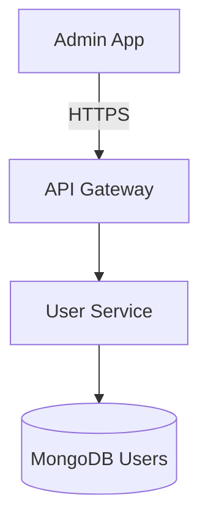
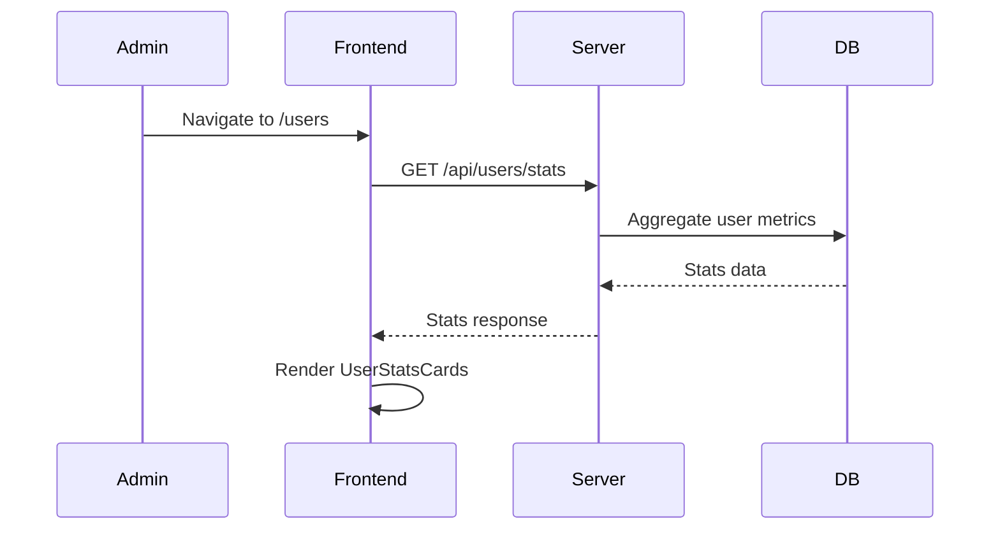
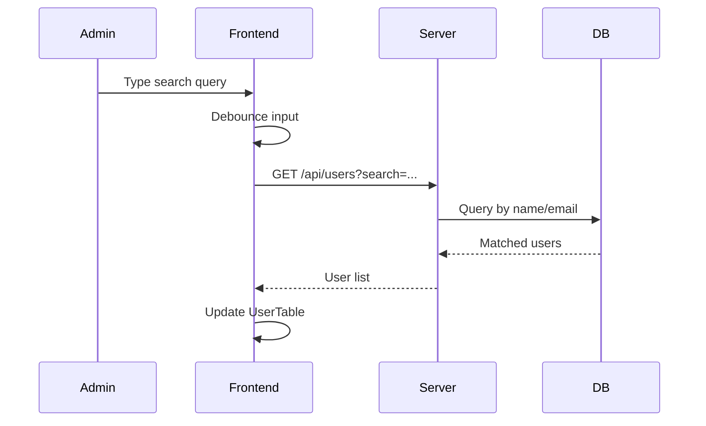
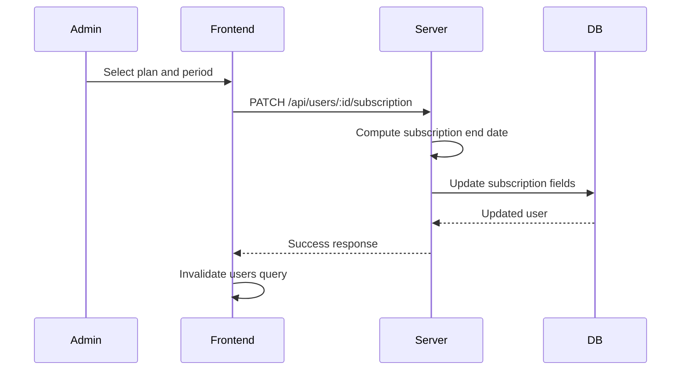
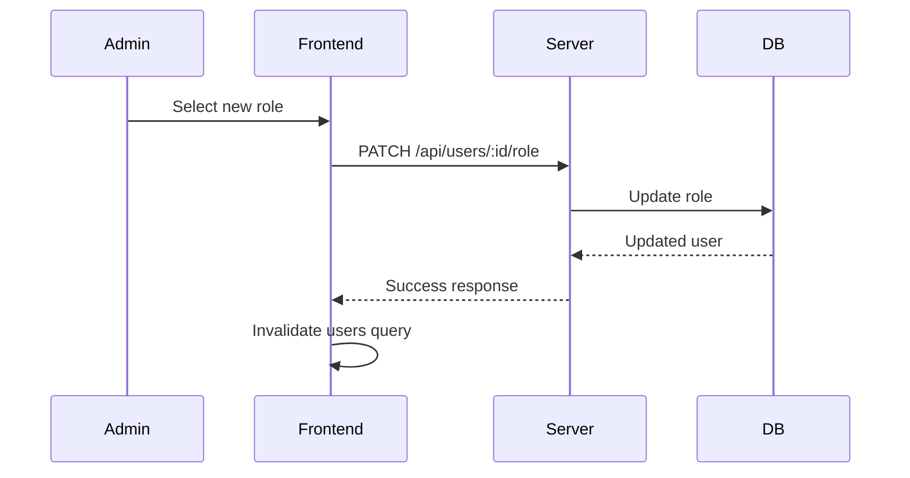
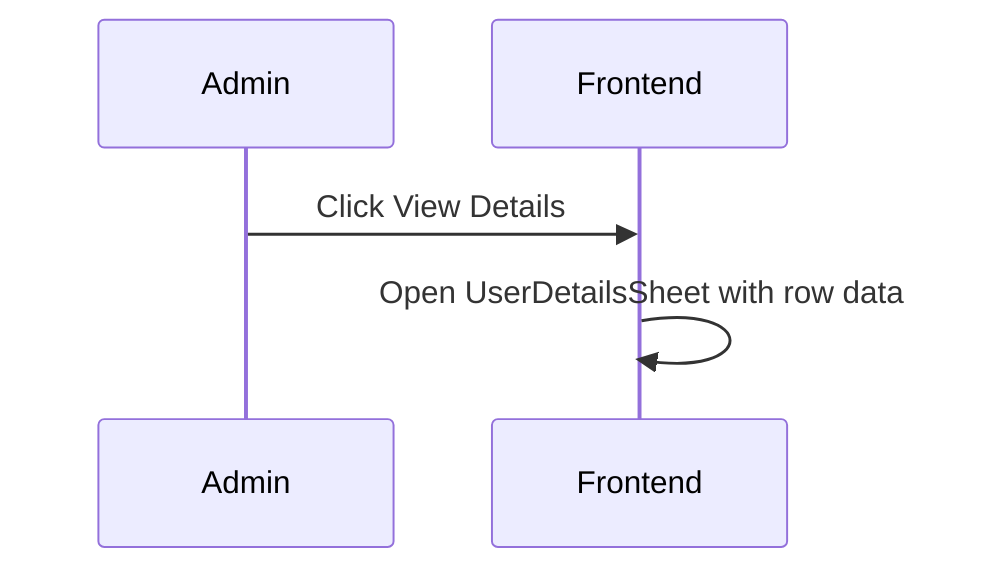

# User Management System Specification

## 1. Functional Overview
The User Management module is the administrative control center for managing users beyond basic CRUD.

- Goal: Provide reliable, auditable control over user accounts, roles, and subscriptions.
- Key Features:
	- User listing with pagination, search, and filters.
	- Detailed user profile view.
	- Subscription management (plan, status, period).
	- Role management (student, content_creator, admin).
	- Analytics dashboard (total, premium, new, active).
- User Personas: Admins, Operations.

---

## 2. Architecture & Workflows

### Component Diagram



### 2.1 Analytics Dashboard Flow



### 2.2 Search and Filter Flow



### 2.3 Update Subscription Flow



### 2.4 Update Role Flow



### 2.5 View User Details Flow



---

## 3. Data Models

### MongoDB Schema: `users`

| Field | Type | Description | Index |
| :--- | :--- | :--- | :--- |
| `email` | String | Unique user email | Yes (Unique) |
| `fullName` | String | User full name | Yes (Text) |
| `role` | Enum | `student` \| `content_creator` \| `admin` | Yes |
| `subscription.plan` | Enum | `FREE` \| `PLUS` \| `PRO` | Yes |
| `subscription.status` | Enum | `active` \| `expired` \| `cancelled` | Yes |
| `subscription.endDate` | Date | Subscription end date | Yes |
| `currentLevel` | Enum | `A1` to `C2` | Yes |
| `stats.streak` | Number | Consecutive active days | No |
| `createdAt` | Date | Account creation time | Yes |

---

## 4. API Specification

**Base URL**: `/api/users`

### 4.1 List Users
- Endpoint: `GET /`
- Query (Zod):
	```json
	{
		"page": 1,
		"limit": 20,
		"search": "nguyen",
		"role": "student",
		"plan": "PRO",
		"level": "B2"
	}
	```
- Response:
	```json
	{
		"users": [],
		"pagination": {
			"page": 1,
			"limit": 20,
			"total": 120
		}
	}
	```

### 4.2 User Stats
- Endpoint: `GET /stats`
- Response:
	```json
	{
		"totalUsers": 0,
		"premiumUsers": 0,
		"newToday": 0,
		"active24h": 0
	}
	```

### 4.3 Get User Details
- Endpoint: `GET /:id`
- Response:
	```json
	{
		"id": "...",
		"email": "...",
		"fullName": "...",
		"role": "student",
		"subscription": {
			"plan": "PRO",
			"status": "active",
			"endDate": "2026-12-31T00:00:00.000Z"
		}
	}
	```

### 4.4 Update Subscription
- Endpoint: `PATCH /:id/subscription`
- Body (Zod):
	```json
	{
		"plan": "PRO",
		"period": "P1Y"
	}
	```
- Response:
	```json
	{
		"message": "Subscription updated",
		"user": {}
	}
	```

### 4.5 Update Role
- Endpoint: `PATCH /:id/role`
- Body (Zod):
	```json
	{
		"role": "content_creator"
	}
	```
- Response:
	```json
	{
		"message": "Role updated",
		"user": {}
	}
	```

---

## 5. Implementation Workflow

1. Database Layer: Ensure indexes exist for `email`, `fullName`, `role`, and subscription fields.
2. Repository Layer: Implement optimized Mongo queries with `.select()` and `.lean()` for reads.
3. Service Layer: Compute subscription end dates and enforce role constraints.
4. Controller Layer: Validate inputs via Zod and return standardized responses.
5. Frontend: Use React Query for list, stats, and mutations with cache invalidation.

---

## 6. Security and Constraints

- Access Control: Admin-only endpoints; enforce role checks in auth middleware.
- Validation: All params, query, and body inputs validated with Zod schemas.
- Rate Limiting: Apply per admin user for list and mutation endpoints.
- Auditing: Log role and subscription changes with admin identity.
