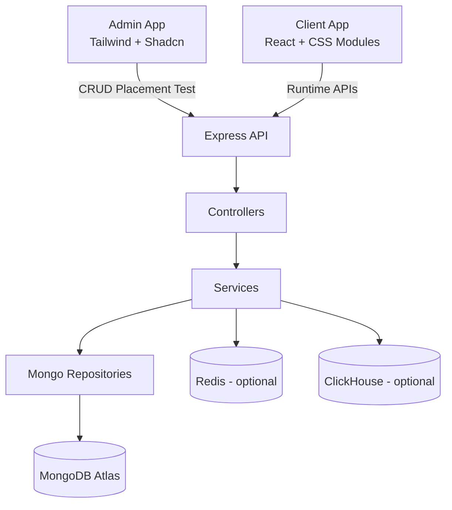
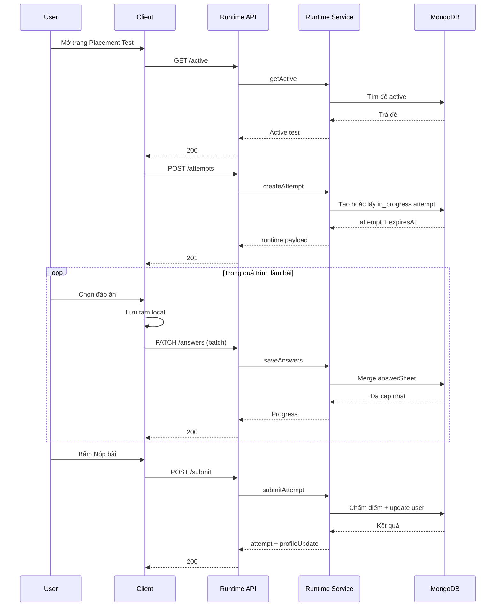
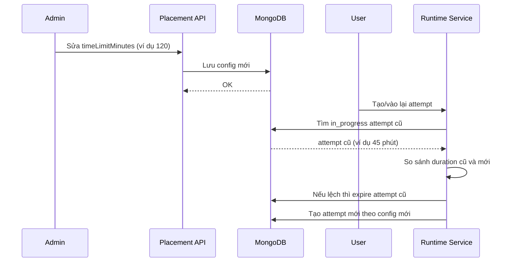

# UNILISH PLACEMENT TEST WORKFLOW

## 1. Tổng quan để thuyết trình
Placement Test trong Unilish là hệ thống đánh giá đầu vào để:
1. Xác định trình độ ban đầu của học viên theo CEFR.
2. Phát hiện kỹ năng yếu (listening, reading) để cá nhân hóa lộ trình học.
3. Đồng bộ kết quả về profile user để dùng xuyên suốt trong dashboard.

Tài liệu này được viết để giảng viên, PM, và thành viên mới có thể hiểu nhanh:
1. Hệ thống được thiết kế như thế nào.
2. Luồng dữ liệu chạy từ Admin sang Client ra sao.
3. Cơ chế tính giờ, lưu bài, resume, nộp bài và chấm điểm.
4. Các tình huống lỗi thực tế và cách hệ thống ứng xử.

## 2. Bài toán nghiệp vụ và giải pháp

### 2.1 Bài toán
1. Admin cần tạo nhiều đề thi theo ngôn ngữ và phiên bản.
2. Học viên cần thi an toàn, không mất bài khi mất mạng ngắn.
3. Hệ thống phải chấm điểm nhất quán, minh bạch.
4. Kết quả phải cập nhật vào hồ sơ người học ngay sau khi nộp.

### 2.2 Giải pháp tổng thể
1. Admin app quản lý cấu trúc đề thi.
2. Server tạo attempt runtime và quản lý vòng đời bài làm.
3. Client render bài thi, autosave theo lô, và nộp bài.
4. Server chấm điểm và map CEFR.

## 3. Kiến trúc hệ thống

### 3.1 Sơ đồ tổng quan


### 3.2 Vai trò từng kho dữ liệu
1. MongoDB:
   1. Lưu đề thi, modules, parts.
   2. Lưu attempt, answer sheet, scoring.
   3. Lưu profile user sau khi nộp bài.
2. Redis:
   1. Session/cache/queue nếu cần tối ưu thêm.
3. ClickHouse:
   1. Lưu log analytics khối lượng lớn.

## 4. Hai nhóm người dùng
1. Admin:
   1. Tạo và sửa đề thi.
   2. Đặt thời gian thi (ví dụ 120 phút).
   3. Kích hoạt phiên bản đề thi.
2. Học viên:
   1. Bắt đầu bài thi.
   2. Trả lời câu hỏi.
   3. Nộp bài và nhận kết quả.

## 5. Data model để hiểu nhanh

### 5.1 PlacementTest
Mục đích: Lưu cấu hình đề thi do Admin tạo.

Thuộc tính quan trọng:
1. language, name, version, status.
2. modules:
   1. module mcq có timeLimitMinutes.
   2. parts chứa questionsCount, poolTag, manualContent.
3. cefrMapping.thresholds để map điểm sang level.

Trạng thái:
1. draft -> active -> paused -> archived.

### 5.2 PlacementTestAttempt
Mục đích: Lưu bài làm thực tế của học viên.

Thuộc tính quan trọng:
1. userId, placementTestId, language.
2. status: in_progress, submitted, expired, cancelled.
3. startedAt, expiresAt, submittedAt.
4. runtimeSnapshot: bộ câu hỏi đã tạo cho lần thi này.
5. answerSheet: đáp án đã chọn + flag.
6. scoring: listeningCorrect, readingCorrect, mcqScoreNormalized, provisionalCefr.

## 6. API hợp đồng (contract)

### 6.1 Chuẩn response
Tất cả endpoint trả về theo envelope:
```json
{
  "status": "success",
  "code": 200,
  "message": "...",
  "data": {},
  "meta": {}
}
```

### 6.2 Runtime APIs cho học viên
Base route chính: /api/placement-tests/runtime

1. GET /active?language=en
   1. Lấy đề active theo ngôn ngữ.
   2. Lỗi thường gặp: 404 nếu chưa có đề active, 401 nếu hết phiên đăng nhập.

2. POST /attempts
   1. Input: { placementTestId }.
   2. Tạo hoặc resume attempt đang làm.
   3. Tự động tính expiresAt dựa trên timeLimitMinutes cấu hình.

3. GET /attempts/:attemptId
   1. Lấy lại bài thi đang làm (resume).
   2. Chỉ owner mới xem được.

4. PATCH /attempts/:attemptId/answers
   1. Input theo batch:
      ```json
      {
        "answers": [
          { "questionId": "...", "selectedOption": "A", "flagged": false }
        ]
      }
      ```
   2. Dùng để autosave đáp án theo lô.

5. POST /attempts/:attemptId/submit
   1. Chấm điểm và khóa bài làm.
   2. Cập nhật profile user.
   3. Trả về kết quả tóm tắt.

### 6.3 Admin APIs
Base route: /api/placement-tests

Nhóm chức năng:
1. CRUD đề thi.
2. Đổi trạng thái đề (active/paused).
3. Version history và rollback.
4. Pool validation và push-to-question-bank.

## 7. Luồng chính end-to-end

### 7.1 Luồng học viên làm bài


### 7.2 Luồng khi Admin đổi thời gian đề thi


## 8. Cơ chế tính thời gian (để giải thích khi thuyết trình)
1. Mỗi attempt có 2 mốc thời gian quan trọng:
   1. startedAt: lúc bắt đầu.
   2. expiresAt: hạn chót nộp bài.
2. Server tính expiresAt = startedAt + tổng timeLimitMinutes của module MCQ.
3. Client không tự quyết định thời gian thi, client chỉ đếm ngược theo expiresAt server trả về.
4. Nếu đồng hồ máy user sai, kết quả vẫn đúng vì server mới là nguồn sự thật.

## 9. Mất mạng, crash, out vào lại: hệ thống xử lý ra sao

### 9.1 Mất mạng tạm thời
1. Đáp án được giữ trong local state.
2. Hệ thống autosave theo lô (debounce), nếu lỗi thì retry theo backoff.
3. Khi mạng ổn định lại, hệ thống tiếp tục gửi lô pending.

### 9.2 Web bị refresh/crash
1. Các đáp án đã save trên server vẫn được giữ.
2. Các thay đổi vừa chọn nhưng chưa kịp flush có thể mất.
3. Khi mở lại trang, user resume từ answerSheet đã được lưu.

### 9.3 User out ra rồi vào lại
1. Nếu attempt còn hạn và status in_progress: tiếp tục thi.
2. Nếu attempt hết hạn: server đánh dấu expired và không cho ghi tiếp.

## 10. Cơ chế chấm điểm
1. Hệ thống tính đúng/sai riêng cho listening và reading.
2. Tổng hợp ra mcqScoreNormalized = totalCorrect / totalQuestions.
3. Đối chiếu bảng threshold để suy ra provisionalCefr.
4. Đánh dấu weakSkills nếu độ chính xác dưới ngưỡng (ví dụ < 0.6).

## 11. Bảo mật và toàn vẹn dữ liệu
1. Mọi endpoint runtime đều yêu cầu auth.
2. Validation input bằng Zod trước khi vào controller.
3. Ownership được enforce theo userId + attemptId.
4. Attempt đã submitted/expired thì không được update đáp án nữa.

## 12. Hiệu năng và độ ổn định
1. Read query tối ưu bằng select + lean.
2. Autosave theo batch để giảm tải API.
3. Query runtime tắt retry cho 401 để tránh spam request.
4. Có fallback thông báo lỗi rõ ràng cho 401/404/500.

## 13. Monitoring và báo cáo
Nên theo dõi các sự kiện:
1. placement_attempt_created.
2. placement_answer_saved.
3. placement_attempt_submitted.
4. placement_attempt_expired.

Các chỉ số báo cáo gợi ý:
1. Tỷ lệ hoàn thành bài thi.
2. Tỷ lệ bỏ bài theo part.
3. Điểm trung bình theo language/version.
4. Thời gian làm bài trung bình.

## 14. Test plan để bảo vệ chất lượng
1. Unit test:
   1. Công thức chấm điểm.
   2. CEFR mapping.
2. Integration test:
   1. active -> createAttempt -> saveAnswers -> submit.
   2. Kiểm tra ownership và auth.
3. Frontend test:
   1. Timer formatter.
   2. Mapper numbering/group/media.
   3. Submit flow có flush pending.

## 15. Kịch bản thuyết trình gợi ý (5-7 phút)
1. Mở đầu 30 giây:
   1. Trình bày bài toán: đánh giá đầu vào chính xác và an toàn dữ liệu.
2. Kiến trúc 1.5 phút:
   1. Admin tạo đề, Server quản lý attempt, Client thi và autosave.
3. Demo flow 2 phút:
   1. Start test.
   2. Chọn đáp án.
   3. Giả lập mất mạng ngắn.
   4. Resume và submit.
4. Chấm điểm 1 phút:
   1. Giải thích normalized score và CEFR mapping.
5. Kết 1 phút:
   1. Nhấn mạnh các điểm mạnh: reliability, security, extensibility.

## 16. Implementation anchors (để đối chiếu code)
Server:
1. server/src/routes/placement-test-runtime.route.ts
2. server/src/controllers/placement-test-runtime.controller.ts
3. server/src/services/placement-test-runtime.service.ts
4. server/src/validations/placement-test-runtime.validation.ts
5. server/src/models/mongo/placement-test-attempt.model.ts

Client:
1. client/src/features/dashboard/placement-test/pages/ListeningReading/ListeningReading.tsx
2. client/src/features/dashboard/placement-test/hooks/use-active-placement-test-query.ts
3. client/src/features/dashboard/placement-test/hooks/use-create-placement-attempt-query.ts
4. client/src/features/dashboard/placement-test/hooks/use-save-placement-answers-mutation.ts
5. client/src/features/dashboard/placement-test/hooks/use-submit-placement-attempt-mutation.ts
6. client/src/features/dashboard/placement-test/utils/question-mapper.ts