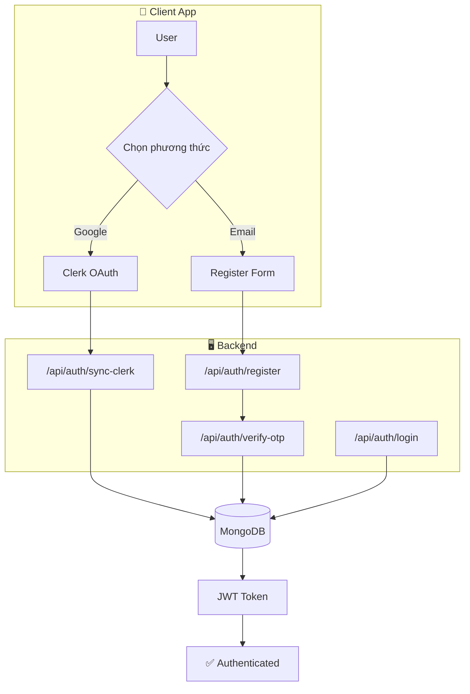

# Hệ thống Xác thực (Authentication)

## 1. Tổng quan

Unilish sử dụng **Hybrid Authentication System** để phục vụ các loại người dùng khác nhau.

| Loại User | Phương thức chính | Phương thức phụ | Provider |
|-----------|-------------------|-----------------|----------|
| **Student** | Google OAuth | Email/Password (OTP) | Clerk + Custom JWT |
| **Admin** | Email/Password | Không có | Custom JWT |

---

## 2. Yêu cầu chức năng

### A. Client (Học viên)
*   **Tiện lợi**: Đăng nhập một chạm qua Google (xử lý bởi **Clerk**).
*   **Truyền thống**: Đăng nhập Email/Password cho user không dùng Google.
*   **Bảo mật**: Đăng ký Email/Password phải xác thực OTP 6 số qua Email.
*   **Đồng bộ**: User Google và Email cùng địa chỉ được liên kết tự động (Account Linking).

### B. Admin (CMS)
*   **Truy cập nghiêm ngặt**: Không OAuth, chỉ Email/Password.
*   **RBAC**: Chỉ user có `role: 'admin'` hoặc `'content_creator'` được truy cập.
*   **Persistence**: Session lưu trong localStorage.

---

## 3. Kiến trúc hệ thống

### Components
1.  **Clerk**: Xử lý OAuth Google, session management.
2.  **JWT**: Token chuẩn hóa nội bộ. Server chỉ verify 1 loại token.
3.  **n8n**: Gửi email OTP tự động, tách biệt khỏi core server.

---

## 4. File Structure (Quick Reference)

### Server (`/server`)
| File | Chức năng | Link |
|------|-----------|------|
| `services/auth.service.ts` | Business logic (hash, JWT, OTP) | [View](file:///Users/nguyenlehuy/Downloads/unilish/server/src/services/auth.service.ts) |
| `controllers/auth.controller.ts` | HTTP handlers | [View](file:///Users/nguyenlehuy/Downloads/unilish/server/src/controllers/auth.controller.ts) |
| `routes/auth.route.ts` | Route definitions | [View](file:///Users/nguyenlehuy/Downloads/unilish/server/src/routes/auth.route.ts) |
| `middlewares/auth.middleware.ts` | `protect`, `restrictTo` | [View](file:///Users/nguyenlehuy/Downloads/unilish/server/src/middlewares/auth.middleware.ts) |

### Client (`/client`)
| File | Chức năng | Link |
|------|-----------|------|
| `features/auth/hooks/useGoogleAuth.ts` | Sync Clerk với backend | [View](file:///Users/nguyenlehuy/Downloads/unilish/client/src/features/auth/hooks/useGoogleAuth.ts) |
| `features/auth/hooks/useTraditionalAuth.ts` | Register, Login, OTP | [View](file:///Users/nguyenlehuy/Downloads/unilish/client/src/features/auth/hooks/useTraditionalAuth.ts) |
| `features/auth/components/AuthGuard.tsx` | Route protection | [View](file:///Users/nguyenlehuy/Downloads/unilish/client/src/features/auth/components/AuthGuard.tsx) |

### Admin (`/admin`)
| File | Chức năng | Link |
|------|-----------|------|
| `features/auth/hooks/useAuth.ts` | Login mutation | [View](file:///Users/nguyenlehuy/Downloads/unilish/admin/src/features/auth/hooks/useAuth.ts) |

---

## 5. Bảo mật

| Khía cạnh | Triển khai |
|-----------|------------|
| Password Hashing | Bcrypt (10 salt rounds) |
| OTP Security | OTP được hash trong DB |
| Token Expiry | JWT 7 ngày |
| Route Guards | Clerk + Local Token |
| Validation | Zod schemas |

---

## 6. API Endpoints

| Method | Endpoint | Mô tả | Auth |
|--------|----------|-------|------|
| POST | `/api/auth/register` | Đăng ký + gửi OTP | ❌ |
| POST | `/api/auth/verify-otp` | Xác thực OTP | ❌ |
| POST | `/api/auth/login` | Đăng nhập | ❌ |
| POST | `/api/auth/sync-clerk` | Sync user từ Clerk | ❌ |

---

*Cập nhật: 2026-01-06*
