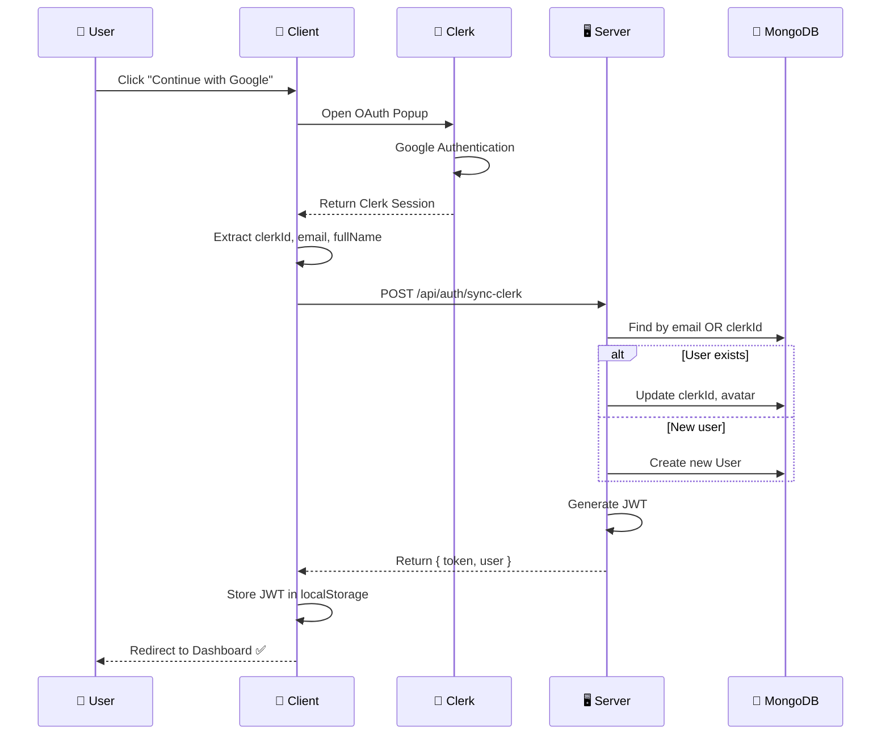
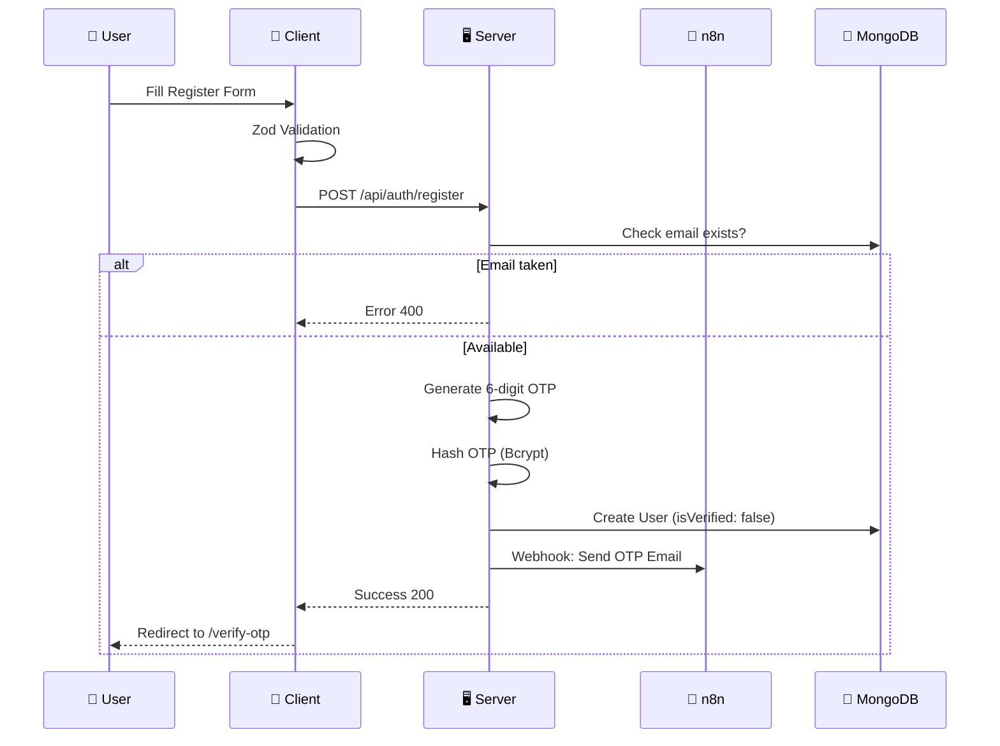
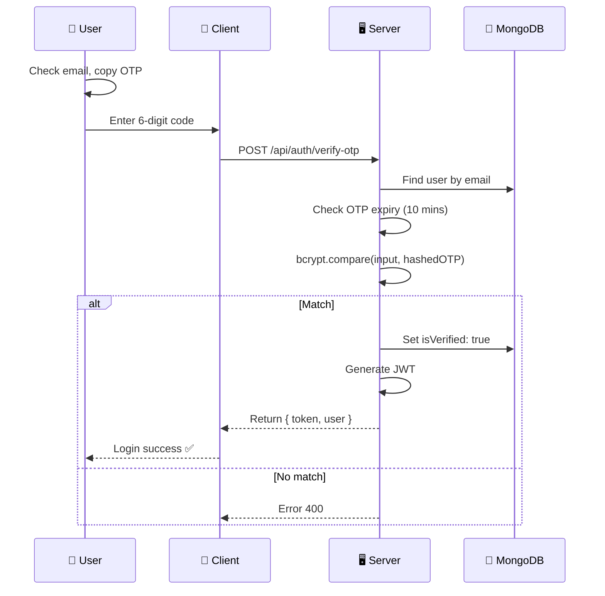
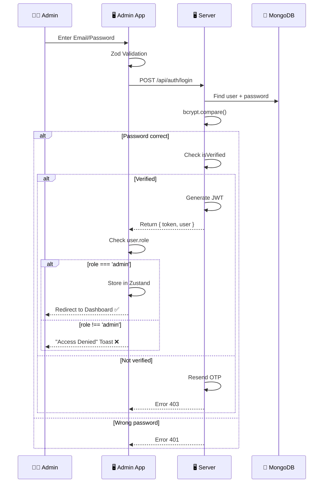

# Luồng hoạt động Authentication

Tài liệu này mô tả chi tiết các luồng xác thực trong hệ thống.

---

## 1. Google Login Flow (Client)

### Code Files
| Step | File | Function |
|------|------|----------|
| 1-3 | [useGoogleAuth.ts](file:///Users/nguyenlehuy/Downloads/unilish/client/src/features/auth/hooks/useGoogleAuth.ts) | Clerk integration |
| 4-5 | [auth-api.ts](file:///Users/nguyenlehuy/Downloads/unilish/client/src/features/auth/api/auth-api.ts) | `syncClerk()` |
| 6-10 | [auth.service.ts](file:///Users/nguyenlehuy/Downloads/unilish/server/src/services/auth.service.ts#L178-244) | `syncWithClerk()` |

---

## 2. Traditional Registration Flow (Client)

### Code Files
| Step | File | Function |
|------|------|----------|
| 2 | [auth.schema.ts](file:///Users/nguyenlehuy/Downloads/unilish/client/src/features/auth/types/auth.schema.ts) | `registerSchema` |
| 3 | [useTraditionalAuth.ts](file:///Users/nguyenlehuy/Downloads/unilish/client/src/features/auth/hooks/useTraditionalAuth.ts) | `register()` |
| 4-10 | [auth.service.ts](file:///Users/nguyenlehuy/Downloads/unilish/server/src/services/auth.service.ts#L14-59) | `register()` |
| 9 | [email.service.ts](file:///Users/nguyenlehuy/Downloads/unilish/server/src/services/email.service.ts) | `sendOTP()` |

---

## 3. OTP Verification Flow (Client)

### Code Files
| Step | File | Function |
|------|------|----------|
| 2-3 | [OTPForm.tsx](file:///Users/nguyenlehuy/Downloads/unilish/client/src/features/auth/components/OTPForm.tsx) | UI Component |
| 4-10 | [auth.service.ts](file:///Users/nguyenlehuy/Downloads/unilish/server/src/services/auth.service.ts#L61-111) | `verifyOTP()` |

---

## 4. Admin Login Flow (Admin Portal)

### Code Files
| Step | File | Function |
|------|------|----------|
| 1-3 | [LoginForm.tsx](file:///Users/nguyenlehuy/Downloads/unilish/admin/src/features/auth/components/LoginForm.tsx) | UI Component |
| 3 | [useAuth.ts](file:///Users/nguyenlehuy/Downloads/unilish/admin/src/features/auth/hooks/useAuth.ts) | Login mutation |
| 4-8 | [auth.service.ts](file:///Users/nguyenlehuy/Downloads/unilish/server/src/services/auth.service.ts#L113-168) | `login()` |

---

## 5. Key Technical Decisions

| Quyết định | Lý do |
|------------|-------|
| **Hybrid Auth** | Giảm rào cản (Google) + Duy trì accessibility (Email) |
| **JWT** | Stateless, scale tốt, hoạt động trên mobile/web |
| **Hashed OTP** | Bảo mật - DB leak không lộ OTP |
| **n8n Email** | Tách biệt email logic khỏi core server |

---

*Cập nhật: 2026-01-06*
