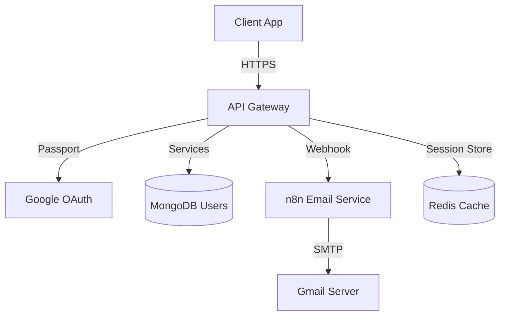

# Authentication System Specification (Unified)

## 1. Functional Overview
The system provides a **Self-Hosted Identity Management** solution for Unilish, designed for complete data ownership and security.

-   **Goal**: Full control over user data and session management without vendor lock-in.
-   **Key Features**:
    -   **Google OAuth 2.0**: Native implementation using `passport-google-oauth20`.
    -   **Local Auth**: Email/Password with Bcrypt hashing and OTP verification (powered by n8n).
    -   **Session Management**: Secure, stateless JWT-based authentication with HttpOnly cookies for refresh tokens.
-   **User Personas**: Students, Admins, Content Creators.

---

## 2. Architecture & Workflows

### Component Diagram

### 2.1 Google OAuth Flow

This flow allows users to sign in using their Google account.

1.  **User Action**: User clicks "Continue with Google" on the Client.
2.  **Redirect**: Client redirects user to `API_URL/auth/google`.
3.  **Passport Strategy**: Server redirects to Google's Consent Screen.
4.  **Callback**:
    *   Google redirects back to `API_URL/auth/google/callback` with an authorization code.
    *   Server exchanges code for user profile.
    *   **Logic**:
        *   If email exists: Update user info (Avatar/Name) & Link Account.
        *   If new: Create User with `authProvider: 'google'` and `isVerified: true`.
    *   **Session**: Server sets an `HttpOnly` cookie containing the JWT/Session Token.
5.  **Completion**: Server redirects Client to `/auth/success`.
6.  **Client Handling**:
    *   `/auth/success` page fetches user profile (`/api/users/me`) to verify session.
    *   On success, updates Global Auth Store (`Zustand`) and redirects to Dashboard.

### 2.2 Local Registration & OTP Flow

1.  **User Action**: User enters Email/Password/Name on Register Page.
2.  **Server Logic (`POST /register`)**:
    *   Hash Password (`bcrypt`).
    *   Generate 4-digit OTP.
    *   Create User with `isVerified: false`.
    *   **Trigger n8n**: Send OTP and Name to n8n Webhook for email delivery.
    *   **Workflow Template**: Please import `.agent/workflows/Client/Auth/n8n_otp_workflow.json` into your n8n instance.
3.  **Client Logic**: Redirect user to OTP Input Page.
4.  **Verification (`POST /verify-otp`)**:
    *   User submits Email + OTP.
    *   Server checks OTP validity (expiry & match).
    *   If valid: Set `isVerified: true`, clear OTP, and return JWT/Session.

---

## 3. Data Models

### MongoDB Schema: `User`

| Field | Type | Description |
| :--- | :--- | :--- |
| `email` | String | Unique Identifier (Index) |
| `googleId` | String | Google OAuth ID (Sparse Index) |
| `password` | String | Bcrypt hash (select: false) |
| `authProvider` | Enum | `local` \| `google` |
| `isVerified` | Boolean | Email verification status |
| `otp` | String | Hashed OTP (select: false) |
| `otpExpires` | Date | OTP Expiration Time |
| `role` | Enum | `student`, `admin`, `content_creator` |

---

## 4. API Specification

**Base URL**: `/api/v1/auth`

### 4.1 OAuth Routes
-   `GET /google`: Initiates Google OAuth flow (Passport).
-   `GET /google/callback`: Handles Google's response, manages interaction with `AuthService`, and sets session cookie.

### 4.2 Local Auth Routes
-   `POST /register`:
    -   Body: `{ email, password, fullName }`
    -   Response: `{ status: 'success', email }`
-   `POST /verify-otp`:
    -   Body: `{ email, otp }`
    -   Response: `{ message, token, user }`
-   `POST /login`:
    -   Body: `{ email, password }`
    -   Response: `{ user, token }`

---

## 5. Security & Configuration

### Environment Variables
-   **Client**:
    -   `VITE_API_URL`: Backend API URL (e.g., `http://localhost:5432/api`)
-   **Server**:
    -   `GOOGLE_CLIENT_ID`: From Google Cloud Console.
    -   `GOOGLE_CLIENT_SECRET`: From Google Cloud Console.
    -   `SESSION_SECRET`: Strong random string for signing session cookies.
    -   `JWT_SECRET`: Secret for signing JSON Web Tokens.
    -   `N8N_WEBHOOK_URL`: URL of the n8n webhook for sending emails.

### Security Best Practices
-   **HttpOnly Cookies**: Used for session/token storage to prevent XSS access.
-   **Secure Flag**: Enabled in production to ensure cookies are only sent over HTTPS.
-   **SameSite**: Set to `Lax` to prevent CSRF while allowing top-level navigation.
-   **Input Validation**: Strict Zod schemas for all API inputs.
-   **Password Hashing**: Bcrypt with adequate salt rounds (10).

---

## 6. Migration Guide (Summary)

This system completely replaces the previous third-party integration.

1.  **Backend**:
    -   Passport.js is configured for `GoogleStrategy`.
    -   `AuthService` handles `findOrCreateFromGoogle` logic.
    -   `express-session` manages session state.
2.  **Frontend**:
    -   Clerk SDK (`@clerk/clerk-react`) has been **completely removed**.
    -   `useAuthStore` (Zustand) manages global auth state.
    -   Google Login button is a direct link to the backend OAuth route.
    -   Auth state is rehydrated via `/api/users/me` on app load/callback.
