# Luồng hoạt động Upload Service

---

## 1. Image Upload Flow

```mermaid
sequenceDiagram
    participant U as 👤 User
    participant C as 📱 Client
    participant S as 🖥️ Server
    participant M as 📦 Multer
    participant CL as ☁️ Cloudinary

    U->>C: Select image file
    C->>C: Create FormData
    C->>S: POST /api/upload
    S->>M: Intercept multipart
    M->>M: Store in Memory (Buffer)
    M-->>S: req.file ready
    S->>S: Check MIME: image/*
    S->>CL: upload_stream(buffer)
    CL->>CL: Optimize (f_auto, q_auto)
    CL-->>S: secure_url
    S-->>C: { url, type: "image" }
    C-->>U: Display new image ✅
```



### Code Reference
| Step | File | Function/Line |
|------|------|---------------|
| 3 | [upload.route.ts](file:///Users/nguyenlehuy/Downloads/unilish/server/src/routes/upload.route.ts#L22) | Route definition |
| 4-6 | [upload.route.ts](file:///Users/nguyenlehuy/Downloads/unilish/server/src/routes/upload.route.ts#L10-15) | Multer config |
| 7-10 | [upload.service.ts](file:///Users/nguyenlehuy/Downloads/unilish/server/src/services/storage/upload.service.ts#L31-55) | `uploadImage()` |

---

## 2. Video/Audio Upload Flow

```mermaid
sequenceDiagram
    participant U as 👤 Admin
    participant C as 🖥️ Admin App
    participant S as 🖥️ Server
    participant R2 as 🪣 Cloudflare R2

    U->>C: Select video file
    C->>S: POST /api/upload
    S->>S: Check MIME: video/*
    S->>S: Generate UUID filename
    S->>R2: Multipart Upload
    R2-->>S: Upload complete
    S->>S: Construct public URL
    S-->>C: { url, type: "media" }
    C-->>U: Save URL to Lesson ✅
```



### Code Reference
| Step | File | Function/Line |
|------|------|---------------|
| 4-7 | [upload.service.ts](file:///Users/nguyenlehuy/Downloads/unilish/server/src/services/storage/upload.service.ts#L57-97) | `uploadMedia()` |

---

## 3. Key Code Snippets

### Cloudinary Upload (Image)
```typescript
// server/src/services/storage/upload.service.ts
static async uploadImage(file: Express.Multer.File): Promise<string> {
    return new Promise((resolve, reject) => {
        const uploadStream = cloudinary.uploader.upload_stream(
            {
                folder: 'unilish',
                resource_type: 'image',
                format: 'webp', // Auto convert to WebP
                transformation: [{ quality: 'auto', fetch_format: 'auto' }]
            },
            (error, result) => {
                if (error) return reject(error);
                resolve(result?.secure_url || '');
            }
        );
        uploadStream.end(file.buffer);
    });
}
```

### R2 Upload (Media)
```typescript
// server/src/services/storage/upload.service.ts
static async uploadMedia(file: Express.Multer.File): Promise<string> {
    const fileName = `${Date.now()}-${file.originalname}`;
    
    const upload = new Upload({
        client: r2Client,
        params: {
            Bucket: env.R2_BUCKET_NAME,
            Key: fileName,
            Body: file.buffer,
            ContentType: file.mimetype,
        },
    });
    
    await upload.done();
    return `${env.R2_PUBLIC_DOMAIN}/${fileName}`;
}
```

---

## 4. Technical Decisions

| Quyết định | Lý do |
|------------|-------|
| **Cloudflare R2** | S3 tính phí Egress (bandwidth). R2 = $0 Egress |
| **MemoryStorage** | Stateless server, không lưu temp files |
| **WebP Format** | Giảm 30% size so với JPEG/PNG |

---

*Cập nhật: 2026-01-06*
