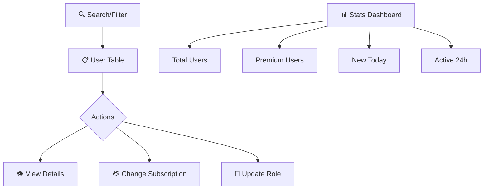

# Quản lý Người dùng (User Management)

## 1. Tổng quan

Module **User Management** là trung tâm quản trị user của nền tảng, cung cấp các chức năng vượt xa CRUD cơ bản.

---

## 2. Yêu cầu chức năng

| Chức năng | Mô tả |
|-----------|-------|
| **User Listing** | Pagination, Search, Filter (Plan/Level/Role) |
| **Detailed Profile** | Xem full thông tin user |
| **Subscription Control** | Upgrade/downgrade gói cước |
| **Role Management** | Phân quyền Student → Admin |
| **Analytics Dashboard** | Real-time metrics |

---

## 3. Data Mapping

| Business Term | Database Field | Values |
|---------------|----------------|--------|
| **Plan** | `subscription.plan` | `FREE`, `PLUS`, `PRO` |
| **Status** | `subscription.status` | `active`, `expired`, `cancelled` |
| **Role** | `role` | `student`, `content_creator`, `admin` |
| **Level** | `currentLevel` | `A1` → `C2` |
| **Engagement** | `stats.streak` | Số ngày liên tục |

---

## 4. File Structure

### Frontend (`/admin`)
| File | Chức năng | Link |
|------|-----------|------|
| `pages/users/UsersPage.tsx` | Page container | [View](file:///Users/nguyenlehuy/Downloads/unilish/admin/src/pages/users/UsersPage.tsx) |
| `features/users/components/UserTable.tsx` | Data table | [View](file:///Users/nguyenlehuy/Downloads/unilish/admin/src/features/users/components/UserTable.tsx) |
| `features/users/components/UserStatsCards.tsx` | Dashboard cards | [View](file:///Users/nguyenlehuy/Downloads/unilish/admin/src/features/users/components/UserStatsCards.tsx) |
| `features/users/components/UserDetailsSheet.tsx` | Detail modal | [View](file:///Users/nguyenlehuy/Downloads/unilish/admin/src/features/users/components/UserDetailsSheet.tsx) |
| `features/users/hooks/useUsers.ts` | React Query hooks | [View](file:///Users/nguyenlehuy/Downloads/unilish/admin/src/features/users/hooks/useUsers.ts) |
| `features/users/api/user.api.ts` | API calls | [View](file:///Users/nguyenlehuy/Downloads/unilish/admin/src/features/users/api/user.api.ts) |

### Backend (`/server`)
| File | Chức năng | Link |
|------|-----------|------|
| `routes/user.route.ts` | Route definitions | [View](file:///Users/nguyenlehuy/Downloads/unilish/server/src/routes/user.route.ts) |
| `controllers/user.controller.ts` | HTTP handlers | [View](file:///Users/nguyenlehuy/Downloads/unilish/server/src/controllers/user.controller.ts) |
| `services/user.service.ts` | Business logic | [View](file:///Users/nguyenlehuy/Downloads/unilish/server/src/services/user.service.ts) |

---

## 5. API Endpoints

| Method | Endpoint | Mô tả | Auth |
|--------|----------|-------|------|
| GET | `/users` | Danh sách users (paginated) | Admin |
| GET | `/users/stats` | Dashboard statistics | Admin |
| GET | `/users/:id` | Chi tiết 1 user | Admin |
| PATCH | `/users/:id/subscription` | Cập nhật gói cước | Admin |
| PATCH | `/users/:id/role` | Cập nhật quyền | Admin |

---

*Cập nhật: 2026-01-06*
