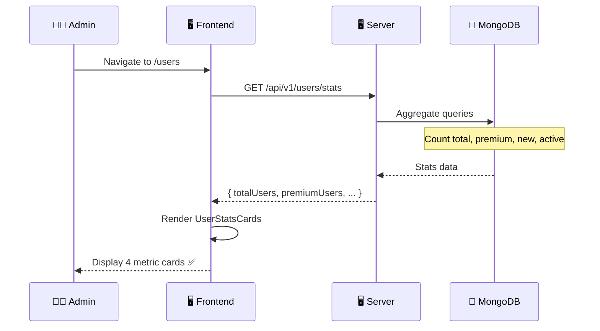
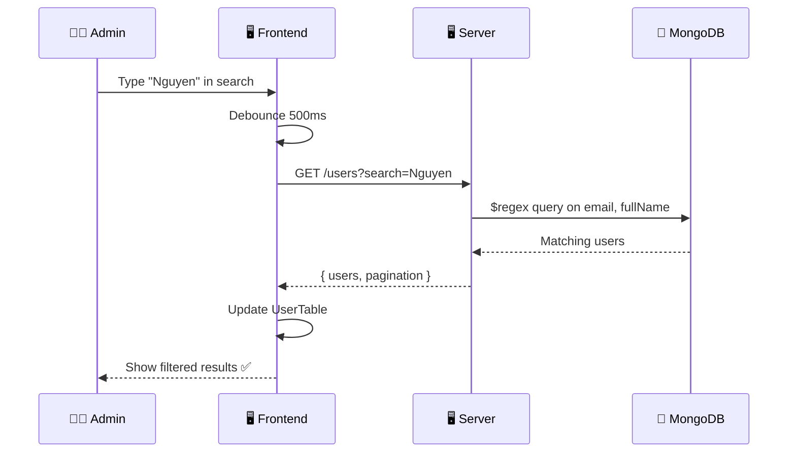
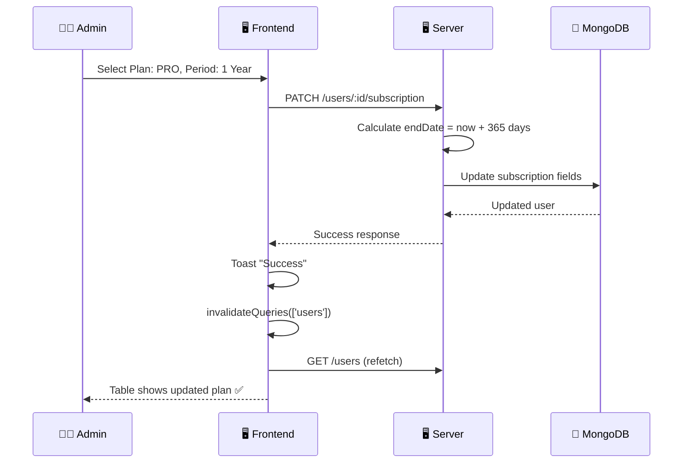
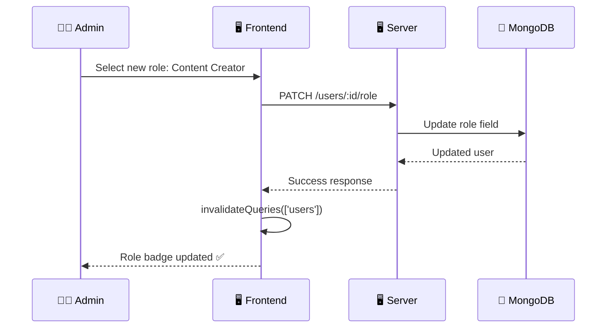
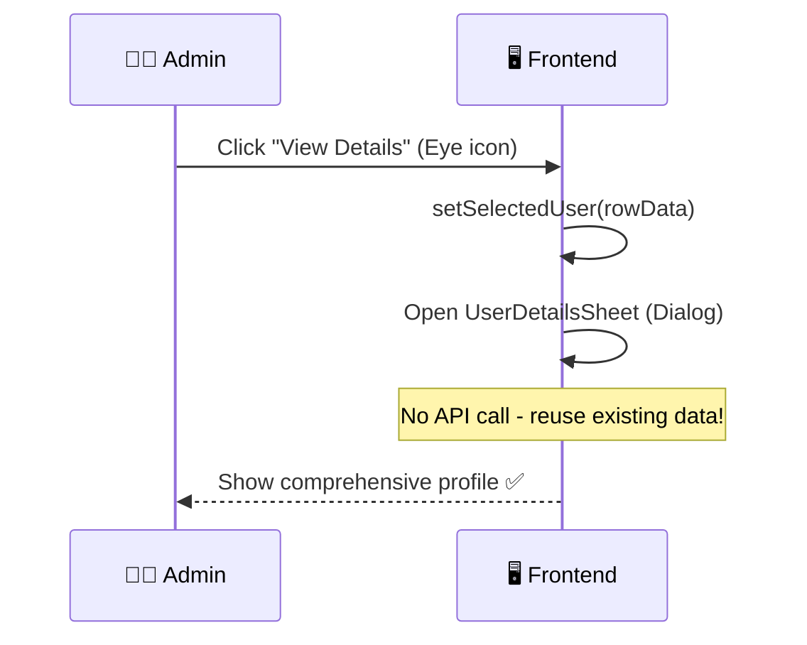

# Luồng hoạt động User Management

---

## 1. Analytics Dashboard Flow

### Code Reference
| Step | File | Function |
|------|------|----------|
| 2 | [useUsers.ts](file:///Users/nguyenlehuy/Downloads/unilish/admin/src/features/users/hooks/useUsers.ts) | `useUserStats()` |
| 3-5 | [user.service.ts](file:///Users/nguyenlehuy/Downloads/unilish/server/src/services/user.service.ts#L69-91) | `getUserStats()` |
| 6-7 | [UserStatsCards.tsx](file:///Users/nguyenlehuy/Downloads/unilish/admin/src/features/users/components/UserStatsCards.tsx) | Component |

---

## 2. Search & Filter Flow

### Code Reference
| Step | File | Function |
|------|------|----------|
| 2 | [useDebounce.ts](file:///Users/nguyenlehuy/Downloads/unilish/admin/src/hooks/useDebounce.ts) | Debounce hook |
| 3 | [user.api.ts](file:///Users/nguyenlehuy/Downloads/unilish/admin/src/features/users/api/user.api.ts) | `getUsers()` |
| 4-5 | [user.service.ts](file:///Users/nguyenlehuy/Downloads/unilish/server/src/services/user.service.ts#L33-68) | `getUsers()` |

---

## 3. Update Subscription Flow

### Code Reference
| Step | File | Function |
|------|------|----------|
| 2 | [useUsers.ts](file:///Users/nguyenlehuy/Downloads/unilish/admin/src/features/users/hooks/useUsers.ts) | `useUpdateSubscription()` |
| 3-5 | [user.service.ts](file:///Users/nguyenlehuy/Downloads/unilish/server/src/services/user.service.ts#L93-118) | `updateSubscription()` |
| 7-8 | React Query | Cache invalidation |

---

## 4. Update Role Flow

### Code Reference
| Step | File | Function |
|------|------|----------|
| 2 | [useUsers.ts](file:///Users/nguyenlehuy/Downloads/unilish/admin/src/features/users/hooks/useUsers.ts) | `useUpdateRole()` |
| 3-4 | [user.service.ts](file:///Users/nguyenlehuy/Downloads/unilish/server/src/services/user.service.ts#L120-136) | `updateRole()` |

---

## 5. View User Details Flow

### Code Reference
| Step | File | Function |
|------|------|----------|
| 2-3 | [UsersPage.tsx](file:///Users/nguyenlehuy/Downloads/unilish/admin/src/pages/users/UsersPage.tsx#L37-40) | `handleViewDetails()` |
| 4 | [UserDetailsSheet.tsx](file:///Users/nguyenlehuy/Downloads/unilish/admin/src/features/users/components/UserDetailsSheet.tsx) | Dialog component |

---

## 6. Technical Decisions

| Quyết định | Lý do |
|------------|-------|
| **Refetch over Optimistic UI** | Đảm bảo data 100% chính xác với DB |
| **Debouncing** | Giảm 90% API calls khi typing |
| **Layered Architecture** | Business logic tách biệt, dễ test |
| **React Query Cache** | `staleTime: 60s` tránh spam requests |

---

*Cập nhật: 2026-01-06*
