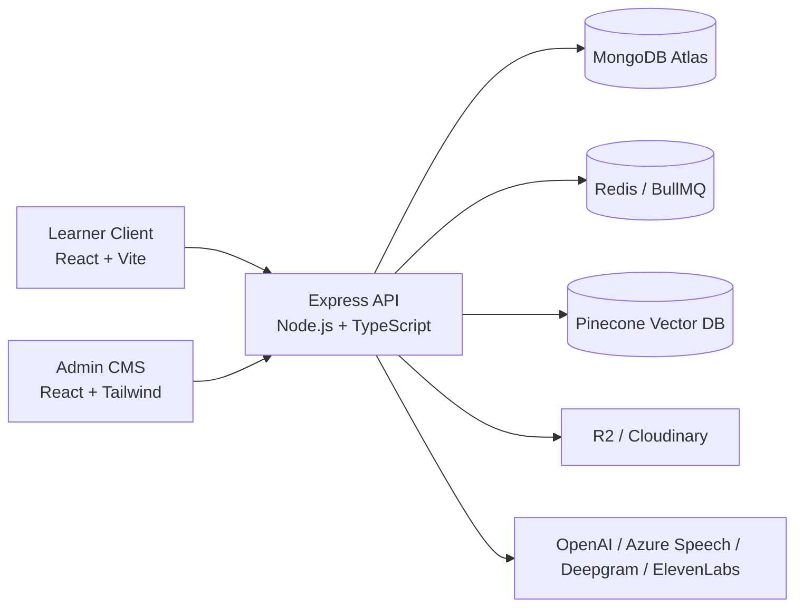
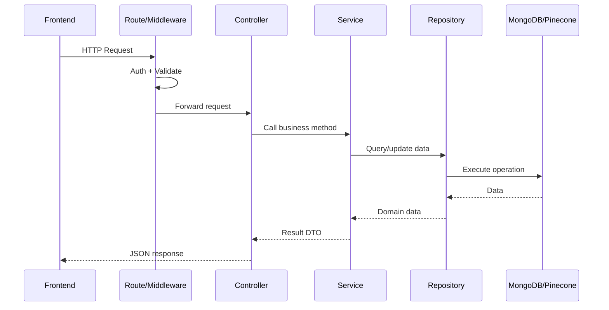
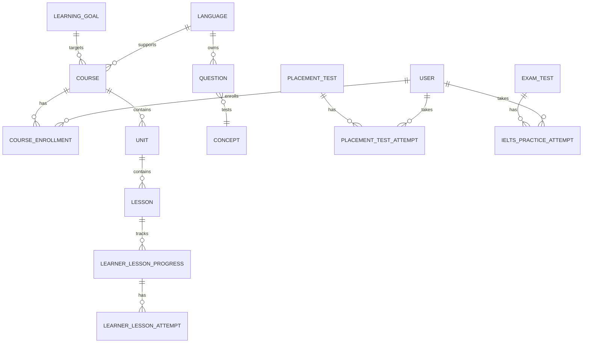
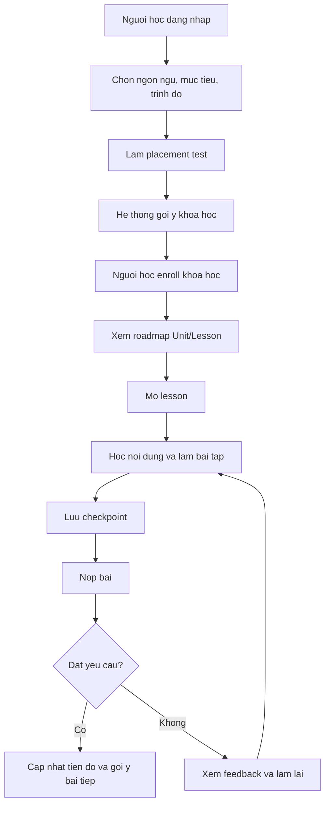

# BAO CAO DO AN TOT NGHIEP

## De tai: Xay dung website hoc ngoai ngu thich ung ung dung tri tue nhan tao

> Ten he thong: **Unilish - AI-Powered Adaptive Language Learning Platform**  
> Sinh vien thuc hien: Nguyen Le Huy  
> Giang vien huong dan: [Bo sung]  
> Lop/Khoa: [Bo sung]  
> Truong: [Bo sung]  
> Nam hoc: [Bo sung]

---

## Muc luc goi y

1. Mo dau
2. Co so ly thuyet va cong nghe su dung
3. Khao sat va phan tich yeu cau
4. Phan tich va thiet ke he thong
5. Cai dat va trien khai he thong
6. Kiem thu va danh gia
7. Ket luan va huong phat trien
8. Tai lieu tham khao
9. Phu luc

---

# Chuong 1. Mo dau

## 1.1. Ly do chon de tai

Trong boi canh hoi nhap quoc te va nhu cau hoc ngoai ngu ngay cang tang, cac nen tang hoc truc tuyen dong vai tro quan trong trong viec giup nguoi hoc tiep can tai lieu, luyen tap ky nang va theo doi tien do ca nhan. Tuy nhien, nhieu he thong hoc ngoai ngu hien nay van con ton tai mot so han che: lo trinh hoc chua duoc ca nhan hoa, noi dung bai hoc chua duoc dieu chinh theo muc tieu va trinh do cua tung nguoi, kha nang luyen phat am va noi chua gan voi phan hoi tu dong, viec quan tri noi dung con phan tan va thieu cong cu ho tro.

Tu thuc te do, de tai **"Xay dung website hoc ngoai ngu thich ung ung dung tri tue nhan tao"** duoc thuc hien voi muc tieu xay dung mot nen tang hoc ngoai ngu co ten **Unilish**. He thong ho tro nguoi hoc lua chon ngon ngu, muc tieu hoc tap, danh gia trinh do dau vao, nhan goi y khoa hoc, hoc theo bai, luyen nghe noi doc viet, luyen shadowing/dictation va luyen de IELTS theo tung ky nang. Ben canh do, he thong cung cap trang quan tri giup admin quan ly chuong trinh hoc, ngan hang cau hoi, bai kiem tra dau vao va noi dung luyen thi.

De tai co y nghia thuc tien vi ket hop cac nghiep vu EdTech pho bien voi cac cong nghe hien dai nhu React, Express, MongoDB, Redis, Pinecone va cac dich vu AI cho xu ly ngon ngu, giong noi, phien am va cham diem. Qua do, san pham khong chi dap ung yeu cau cua mot website hoc ngoai ngu ma con tao nen nen tang co kha nang mo rong thanh he thong hoc tap thich ung.

## 1.2. Muc tieu de tai

Muc tieu tong quat cua de tai la xay dung mot he thong website hoc ngoai ngu gom ba thanh phan chinh: ung dung nguoi hoc, ung dung quan tri va may chu API. He thong can cho phep nguoi hoc dang ky/dang nhap, thiet lap thong tin hoc tap, nhan goi y khoa hoc phu hop, hoc bai theo lo trinh, luu tien do, lam bai tap, luyen giong noi va luyen de IELTS.

Cu the, de tai huong den cac muc tieu sau:

- Xay dung giao dien nguoi hoc de thuc hien cac tac vu hoc tap chinh: onboarding, chon ngon ngu, chon muc tieu, chon trinh do, lam bai test dau vao, xem khoa hoc duoc goi y, hoc bai, luyen AI voice, shadowing, dictation va IELTS practice.
- Xay dung giao dien quan tri de quan ly ngon ngu, muc tieu hoc, khoa hoc, bai hoc, ngan hang cau hoi, de placement test va de IELTS practice.
- Xay dung backend theo kien truc phan lop gom route, controller, service, repository va model, dam bao tach biet nghiep vu va truy cap du lieu.
- Thiet ke co so du lieu MongoDB phu hop voi mien nghiep vu hoc ngoai ngu: user, language, learning goal, course, unit, lesson, question, enrollment, progress, attempt, placement test va IELTS practice.
- Tich hop cac dich vu AI va xu ly giong noi de ho tro goi y khoa hoc, tao/cham noi dung, luyen phat am, luyen noi va xu ly audio.
- Dam bao he thong co kha nang mo rong, bao mat co ban, quan ly phien dang nhap, phan quyen va xu ly loi tap trung.

## 1.3. Pham vi de tai

Pham vi thuc hien cua de tai tap trung vao viec xay dung nen tang hoc ngoai ngu truc tuyen co tinh ca nhan hoa. He thong ho tro cac nhom chuc nang sau:

- **Nguoi hoc:** dang ky, dang nhap, dang nhap Google, xac thuc OTP, chon ngon ngu hoc, chon muc tieu, chon trinh do, lam bai danh gia, nhan goi y khoa hoc, hoc theo lesson, theo doi tien do, luyen shadowing, dictation, AI voice va IELTS practice.
- **Quan tri vien/content creator:** quan ly ngon ngu, muc tieu hoc, khoa hoc, unit, lesson, cau hoi, de kiem tra dau vao va de IELTS practice.
- **He thong AI va dich vu ngoai:** goi y khoa hoc, embedding vector, xu ly giong noi, cham phat am, transcription, text-to-speech va quan ly media.

Mot so tinh nang khong nam trong pham vi chinh cua phien ban do an:

- Thanh toan, goi premium, chung chi va xep hang xa hoi.
- Lop hoc truc tiep, chat giua giao vien va hoc vien.
- Ung dung mobile native.
- Thi IELTS day du bon ky nang trong mot phien thi hoan chinh.
- Co che goi y thich ung nang cao dua tren lich su dai han cua nhieu nguoi hoc.

## 1.4. Phuong phap thuc hien

Qua trinh thuc hien de tai duoc tien hanh theo cac buoc:

1. Khao sat cac nen tang hoc ngoai ngu va xac dinh yeu cau chuc nang.
2. Phan tich nghiep vu, xac dinh actor, use case va luong xu ly.
3. Thiet ke kien truc tong the, mo hinh du lieu, class diagram va API contract.
4. Xay dung backend bang Node.js, Express, TypeScript va MongoDB.
5. Xay dung frontend nguoi hoc bang React, Vite, TypeScript, TanStack Query va CSS Modules.
6. Xay dung frontend quan tri bang React, Vite, TypeScript, TailwindCSS va Shadcn/UI.
7. Tich hop cac dich vu AI, speech, storage, cache va queue.
8. Kiem thu chuc nang, kiem tra luong nghiep vu va danh gia ket qua.

## 1.5. Ket qua dat duoc

San pham sau khi thuc hien la mot he thong monorepo gom:

- `client/`: ung dung nguoi hoc chay tren cong mac dinh `5173`.
- `admin/`: ung dung quan tri/CMS chay tren cong mac dinh `5174`.
- `server/`: may chu API Express chay trong Docker, cong noi bo `5432`, expose ra host `5433` trong moi truong phat trien.
- `docs/`: tai lieu phan tich, use case, ERD, class diagram va dac ta tinh nang.

He thong da co nen tang ky thuat de phuc vu day du quy trinh hoc ngoai ngu truc tuyen: tu thiet lap muc tieu, danh gia dau vao, goi y khoa hoc, hoc bai, lam bai tap, luyen noi, luyen nghe va quan ly noi dung.

---

# Chuong 2. Co so ly thuyet va cong nghe su dung

## 2.1. Hoc ngoai ngu truc tuyen va hoc tap thich ung

Hoc ngoai ngu truc tuyen la hinh thuc hoc tap su dung nen tang web/mobile de cung cap noi dung, bai tap, bai kiem tra va cong cu theo doi tien do. Uu diem cua hinh thuc nay la nguoi hoc co the hoc moi luc moi noi, tu chu toc do hoc tap va tiep can nhieu loai tai nguyen so.

Hoc tap thich ung la huong tiep can trong do he thong dieu chinh lo trinh hoc dua tren du lieu cua tung nguoi hoc, bao gom trinh do, muc tieu, ket qua bai test, tien do va cac diem yeu. Trong pham vi Unilish, y tuong thich ung duoc the hien thong qua:

- Thu thap thong tin ngon ngu, muc tieu va trinh do cua nguoi hoc.
- Danh gia nang luc thong qua placement test.
- Goi y khoa hoc dua tren thong tin ca nhan va vector search.
- Luu tien do hoc, checkpoint va ket qua attempt.
- Ho tro luyen tap theo nhieu ky nang: tu vung, ngu phap, doc, nghe, noi, viet va IELTS.

## 2.2. Mo hinh CEFR trong hoc ngoai ngu

CEFR (Common European Framework of Reference for Languages) la khung tham chieu ngon ngu pho bien, chia nang luc ngoai ngu thanh cac cap do A1, A2, B1, B2, C1 va C2. Trong he thong Unilish, cap do CEFR duoc su dung de:

- Bieu dien trinh do hien tai va muc tieu cua nguoi hoc.
- Phan loai khoa hoc va bai hoc.
- Ho tro mapping ket qua placement test sang muc trinh do.
- Dinh huong do kho cua cau hoi va bai tap.

## 2.3. Kien truc client-server

He thong duoc xay dung theo mo hinh client-server. Client gui yeu cau HTTP den server thong qua REST API. Server xu ly xac thuc, nghiep vu, truy cap co so du lieu va tra ve du lieu duoi dang JSON. Mo hinh nay phu hop voi ung dung web hien dai vi giup tach rieng giao dien, logic nghiep vu va tang du lieu.

Unilish co hai client rieng:

- **Learner Client:** phuc vu nguoi hoc.
- **Admin CMS:** phuc vu quan tri vien va nguoi tao noi dung.

Backend dong vai tro trung tam, cung cap API cho ca hai ung dung frontend va tich hop voi cac dich vu ngoai nhu MongoDB Atlas, Redis, Pinecone, Cloudflare R2, Cloudinary, OpenAI, Azure Speech, Deepgram va ElevenLabs.

## 2.4. Cong nghe frontend

### React, Vite va TypeScript

React duoc su dung de xay dung giao dien theo mo hinh component. Vite giup khoi tao va build ung dung nhanh, ho tro hot module replacement trong qua trinh phat trien. TypeScript giup tang do an toan kieu du lieu va giam loi runtime.

### TanStack Query va Zustand

TanStack Query duoc su dung de quan ly server state: goi API, cache du lieu, loading state, error state va refetch. Zustand duoc su dung cho client state cuc bo nhu trang thai auth, onboarding hoac placement test.

### React Hook Form va Zod

React Hook Form ho tro xu ly form hieu qua, giam render lai khong can thiet. Zod dung de dinh nghia schema va validate du lieu o phia frontend/backend, giup tang tinh nhat quan cua du lieu.

### Styling

Learner client su dung CSS Modules va CSS Variables de tach rieng style theo component, tranh xung dot ten class. Admin CMS su dung TailwindCSS va Shadcn/UI de xay dung cac thanh phan quan tri nhanh va nhat quan.

## 2.5. Cong nghe backend

### Node.js, Express va TypeScript

Backend duoc xay dung bang Node.js 20+, Express 5 va TypeScript. Express phu hop cho REST API, middleware, route va xu ly loi. TypeScript giup dinh nghia kieu cho request, response, service va model.

### MongoDB va Mongoose

MongoDB duoc su dung lam co so du lieu chinh. Mongoose cung cap schema, model, middleware, validation va quan he tham chieu bang ObjectId. Cach luu document phu hop voi noi dung bai hoc, cau hoi, snapshot bai lam va du lieu cau truc long nhau.

### Redis va BullMQ

Redis duoc dung cho cache va queue. BullMQ ho tro xu ly cac tac vu nen nhu tao audio, cham bai noi/viet, dong bo listening mix hoac cac cong viec bat dong bo can thoi gian xu ly dai.

### Pinecone va vector search

Pinecone duoc su dung lam vector database. He thong co cac index vector cho knowledge va course recommendation. Ket hop voi embedding, he thong co the tim khoa hoc/noi dung phu hop voi muc tieu va ngu canh cua nguoi hoc.

## 2.6. Dich vu AI va xu ly giong noi

He thong tich hop nhieu dich vu AI:

- OpenAI cho LLM, embedding, text-to-speech va realtime speech.
- Azure AI Speech cho cham phat am.
- Deepgram cho transcription.
- ElevenLabs cho text-to-speech.
- Cloudflare R2 va Cloudinary de luu tru audio, video va hinh anh.

Viec tich hop cac dich vu nay giup Unilish mo rong trai nghiem hoc tap tu noi dung tinh sang cac hoat dong tuong tac nhu noi, nghe, doc transcript, cham phat am va sinh phan hoi.

---

# Chuong 3. Khao sat va phan tich yeu cau

## 3.1. Khao sat bai toan

Nguoi hoc ngoai ngu thuong gap cac van de sau:

- Khong biet nen bat dau tu cap do nao.
- Khong co lo trinh hoc phu hop voi muc tieu ca nhan.
- Kho theo doi tien do va tiep tuc bai hoc dang dang do.
- Thieu moi truong luyen noi/phat am va nhan phan hoi tu dong.
- Noi dung hoc va bai kiem tra thuong tach roi, khong lien ket thanh mot luong hoc lien tuc.

Tu goc nhin nguoi quan tri noi dung, mot nen tang hoc ngoai ngu can co cong cu de quan ly ngon ngu, muc tieu, khoa hoc, bai hoc, ngan hang cau hoi va bai kiem tra. Neu thieu CMS, viec cap nhat noi dung se phu thuoc nhieu vao lap trinh vien va kho mo rong.

Vi vay, Unilish duoc thiet ke nhu mot nen tang gom hai phan: ung dung hoc tap cho learner va ung dung quan tri cho admin/content creator.

## 3.2. Actor cua he thong

He thong co cac actor chinh:

| Actor | Mo ta |
|---|---|
| Khach truy cap | Xem trang gioi thieu, dang ky hoac dang nhap. |
| Nguoi hoc | Su dung he thong de hoc ngoai ngu, lam bai test, hoc khoa hoc va luyen tap. |
| Quan tri vien | Quan ly nguoi dung, ngon ngu, muc tieu, khoa hoc, bai hoc, cau hoi va de thi. |
| Content creator | Tao va cap nhat noi dung hoc tap theo phan quyen. |
| He thong AI | Ho tro goi y, xu ly giong noi, cham diem va tao phan hoi. |
| Dich vu ngoai | MongoDB, Redis, Pinecone, Cloudflare R2, Cloudinary, OpenAI, Azure Speech, Deepgram. |

## 3.3. Yeu cau chuc nang

### 3.3.1. Nhom chuc nang xac thuc

- Dang ky tai khoan bang email.
- Xac thuc OTP.
- Dang nhap bang email/mat khau.
- Dang nhap Google OAuth.
- Lay thong tin nguoi dung hien tai.
- Bao ve route can dang nhap.
- Phan quyen admin/content creator/learner.

### 3.3.2. Nhom chuc nang onboarding

- Chon ngon ngu muon hoc.
- Chon muc tieu hoc tap.
- Chon trinh do hien tai va muc tieu.
- Lam placement test de danh gia nang luc.
- Luu thong tin hoc tap vao ho so nguoi dung.

### 3.3.3. Nhom chuc nang khoa hoc va bai hoc

- Hien thi danh sach khoa hoc phu hop.
- Goi y khoa hoc dua tren muc tieu va trinh do.
- Dang ky/enroll khoa hoc.
- Hien thi roadmap gom unit va lesson.
- Mo bai hoc, hoc noi dung, lam bai tap va luu checkpoint.
- Nop bai, nhan diem, xem ket qua va tiep tuc bai tiep theo.
- Theo doi tien do khoa hoc, so bai da hoan thanh va thoi gian hoc.

### 3.3.4. Nhom chuc nang luyen tap ky nang

- Tu vung, ngu phap, doc, nghe, noi, viet.
- AI Voice de luyen hoi thoai/noi.
- Shadowing: luyen noi theo video/audio.
- Dictation: nghe va chep lai noi dung.
- IELTS Practice theo tung ky nang Listening, Reading, Writing va Speaking.

### 3.3.5. Nhom chuc nang quan tri

- Quan ly ngon ngu.
- Quan ly muc tieu hoc.
- Quan ly khoa hoc, unit va lesson.
- Quan ly ngan hang cau hoi.
- Quan ly placement test.
- Quan ly de IELTS practice.
- Quan ly nguoi dung.
- Upload va quan ly media.
- Publish, pause hoac archive noi dung.

## 3.4. Yeu cau phi chuc nang

| Nhom yeu cau | Mo ta |
|---|---|
| Bao mat | Su dung JWT, session, Passport Google OAuth, middleware bao ve route, CORS va Helmet. |
| Hieu nang | Su dung cache/queue, lazy loading frontend, compression va tach rieng server state. |
| Mo rong | Kien truc monorepo tach client/admin/server; backend phan lop controller-service-repository. |
| Bao tri | TypeScript, validation Zod, model ro rang, tai lieu use case/API/ERD. |
| Do tin cay | Xu ly loi tap trung, request id, logging Winston, idempotency cho mot so thao tac hoc tap. |
| Kha dung | Giao dien co trang thai loading, empty, error, retry va resume. |
| An toan du lieu bai tap | Learner API khong tra dap an dung truoc khi nguoi hoc nop bai. |

## 3.5. Use case tong quan

Use case tong quan cua he thong co the chia thanh cac nhom:

- **Authentication:** dang ky, dang nhap, xac thuc OTP, Google OAuth.
- **Learner:** thiet lap muc tieu, lam placement test, hoc khoa hoc, luyen ky nang, xem tien do.
- **Admin/CMS:** quan ly chuong trinh hoc, ngan hang cau hoi, de thi va nguoi dung.
- **Assessment:** tao bai test, lam bai test, cham diem, mapping trinh do.
- **Content/AI:** tao noi dung, xu ly giong noi, embedding, goi y va phan hoi.

Tai lieu use case chi tiet nam tai:

- `docs/usecase/overview-usecase.md`
- `docs/usecase/learner-usecase.md`
- `docs/usecase/admin-cms-usecase.md`
- `docs/usecase/assessment-usecase.md`
- `docs/usecase/content-ai-usecase.md`

---

# Chuong 4. Phan tich va thiet ke he thong

## 4.1. Kien truc tong the

He thong Unilish duoc thiet ke theo kien truc monorepo gom ba ung dung:

| Thanh phan | Thu muc | Vai tro |
|---|---|---|
| Learner Client | `client/` | Giao dien cho nguoi hoc. |
| Admin CMS | `admin/` | Giao dien quan tri noi dung va nguoi dung. |
| Server API | `server/` | Xu ly xac thuc, nghiep vu, du lieu va tich hop dich vu ngoai. |

So do kien truc tong quan:



Trong kien truc nay, frontend khong truy cap truc tiep database hoac dich vu AI ma thong qua server API. Server chiu trach nhiem kiem tra quyen, validate du lieu, xu ly nghiep vu, cham diem va tra ve DTO phu hop voi tung vai tro.

## 4.2. Kien truc backend

Backend duoc to chuc theo cac lop:

- **Route:** dinh nghia endpoint va gan middleware.
- **Controller:** nhan request, goi service va tra response.
- **Service:** chua logic nghiep vu chinh.
- **Repository:** truy cap MongoDB/Pinecone.
- **Model:** dinh nghia schema Mongoose.
- **Validation:** dinh nghia schema validate bang Zod.
- **Middleware:** auth, validate, rate limit, request id, error handling.
- **Job/Worker:** xu ly tac vu nen voi BullMQ.

So do luong xu ly backend:



## 4.3. Kien truc frontend nguoi hoc

Learner Client duoc xay dung bang React 19, Vite va TypeScript. Ung dung su dung React Router de quan ly route va lazy loading de toi uu thoi gian tai.

Mot so route chinh:

| Route | Chuc nang |
|---|---|
| `/` | Trang marketing/gioi thieu. |
| `/auth/login` | Dang nhap. |
| `/auth/register` | Dang ky. |
| `/auth/otp` | Xac thuc OTP. |
| `/dashboard` | Trang tong quan nguoi hoc. |
| `/dashboard/language-selection` | Chon ngon ngu hoc. |
| `/dashboard/goal-selection` | Chon muc tieu hoc. |
| `/dashboard/level-selection` | Chon trinh do. |
| `/dashboard/recommend-course` | Goi y khoa hoc. |
| `/dashboard/course/:slug` | Tong quan khoa hoc va roadmap. |
| `/dashboard/learning/lessons/:lessonId` | Man hinh hoc bai. |
| `/dashboard/ai-voice` | Luyen noi voi AI. |
| `/dashboard/shadowing` | Danh sach video shadowing. |
| `/dashboard/shadowing/:videoId` | Luyen shadowing theo video. |
| `/dashboard/dictation/:videoId` | Luyen dictation. |
| `/dashboard/ielts-practice` | Hub luyen IELTS. |
| `/dashboard/ielts-practice/:skill` | Danh sach bai theo ky nang IELTS. |

Server state duoc quan ly bang TanStack Query, trong khi mot so state cuc bo nhu auth, onboarding va placement test duoc luu trong Zustand.

## 4.4. Kien truc frontend quan tri

Admin CMS su dung React, Vite, TypeScript, TailwindCSS va Shadcn/UI. Cac route chinh:

| Route | Chuc nang |
|---|---|
| `/auth/login` | Dang nhap admin. |
| `/dashboard` | Tong quan quan tri. |
| `/curriculum/courses` | Quan ly khoa hoc. |
| `/curriculum/courses/:courseId/studio` | Bien tap noi dung khoa hoc. |
| `/curriculum/languages` | Quan ly ngon ngu. |
| `/curriculum/goals` | Quan ly muc tieu hoc. |
| `/questions` | Ngan hang cau hoi. |
| `/placement-tests` | Quan ly placement test. |
| `/ielts-practice` | Quan ly de IELTS practice. |
| `/users` | Quan ly nguoi dung. |

Admin duoc bao ve boi `AuthGuard`, chi nguoi dung co quyen phu hop moi truy cap duoc cac man hinh quan tri.

## 4.5. Thiet ke co so du lieu

Co so du lieu chinh la MongoDB. Cac collection/model quan trong:

| Model | Vai tro |
|---|---|
| `User` | Luu thong tin nguoi dung, email, googleId, role, ngon ngu/muc tieu/trinh do. |
| `Language` | Danh muc ngon ngu. |
| `LearningGoal` | Muc tieu hoc tap va trong so ky nang. |
| `Course` | Khoa hoc theo ngon ngu, muc tieu va cap do. |
| `Unit` | Don vi hoc trong khoa hoc. |
| `Lesson` | Bai hoc, noi dung va cau hinh luyen tap. |
| `Concept` | Khai niem ngon ngu duoc day/kiem tra. |
| `Question` | Ngan hang cau hoi. |
| `CourseEnrollment` | Thong tin nguoi hoc tham gia khoa hoc. |
| `LearnerLessonProgress` | Tien do cua nguoi hoc theo tung lesson. |
| `LearnerLessonAttempt` | Moi lan nop bai cua nguoi hoc. |
| `PlacementTest` | Cau hinh bai danh gia dau vao. |
| `PlacementTestAttempt` | Lan lam bai placement test. |
| `PlacementSession` | Phien lam placement theo module. |
| `ExamTest` | Noi dung de IELTS/assessment. |
| `IeltsPracticeAttempt` | Lan lam de IELTS practice. |
| `ShadowingVideo` | Noi dung video shadowing/dictation. |
| `UserLessonProgress` | Du lieu phien speaking/transcript/evaluation. |

ERD hien trang cua he thong da duoc mo ta trong `docs/erd.md`. Duoi day la phien ban rut gon:



## 4.6. Thiet ke API

Server dinh nghia nhieu nhom API:

| Prefix | Chuc nang |
|---|---|
| `/api/auth`, `/api/v1/auth` | Xac thuc, dang nhap, dang ky, Google OAuth. |
| `/api/users` | Quan ly nguoi dung. |
| `/api/curriculum/goals` | Muc tieu hoc. |
| `/api/curriculum/languages` | Ngon ngu. |
| `/api/curriculum/courses` | Khoa hoc. |
| `/api/curriculum/units` | Unit. |
| `/api/curriculum/lessons` | Lesson va cac noi dung vocab/grammar/reading/listening/writing. |
| `/api/questions` | Ngan hang cau hoi. |
| `/api/placement-tests` | Quan ly placement test. |
| `/api/placement-tests/runtime` | Lam placement test. |
| `/api/exam-tests` | Quan ly de thi/de luyen tap. |
| `/api/ielts-practice` | Learner IELTS practice. |
| `/api/learning` | Enroll, dashboard, roadmap, checkpoint, submit lesson. |
| `/api/v1/ai-voice` | Luyen noi voi AI. |
| `/api/v1/azure-speech` | Cham phat am. |
| `/api/v1/shadowing` | Shadowing/dictation. |
| `/api/upload` | Upload media. |

Response API duoc chuan hoa theo dang envelope:

```json
{
  "status": "success",
  "code": 200,
  "message": "Operation completed",
  "data": {}
}
```

## 4.7. Thiet ke luong hoc khoa hoc

Luong hoc co ban:



## 4.8. Thiet ke an toan bai tap

Mot yeu cau quan trong cua he thong hoc tap la khong lam lo dap an dung truoc khi nguoi hoc nop bai. Vi vay:

- Learner API chi tra cau hoi da duoc sanitize.
- Cac truong nhu correct answer, explanation, mapping dap an va rubric khong duoc tra ve truoc submit.
- Client chi gui cau tra loi cua nguoi hoc.
- Server doc dap an dung tu database va thuc hien cham diem.
- Ket qua va feedback chi hien thi sau khi submit hop le.
- Moi lan submit co the gan idempotency key hoac clientAttemptId de tranh cham/ghi nhan lap.

## 4.9. Thiet ke tich hop AI

AI duoc su dung trong cac khu vuc:

- **Embedding va recommendation:** tao vector cho khoa hoc/noi dung, tim khoa hoc phu hop qua Pinecone.
- **AI Voice:** ho tro hoi thoai va luyen noi.
- **Speech-to-text:** chuyen giong noi thanh van ban de phan tich.
- **Pronunciation assessment:** danh gia phat am qua Azure Speech.
- **Text-to-speech:** tao audio cho noi dung hoc bang OpenAI/ElevenLabs.
- **Grading/feedback:** ho tro cham bai noi/viet hoac tao phan hoi hoc tap.

De dam bao he thong on dinh, cac tac vu AI ton thoi gian co the duoc dua vao queue voi BullMQ va xu ly nen.

---

# Chuong 5. Cai dat va trien khai he thong

## 5.1. Moi truong phat trien

Yeu cau moi truong:

- Node.js 20 tro len.
- Docker va Docker Compose.
- MongoDB Atlas.
- Redis.
- Tai khoan/API key cho Pinecone, OpenAI, Azure Speech, Deepgram, ElevenLabs, Cloudflare R2 va Cloudinary.

## 5.2. Cau truc thu muc

```text
unilish/
├── client/                  # Ung dung nguoi hoc
├── admin/                   # Ung dung quan tri
├── server/                  # Backend API
├── docs/                    # Tai lieu phan tich/thiet ke
├── docker-compose.yml       # Moi truong development
└── docker-compose.prod.yml  # Moi truong production
```

## 5.3. Cai dat backend

Backend nam trong thu muc `server/`. Cac buoc cau hinh:

1. Tao file `.env` tu `.env.example`.
2. Cau hinh MongoDB, Redis, JWT secret, Google OAuth, Pinecone, OpenAI va cac dich vu media/speech.
3. Chay server bang Docker Compose hoac npm script.

Lenh phat trien:

```bash
docker compose up -d --build
```

Trong development, server chay trong container voi `PORT=5432` va expose ra host `5433`.

## 5.4. Cai dat frontend nguoi hoc

```bash
cd client
npm install
npm run dev
```

Ung dung chay tai:

```text
http://localhost:5173
```

## 5.5. Cai dat frontend quan tri

```bash
cd admin
npm install
npm run dev
```

Ung dung chay tai:

```text
http://localhost:5174
```

## 5.6. Cau hinh Docker

Trong `docker-compose.yml`, Redis va server duoc chay bang container. Client va admin duoc chay truc tiep tren macOS de tranh van de file watcher/HMR cua Vite khi mount vao Docker.

Thanh phan Docker development:

- `redis`: Redis Stack, expose `6379` va RedisInsight `8001`.
- `server`: Express API hot reload, expose host `5433`, ket noi Redis qua `redis://redis:6379`.

## 5.7. Mot so script quan trong

Backend:

| Script | Chuc nang |
|---|---|
| `npm run dev` | Chay server bang nodemon. |
| `npm run build` | Build TypeScript. |
| `npm run start` | Chay ban build trong `dist`. |
| `npm run sync:vectors` | Dong bo vector khoa hoc len Pinecone. |
| `npm run seed:ielts-practice` | Seed du lieu IELTS practice. |
| `npm run e2e:learning-flow` | Kiem tra luong hoc tap. |

Client:

| Script | Chuc nang |
|---|---|
| `npm run dev` | Chay Vite dev server. |
| `npm run build` | Type-check va build production. |
| `npm run lint` | Kiem tra lint. |
| `npm run preview` | Xem ban build. |

---

# Chuong 6. Kiem thu va danh gia

## 6.1. Muc tieu kiem thu

Kiem thu nham dam bao cac chuc nang chinh cua he thong hoat dong dung yeu cau, du lieu duoc luu chinh xac, route duoc bao ve, learner khong nhan du lieu nhay cam nhu dap an dung truoc submit va cac man hinh chinh co trang thai loading/error phu hop.

## 6.2. Pham vi kiem thu

Pham vi kiem thu tap trung vao:

- Xac thuc va phan quyen.
- Onboarding nguoi hoc.
- Goi y va enroll khoa hoc.
- Hien thi roadmap va lesson.
- Checkpoint va submit bai tap.
- Placement test.
- IELTS practice.
- Quan tri ngon ngu, muc tieu, khoa hoc, cau hoi va de thi.
- Upload media.
- Tich hop speech/AI o muc API.

## 6.3. Bang test case mau

| Ma | Chuc nang | Du lieu/Dieu kien | Ket qua mong doi |
|---|---|---|---|
| TC-01 | Dang ky | Email hop le, mat khau hop le | Tao tai khoan va gui OTP. |
| TC-02 | Dang nhap | Tai khoan dung | Tra token/session va thong tin user. |
| TC-03 | Bao ve route | Truy cap dashboard khi chua dang nhap | Chuyen ve trang dang nhap. |
| TC-04 | Chon ngon ngu | Nguoi hoc dang nhap | Luu ngon ngu hoc vao profile. |
| TC-05 | Chon muc tieu | Nguoi hoc dang nhap | Luu muc tieu hoc vao profile. |
| TC-06 | Goi y khoa hoc | Co profile hoc tap | Tra danh sach khoa hoc phu hop. |
| TC-07 | Enroll khoa hoc | Khoa hoc active | Tao/reactivate enrollment. |
| TC-08 | Mo roadmap | Da enroll | Hien thi unit/lesson dung thu tu. |
| TC-09 | Mo lesson | Lesson active | Tra noi dung lesson va checkpoint. |
| TC-10 | Submit bai objective | Cau tra loi day du | Server cham diem va luu attempt. |
| TC-11 | Submit thieu cau | Thieu mot cau tra loi | Tra loi validate error, khong cham diem. |
| TC-12 | Kiem tra lo dap an | Goi API lesson truoc submit | Response khong co correct answer/explanation. |
| TC-13 | IELTS Listening | Nop bai listening | Cham diem tu dong va luu ket qua. |
| TC-14 | IELTS Writing | Nop bai writing | Luu submission/draft theo attempt. |
| TC-15 | Admin tao cau hoi | Admin hop le | Cau hoi duoc luu va co trang thai phu hop. |
| TC-16 | Upload media | File hop le | Tra URL media tu storage. |

## 6.4. Danh gia ket qua

He thong dat duoc cac ket qua:

- Xay dung duoc kien truc monorepo ro rang, tach rieng learner, admin va server.
- Backend co cau truc phan lop, de bao tri va mo rong.
- Mo hinh du lieu dap ung nhieu nghiep vu cua nen tang hoc ngoai ngu: curriculum, progress, attempt, placement test, IELTS practice va shadowing.
- Frontend nguoi hoc co day du route cho hanh trinh hoc tap tu onboarding den luyen tap.
- Admin CMS co cac man hinh quan ly cot loi cho chuong trinh hoc va de thi.
- He thong da chuan bi tot cho viec tich hop AI va speech services.

Mot so han che:

- Mot so tinh nang nang cao nhu adaptive curriculum ordering va full IELTS exam chua nam trong pham vi MVP.
- Viec phu thuoc nhieu dich vu AI ben ngoai co the lam tang chi phi va do phuc tap khi trien khai that.
- Can bo sung them automated test end-to-end va test tai cho moi truong production.
- Can hoan thien hon ve quan sat he thong: metrics, tracing va dashboard van hanh.

---

# Chuong 7. Ket luan va huong phat trien

## 7.1. Ket luan

De tai da xay dung nen tang **Unilish - website hoc ngoai ngu thich ung ung dung tri tue nhan tao** voi day du cac thanh phan quan trong cua mot he thong EdTech hien dai. San pham gom ung dung nguoi hoc, ung dung quan tri va backend API, duoc trien khai theo kien truc monorepo va su dung cac cong nghe pho bien nhu React, Vite, TypeScript, Express, MongoDB, Redis, Pinecone va cac dich vu AI.

Ve mat nghiep vu, he thong ho tro nguoi hoc thiet lap muc tieu, danh gia trinh do, nhan goi y khoa hoc, hoc theo lesson, lam bai tap, luyen noi, shadowing, dictation va IELTS practice. Ve mat quan tri, he thong cung cap CMS de quan ly ngon ngu, muc tieu, khoa hoc, bai hoc, ngan hang cau hoi va de luyen tap. Ve mat ky thuat, backend duoc tach lop ro rang va co mo hinh du lieu phu hop voi bai toan hoc ngoai ngu truc tuyen.

Qua qua trinh thuc hien, de tai giup cung co kien thuc ve phan tich yeu cau, thiet ke he thong, xay dung REST API, thiet ke frontend, quan ly state, thiet ke co so du lieu NoSQL, tich hop AI va trien khai bang Docker.

## 7.2. Huong phat trien

Trong tuong lai, he thong co the duoc phat trien theo cac huong:

- Hoan thien co che hoc tap thich ung nang cao dua tren lich su hoc tap va diem yeu cua tung nguoi hoc.
- Bo sung full IELTS mock test gom bon ky nang trong mot phien thi.
- Xay dung dashboard thong ke chi tiet cho learner va admin.
- Bo sung ung dung mobile hoac giao dien responsive day du cho mobile.
- Them co che thanh toan, goi hoc, chung chi va lop hoc truc tiep neu can.
- Cai thien he thong recommendation bang collaborative filtering va learning analytics.
- Bo sung test tu dong, CI/CD, monitoring, tracing va canh bao production.
- Ho tro nhieu ngon ngu hon va mo rong kho noi dung.

---

# Tai lieu tham khao

> Phan nay can bo sung theo dinh dang cua truong. Duoi day la danh sach goi y.

1. React Documentation, https://react.dev/
2. Vite Documentation, https://vite.dev/
3. TypeScript Documentation, https://www.typescriptlang.org/docs/
4. Express Documentation, https://expressjs.com/
5. MongoDB Documentation, https://www.mongodb.com/docs/
6. Mongoose Documentation, https://mongoosejs.com/docs/
7. TanStack Query Documentation, https://tanstack.com/query/latest
8. Redis Documentation, https://redis.io/docs/
9. BullMQ Documentation, https://docs.bullmq.io/
10. Pinecone Documentation, https://docs.pinecone.io/
11. OpenAI API Documentation, https://platform.openai.com/docs/
12. Azure AI Speech Documentation, https://learn.microsoft.com/azure/ai-services/speech-service/
13. Deepgram Documentation, https://developers.deepgram.com/
14. Cloudflare R2 Documentation, https://developers.cloudflare.com/r2/

---

# Phu luc A. Danh sach hinh anh/sơ do nen chen vao bao cao

Nen chen cac so do co san trong thu muc `docs/`:

| Noi dung | File goi y |
|---|---|
| Use case tong quan | `docs/usecase/overview-usecase.svg` |
| Use case nguoi hoc | `docs/usecase/learner-usecase.svg` |
| Use case admin/CMS | `docs/usecase/admin-cms-usecase.svg` |
| Use case assessment | `docs/usecase/assessment-usecase.svg` |
| Use case content/AI | `docs/usecase/content-ai-usecase.svg` |
| ERD day du | `docs/erd.md` |
| Class diagram | `docs/class-diagram.md` |
| Luong hoc khoa hoc | `docs/course-learning/user-flows.md` |
| IELTS practice architecture | `docs/ielts-practice/README.md` |

# Phu luc B. Goi y anh chup man hinh can bo sung

Khi hoan thien ban nop cuoi, nen chup va chen cac man hinh:

- Trang marketing/gioi thieu Unilish.
- Man hinh dang nhap/dang ky.
- Man hinh onboarding chon ngon ngu.
- Man hinh chon muc tieu hoc.
- Man hinh dashboard nguoi hoc.
- Man hinh goi y khoa hoc.
- Man hinh roadmap khoa hoc.
- Man hinh lesson player.
- Man hinh AI Voice.
- Man hinh shadowing/dictation.
- Man hinh IELTS practice hub.
- Man hinh lam IELTS Listening/Reading/Writing/Speaking.
- Man hinh admin dashboard.
- Man hinh quan ly khoa hoc.
- Man hinh course studio.
- Man hinh ngan hang cau hoi.
- Man hinh quan ly placement test.
- Man hinh quan ly IELTS practice.

# Phu luc C. Luu y bien tap thanh ban nop chinh thuc

- Thay cac noi dung `[Bo sung]` bang thong tin cua truong, khoa, giang vien va sinh vien.
- Neu truong yeu cau dinh dang Word, co the chuyen file Markdown nay sang `.docx`.
- Bo sung anh chup man hinh that cua san pham sau khi chay du an.
- Danh so bang, hinh va chuong theo quy dinh cua khoa.
- Kiem tra lai ten cong nghe, phien ban va tinh nang da hoan thien truoc khi nop.
- Rut gon hoac mo rong tung chuong theo quy dinh so trang cua do an.
