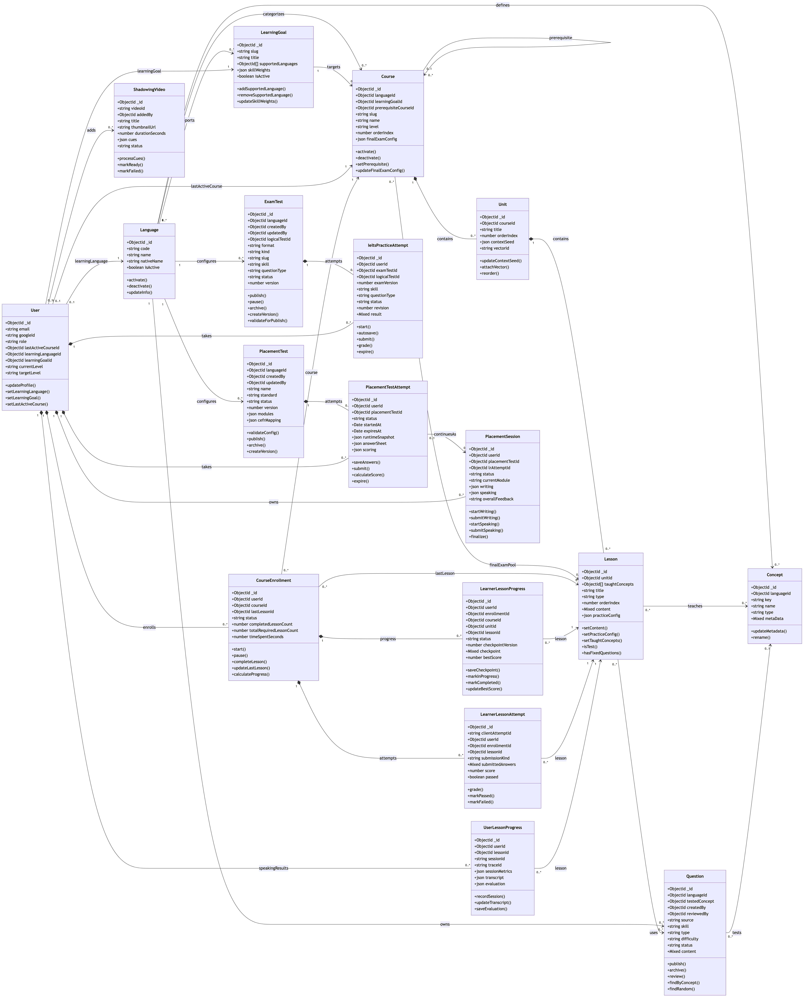
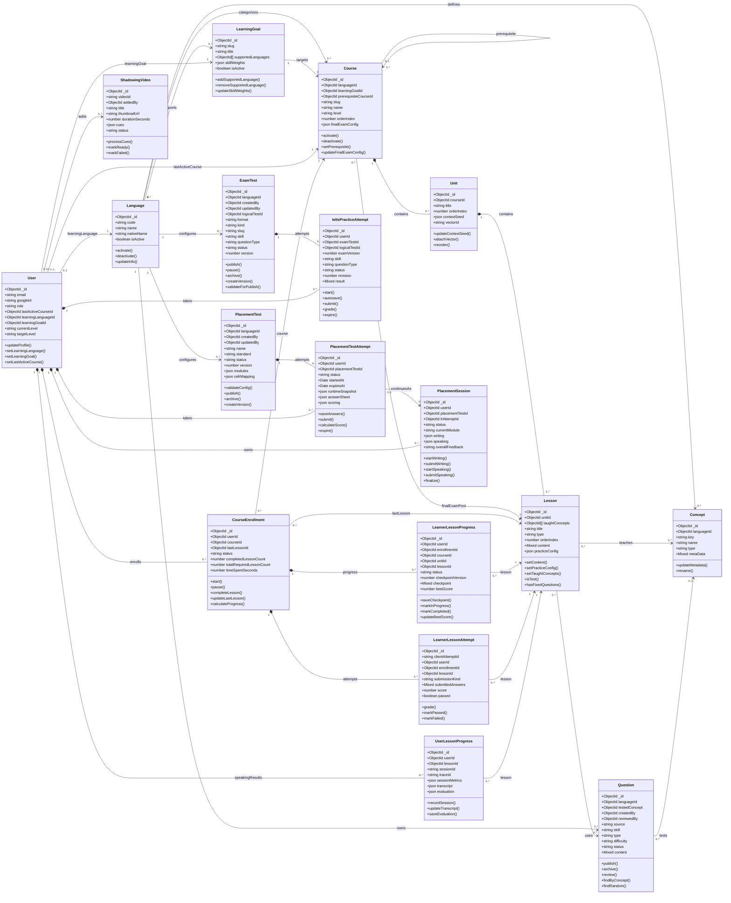

# UniLish - Class diagram

So do nay ve theo dang UML class diagram: moi class co thuoc tinh va phuong
thuc. Danh sach class dua tren 18 model hien co trong `docs/erd.md`.

Code TypeScript duoc sinh tu domain model nam o
`server/src/types/domain-model.types.ts`.

## Class diagram

## Ghi chu

- Thuoc tinh dua tren ERD hien tai.
- Phuong thuc the hien hanh vi nghiep vu chinh dang co trong model/service/repository.
- `UserKnowledgeState` va `AuditLog` khong con trong so do vi model da bi xoa.
