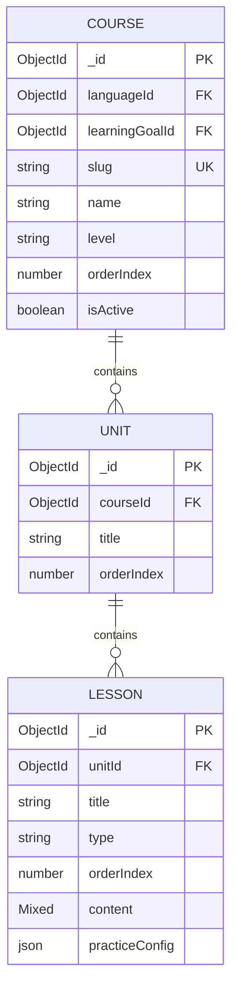
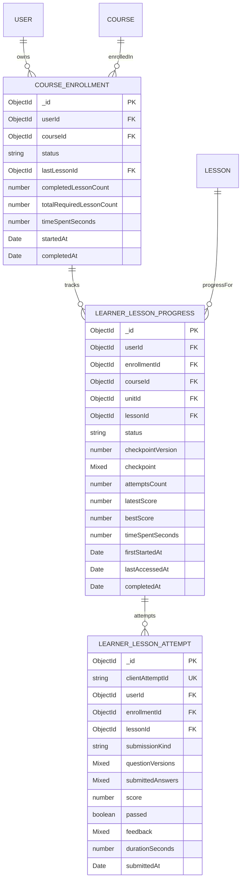

# Data Model

## Existing Curriculum

## New Learning State

## CourseEnrollment

- Source of truth for Course participation and active Course.
- Unique `{ userId, courseId }`.
- Index `{ userId, status, updatedAt: -1 }`.
- Index `{ courseId, status }`.
- Enforce one `ACTIVE` enrollment per user transactionally or with a supported partial unique index.
- `User.lastActiveCourseId` remains a compatibility projection during migration.

## LearnerLessonProgress

- One aggregate state per learner/Lesson.
- Unique `{ userId, lessonId }`.
- Index `{ enrollmentId, status }`.
- Index `{ userId, lastAccessedAt: -1 }`.
- Checkpoint is allowlisted and size-limited by Lesson type.
- `checkpointVersion` supports optimistic concurrency.

## LearnerLessonAttempt

- Immutable submission record.
- Unique `{ userId, clientAttemptId }` prevents duplicate grading.
- Index `{ userId, lessonId, submittedAt: -1 }`.
- Stores submitted learner data and post-grade result, not precomputed client score.
- Stores the submission kind and submitted Question version map so an attempt can be audited against the exact learner DTO.
- Never stores answer-key fields copied from the client; grading reads authoritative Question documents.

## Existing Speaking Progress

The current `UserLessonProgress` schema is a Speaking session result containing transcript, session metrics, and evaluation. Keep it unchanged initially. It may later be renamed to `SpeakingSessionResult`, but it must not be reused as general Lesson progress.

## Consistency Rules

1. Lesson completion and enrollment counters update in one transaction where Mongo deployment supports transactions.
2. If counters drift, canonical completion can be rebuilt from `LearnerLessonProgress` completed records.
3. Course percentage is derived; clients never write it.
4. Curriculum changes require recalculation of `totalRequiredLessonCount` without removing historical attempts.
5. Deleting learner data must cascade enrollment, progress, attempts, and Speaking-session data according to the project's retention policy.
