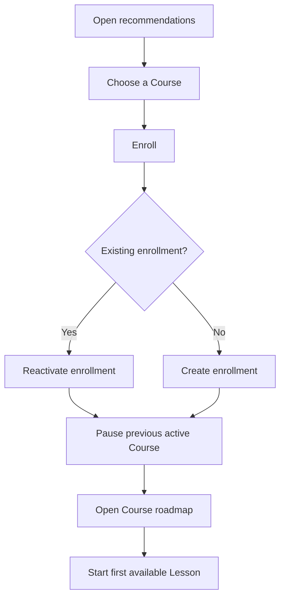
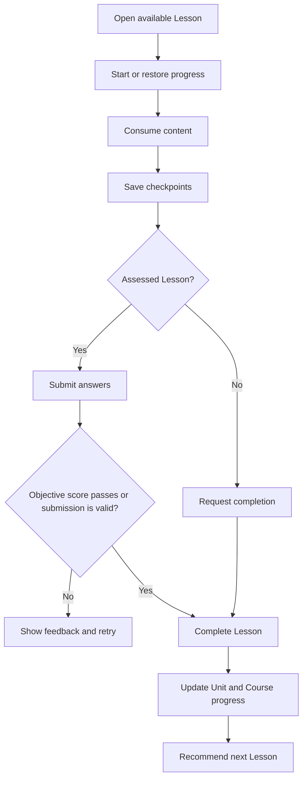
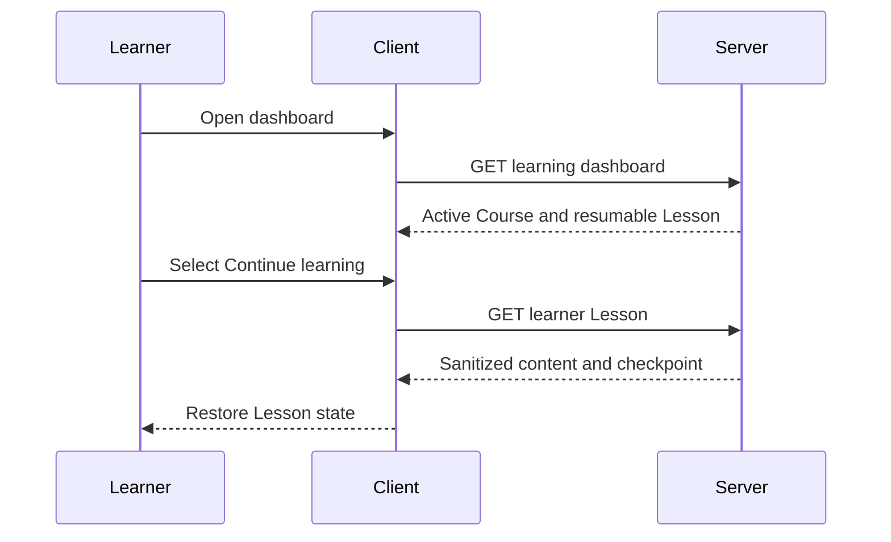
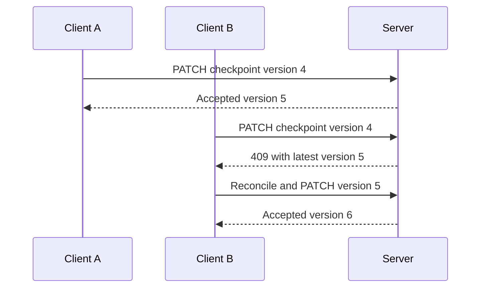
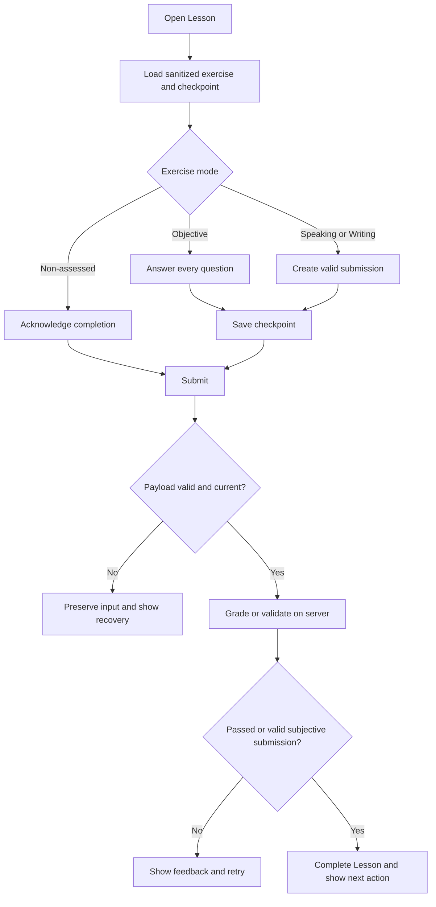

# User Flows

## Flow 1: Enroll and Start

Alternate/error flows:

- Inactive Course: reject enrollment and refresh recommendations.
- Missing prerequisite: return lock reason and keep current enrollment unchanged.
- Duplicate request: return the existing enrollment.

## Flow 2: Study and Complete a Lesson

## Flow 3: Resume

## Flow 4: Checkpoint Conflict

## Flow 5: Course Completion

1. Learner passes/completes the final required Lesson.
2. Server marks that Lesson complete exactly once.
3. Server recalculates Unit and Course completion.
4. Enrollment changes to `COMPLETED` with timestamp.
5. Dashboard shows congratulations, 100%, review CTA, and choose-another-Course CTA.
6. The completed enrollment remains available for review; another Course becomes active only when the learner chooses one.

## Free Lesson Navigation

- All active/published Lessons in an enrolled Course are selectable regardless of `orderIndex`.
- `orderIndex` controls display order and recommended-next behavior only.
- Access may still be unavailable when the Course prerequisite is unmet or curriculum content is inactive.

## Flow 6: Complete a Per-Lesson Exercise

Submission retry after a network failure reuses the same `clientAttemptId`. Starting a deliberate new attempt creates a new ID.
