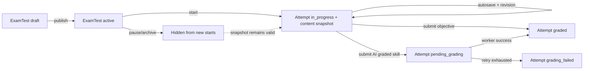

# UniLish — ERD logic tổng thể

Đây là mô hình dữ liệu logic mục tiêu của UniLish, bao gồm học theo khóa, placement test, IELTS Practice và shadowing. ERD ưu tiên các aggregate đang dùng hoặc đã có thiết kế được duyệt; không thể hiện system setting, payment/transaction, coupon, course series, concept và user knowledge state.

> **Trạng thái triển khai:** `IELTS_PRACTICE_ATTEMPT` và các field IELTS Practice mở rộng trên `EXAM_TEST` là mô hình đích theo [thiết kế IELTS Practice](ielts-practice/data-model.md), chưa phải schema đã triển khai hoàn chỉnh. `AUDIT_LOG` đã có model trên server nhưng cần mở rộng action/metadata để đáp ứng audit của IELTS Practice.

Quy ước:

- Chỉ thể hiện các trường cốt lõi và quan hệ giữa collection.
- Các cấu trúc lồng như `content`, `modules`, `answerSheet`, `scoring` và `cues` được giữ dưới dạng `json`/`Mixed`.
- `Course` liên kết trực tiếp với `Language` và `LearningGoal`, không còn qua `CourseSeries`.
- `ExamTest.kind = full_exam` tiếp tục dùng `modules`; `kind = skill_practice` dùng đúng một `skill`, một `questionType` và một `content` union.
- `IeltsPracticeAttempt.contentSnapshot` là snapshot server-only có thể chứa answer key; learner API phải redaction bằng allowlist.
- `PK`: primary key, `FK`: reference, `UK`: unique key.

```mermaid
erDiagram
    LANGUAGE {
        ObjectId _id PK
        string code UK
        string name
        string nativeName
        string flagIconUrl
        boolean isActive
    }

    LEARNING_GOAL {
        ObjectId _id PK
        string slug UK
        string title
        string description
        ObjectId_array supportedLanguages FK
        json skillWeights
        boolean isActive
    }

    COURSE {
        ObjectId _id PK
        ObjectId languageId FK
        ObjectId learningGoalId FK
        ObjectId prerequisiteCourseId FK
        string slug UK
        string name
        string description
        string thumbnailUrl
        string level
        number orderIndex
        number totalUnits
        json finalExamConfig
        ObjectId_array readingLessonIds FK
        ObjectId_array listeningLessonIds FK
        boolean isActive
    }

    UNIT {
        ObjectId _id PK
        ObjectId courseId FK
        string title
        string description
        string thumbnailUrl
        number orderIndex
        json contextSeed
    }

    LESSON {
        ObjectId _id PK
        ObjectId unitId FK
        string title
        string type
        number orderIndex
        Mixed content
        json practiceConfig
        ObjectId_array questionIds FK
    }

    QUESTION {
        ObjectId _id PK
        ObjectId languageId FK
        string source
        string skill
        string type
        string difficulty
        string status
        json stem
        Mixed content
        string explanation
        string_array tags
        ObjectId createdBy FK
        ObjectId reviewedBy FK
    }

    USER {
        ObjectId _id PK
        string email UK
        string googleId UK
        string authProvider
        string password
        boolean isVerified
        string role
        string fullName
        string avatarUrl
        Date lastActiveAt
        ObjectId lastActiveCourseId FK
        ObjectId learningLanguageId FK
        ObjectId learningGoalId FK
        string currentLevel
        string targetLevel
        string_array weakSkills
        number placementTestScore
    }

    USER_LESSON_PROGRESS {
        ObjectId _id PK
        ObjectId userId FK
        ObjectId lessonId FK
        string sessionId UK
        json sessionMetrics
        json transcript
        json evaluation
        Date createdAt
    }

    PLACEMENT_TEST {
        ObjectId _id PK
        ObjectId languageId FK
        string name
        string standard
        string status
        number version
        json settings
        json modules
        json cefrMapping
        ObjectId createdBy FK
        ObjectId updatedBy FK
    }

    PLACEMENT_TEST_ATTEMPT {
        ObjectId _id PK
        ObjectId userId FK
        ObjectId placementTestId FK
        string status
        Date startedAt
        Date expiresAt
        Date submittedAt
        json runtimeSnapshot
        json answerSheet
        json scoring
    }

    PLACEMENT_SESSION {
        ObjectId _id PK
        ObjectId userId FK
        ObjectId placementTestId FK
        ObjectId lrAttemptId FK
        string status
        string currentModule
        json writing
        json speaking
        string overallFeedback
    }

    EXAM_TEST {
        ObjectId _id PK
        ObjectId logicalTestId
        ObjectId languageId FK
        string name
        string format
        string kind
        string slug
        string skill
        string questionType
        string status
        number version
        number durationMinutes
        Mixed content
        json modules
        json scoringConfig
        json settings
        Date publishedAt
        ObjectId createdBy FK
        ObjectId updatedBy FK
    }

    IELTS_PRACTICE_ATTEMPT {
        ObjectId _id PK
        ObjectId userId FK
        ObjectId examTestId FK
        ObjectId logicalTestId
        number examVersion
        string skill
        string questionType
        string status
        number revision
        Mixed contentSnapshot
        Mixed draft
        string_array flaggedItemIds
        Mixed result
        json grading
        Date startedAt
        Date deadlineAt
        Date lastSavedAt
        Date submittedAt
    }

    AUDIT_LOG {
        ObjectId _id PK
        ObjectId actorId FK
        string action
        string target
        ObjectId targetId
        number targetVersion
        Mixed diff
        json metadata
        Date createdAt
    }

    SHADOWING_VIDEO {
        ObjectId _id PK
        string videoId UK
        string title
        string thumbnailUrl
        number durationSeconds
        ObjectId addedBy FK
        json cues
        string status
    }

    LANGUAGE }o--o{ LEARNING_GOAL : supports
    LANGUAGE ||--o{ COURSE : categorizes
    LEARNING_GOAL ||--o{ COURSE : targets
    COURSE ||--o| COURSE : prerequisite
    COURSE ||--o{ UNIT : contains
    UNIT ||--o{ LESSON : contains
    LESSON }o--o{ QUESTION : uses
    COURSE }o--o{ LESSON : finalExamPool

    LANGUAGE ||--o{ QUESTION : has
    LANGUAGE ||--o{ PLACEMENT_TEST : has
    LANGUAGE ||--o{ EXAM_TEST : has

    USER }o--o| LANGUAGE : learns
    USER }o--o| LEARNING_GOAL : follows
    USER }o--o| COURSE : lastActiveCourse
    USER ||--o{ USER_LESSON_PROGRESS : records
    LESSON ||--o{ USER_LESSON_PROGRESS : progressFor

    USER ||--o{ QUESTION : creates
    USER ||--o{ QUESTION : reviews
    USER ||--o{ PLACEMENT_TEST : creates
    USER ||--o{ PLACEMENT_TEST : updates
    USER ||--o{ EXAM_TEST : creates
    USER ||--o{ EXAM_TEST : updates
    USER ||--o{ IELTS_PRACTICE_ATTEMPT : owns
    USER ||--o{ AUDIT_LOG : acts

    EXAM_TEST ||--o{ IELTS_PRACTICE_ATTEMPT : attemptedAsSnapshot
    EXAM_TEST ||--o{ AUDIT_LOG : auditTarget
    IELTS_PRACTICE_ATTEMPT ||--o{ AUDIT_LOG : gradingAuditTarget

    PLACEMENT_TEST ||--o{ PLACEMENT_TEST_ATTEMPT : has
    USER ||--o{ PLACEMENT_TEST_ATTEMPT : takes
    PLACEMENT_TEST ||--o{ PLACEMENT_SESSION : drives
    PLACEMENT_TEST_ATTEMPT ||--o| PLACEMENT_SESSION : starts
    USER ||--o{ PLACEMENT_SESSION : owns

    USER ||--o{ SHADOWING_VIDEO : adds
```

## Index và constraint chính

- `Language.code`, `LearningGoal.slug`, `Course.slug`, `User.email`, `UserLessonProgress.sessionId` và `ShadowingVideo.videoId` là unique.
- `User.googleId` là sparse unique.
- `Course` nên unique theo `{ languageId, learningGoalId, level, orderIndex }`.
- `Unit` unique theo `{ courseId, orderIndex }`.
- `PlacementSession` unique theo `{ userId, lrAttemptId }`.
- `ExamTest` version unique theo `{ logicalTestId, version }` đối với record có `logicalTestId`.
- `ExamTest` chỉ có một active version theo partial unique index `{ logicalTestId, status }` với `status = active`.
- Danh sách IELTS Practice dùng index `{ kind, format, skill, status, publishedAt }`.
- `IeltsPracticeAttempt` chỉ có một attempt `in_progress` theo `{ userId, logicalTestId, status }` bằng partial unique index.
- Autosave IELTS dùng `revision`; update chỉ thành công khi revision request bằng revision hiện tại.
- `IeltsPracticeAttempt.grading.jobId` là sparse unique để worker không chấm trùng.
- Các khóa ngoại thường xuyên được filter cần index: `languageId`, `learningGoalId`, `courseId`, `unitId`, `lessonId`, `userId`, `placementTestId`, `examTestId`.

## Constraint IELTS Practice

| `skill` | `questionType` duy nhất | Constraint nội dung MVP |
|---|---|---|
| `listening` | `form_completion` | Đúng 10 item, có audio và accepted answers |
| `reading` | `true_false_not_given` | Một passage, statements có đáp án enum |
| `writing` | `academic_task_1_chart` | Một prompt/image, 20 phút, tối thiểu 150 từ |
| `speaking` | `ai_conversation` | Một scenario cố định, opening prompt và duration |

`skill_practice` không dùng nhiều module hoặc nhiều question type. Reading Note Completion, Writing Task 2 và full IELTS simulation nằm ngoài MVP.

## Vòng đời IELTS Practice

## Tác động cần đồng bộ vào code

ERD này là mô hình đích đã tối giản. Mongoose schema và service hiện tại cần được cập nhật riêng để:

- chuyển liên kết `Course.seriesId` sang `Course.languageId` và `Course.learningGoalId`;
- đổi `Course.orderInSeries` thành `Course.orderIndex` và bổ sung `slug` nếu dùng route theo slug;
- bỏ `Lesson.taughtConcepts` và `Question.testedConcept`;
- bỏ `User.subscription` và `User.subscription.lastTransactionId`;
- loại bỏ model, repository, service, route và admin UI của các module đã xóa;
- backfill `ExamTest.kind = full_exam` cho dữ liệu hiện có trước khi thêm index mới;
- mở rộng `ExamTest` với `logicalTestId`, `kind`, `slug`, `skill`, `questionType`, `durationMinutes`, `content` và `publishedAt`;
- tạo `IeltsPracticeAttempt` với snapshot, revision, deadline, draft, result và grading state;
- thêm mapper redaction learner-safe; không serialize trực tiếp `contentSnapshot` hoặc answer key;
- mở rộng `AuditLog` với `targetId`, `targetVersion` và action create/update/publish/pause/archive/rollback/retry grading;
- giữ binary image/audio ở R2/Cloudinary; MongoDB chỉ lưu asset id/storage key ổn định.

Chi tiết field, migration và lifecycle IELTS Practice nằm tại [docs/ielts-practice/data-model.md](ielts-practice/data-model.md).
