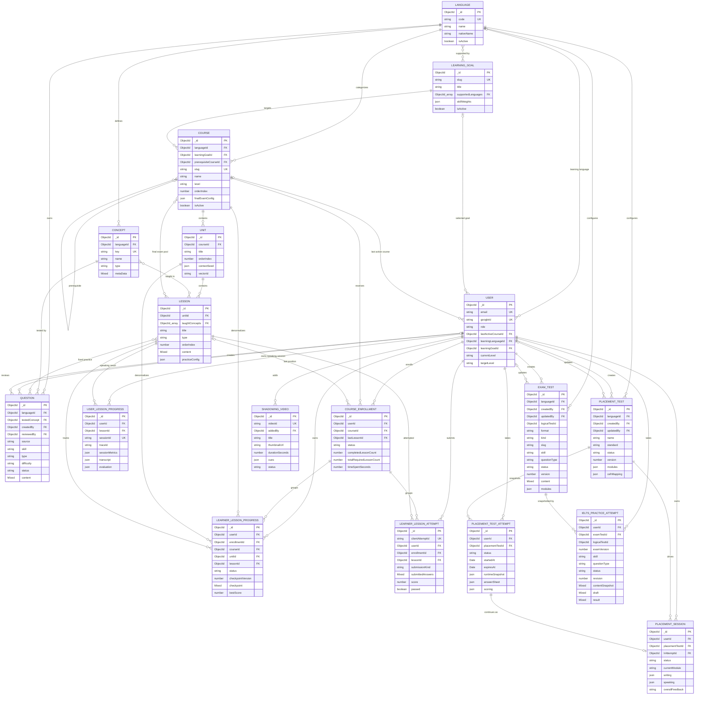

# UniLish — ERD hiện trạng

ERD này phản ánh trực tiếp các Mongoose model đang được triển khai trong
`server/src/models/mongo` tại thời điểm cập nhật. Đây là mô hình logic của
MongoDB: các object lồng (`content`, `modules`, `snapshot`, `draft`, `feedback`,
...) được giữ trong document và không tách thành collection riêng.

Quy ước:

- `PK`: khóa chính MongoDB.
- `FK`: trường `ObjectId` có khai báo `ref` tới model khác.
- `UK`: unique key hoặc thuộc unique compound index.
- `ObjectId_array`: mảng reference; quan hệ vật lý được lưu ở một phía.
- Các field trong sơ đồ là field cốt lõi, không phải toàn bộ schema.

## ERD tổng thể

## Nhóm chức năng

| Nhóm | Collection | Vai trò |
|---|---|---|
| Danh mục học | `languages`, `learninggoals`, `courses`, `units`, `lessons` | Cấu trúc chương trình học |
| Knowledge graph/CMS | `concepts`, `questions` | Concept và ngân hàng câu hỏi |
| Tiến độ học | `courseenrollments`, `learnerlessonprogresses`, `learnerlessonattempts` | Enrollment, checkpoint và lịch sử nộp bài |
| Speaking legacy | `userlessonprogresses` | Kết quả từng phiên luyện nói; không phải progress tổng quát |
| Placement | `placementtests`, `placementtestattempts`, `placementsessions` | Cấu hình đề, L/R attempt và chuỗi Writing/Speaking |
| IELTS/Exam | `examtests`, `ieltspracticeattempts` | Full exam/skill practice và attempt snapshot |
| Vận hành | `shadowing_videos` | Nội dung shadowing |

## Constraint và index quan trọng

| Collection | Constraint chính |
|---|---|
| `languages` | `code` unique |
| `learninggoals` | `slug` unique |
| `courses` | `slug` unique; `{ languageId, learningGoalId, level, orderIndex }` unique |
| `units` | `{ courseId, orderIndex }` unique |
| `concepts` | `{ languageId, key }` unique |
| `users` | `email` unique; `googleId` sparse unique |
| `courseenrollments` | `{ userId, courseId }` unique |
| `learnerlessonprogresses` | `{ userId, lessonId }` unique |
| `learnerlessonattempts` | `{ userId, clientAttemptId }` unique |
| `userlessonprogresses` | `sessionId` unique |
| `placementsessions` | `{ userId, lrAttemptId }` unique |
| `examtests` | `{ logicalTestId, version }` sparse unique |
| `ieltspracticeattempts` | Một `in_progress` attempt cho `{ userId, logicalTestId }` bằng partial unique index |
| `shadowing_videos` | `videoId` unique |

## Lưu ý kiến trúc

1. `Course.seriesId` vẫn tồn tại để tương thích migration nhưng trỏ tới
   `CourseSeries`, trong khi project hiện không còn model `CourseSeries`; vì vậy
   quan hệ này không được đưa vào ERD chính.
2. `Lesson.taughtConcepts` và `Question.testedConcept` vẫn đang tồn tại trong
   schema hiện hành, dù tài liệu migration trước đó từng đề xuất loại bỏ.
3. `LearnerLessonProgress` là aggregate tiến độ chung. `UserLessonProgress` là
   kết quả phiên Speaking cũ; hai collection không nên được hiểu là cùng một
   loại dữ liệu.
4. `ExamTest.logicalTestId` và `IeltsPracticeAttempt.logicalTestId` là khóa gom
   version theo nghiệp vụ, không khai báo Mongoose `ref`, nên không vẽ như FK.
5. Pinecone không phải MongoDB collection. `Unit.vectorId` và
   `KnowledgeVectorMetadata.mongo_id` là liên kết cross-store mềm, không có ràng
   buộc FK.
6. Các snapshot và nội dung polymorphic được embed trong document để giữ đúng
   cách MongoDB/Mongoose đang lưu dữ liệu; chúng không phải entity độc lập.

## Nguồn đối chiếu

- Mongo models: `server/src/models/mongo/*.model.ts`
- Vector metadata: `server/src/models/vector/*.ts`
- Luồng học: `docs/course-learning/data-model.md`
- IELTS Practice: `docs/ielts-practice/data-model.md`
