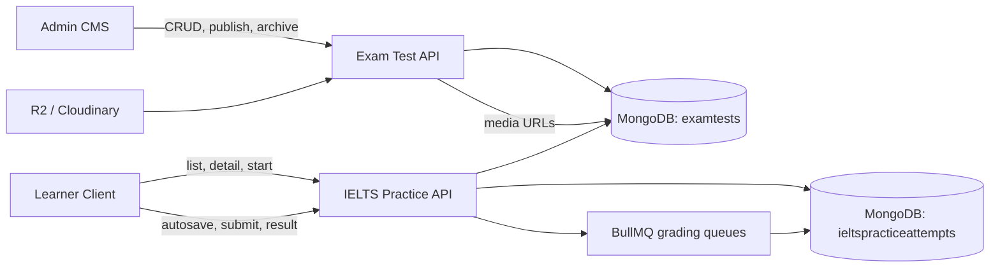

# IELTS Practice — CRUD nội dung và làm bài

## Tóm tắt

Tài liệu này đặc tả tính năng quản trị nội dung và làm bài IELTS theo từng kỹ năng. MVP giữ đúng một dạng bài cho mỗi kỹ năng, bám theo trải nghiệm learner hiện đã có trong client:

| Kỹ năng | Dạng duy nhất trong MVP | Mã hợp đồng |
|---|---|---|
| Listening | Form Completion, 10 câu trả lời ngắn | `form_completion` |
| Reading | True / False / Not Given | `true_false_not_given` |
| Writing | Academic Task 1 có ảnh/biểu đồ, một bài viết | `academic_task_1_chart` |
| Speaking | Hội thoại theo tình huống với AI Coach | `ai_conversation` |

Admin quản lý đề theo vòng đời draft → active → paused/archived. Learner chỉ nhìn thấy đề active, có thể bắt đầu, autosave, tiếp tục và nộp một lượt làm. Nội dung dùng `ExamTest` hiện có làm aggregate quản trị; lượt làm dùng collection riêng để không trộn dữ liệu người học vào nội dung.

## Hiện trạng đã kiểm tra

- Client có hub bốn kỹ năng, danh sách đề và player Listening/Reading/Writing; dữ liệu đề và đáp án vẫn hard-code trong component.
- Speaking từ danh sách đề đang điều hướng sang AI Voice chung, chưa tạo attempt gắn với đề đã chọn.
- Reading prototype hiện render cả True/False/Not Given và Note Completion. Theo yêu cầu mới, MVP chỉ giữ True/False/Not Given; Note Completion không được đưa vào API production.
- Writing hiện chỉ có một bài Academic Task 1, 20 phút, tối thiểu 150 từ và lưu nháp localStorage.
- Server có CRUD `/api/exam-tests`, version/status/audit cơ bản, nhưng chỉ cho admin/content creator và chưa có learner API.
- `ExamTest` IELTS mặc định hiện chứa đủ bốn module và Writing Task 1 + Task 2; cấu trúc này chưa phù hợp với một đề luyện riêng theo kỹ năng.
- Admin chưa có route/UI riêng cho IELTS practice CRUD. Module `placement-test` không phải màn hình quản lý IELTS practice và không được tái sử dụng như cùng một nghiệp vụ.
- Chưa có model attempt cho IELTS practice, endpoint autosave/submit, thống kê thật hoặc cơ chế redaction đáp án đúng.

## Mục lục

- [Yêu cầu](requirements.md)
- [Luồng người dùng](user-flows.md)
- [Thiết kế UX và hệ thống](design-spec.md)
- [Hợp đồng API](api-contract.md)
- [Mô hình dữ liệu](data-model.md)
- [Tiêu chí nghiệm thu](acceptance-criteria.md)
- [Kế hoạch triển khai](plan.md)
- [Quyết định](decisions.md)

## Phạm vi

### Trong phạm vi

- CRUD và vòng đời đề luyện IELTS trên admin.
- Một đề thuộc chính xác một kỹ năng và một dạng bài MVP.
- Upload/tham chiếu media cần thiết cho Listening và Writing.
- Danh sách đề learner theo kỹ năng, attempt count và thời lượng.
- Start/resume/autosave/submit attempt.
- Chấm tự động Listening/Reading; pipeline chấm bất đồng bộ cho Writing/Speaking sau khi adapter tương ứng sẵn sàng.
- Phiên bản nội dung và snapshot attempt để đề thay đổi không làm sai lượt đang làm.
- Phân quyền, audit, idempotency và trạng thái lỗi/empty/loading/offline.

### Ngoài phạm vi MVP

- Full IELTS exam gồm bốn kỹ năng trong một phiên.
- Nhiều dạng câu hỏi trong cùng một kỹ năng.
- Reading Note Completion, Matching, Multiple Choice.
- Writing Task 2.
- Speaking Part 1/2/3 mô phỏng đầy đủ examiner.
- Marketplace, trả phí, quota theo gói, xếp hạng và chứng chỉ.
- AI tự sinh/parse đề production.

## Kiến trúc tổng quan

## Phụ thuộc

- Auth/JWT và role hiện có: `admin`, `content_creator`, learner đã đăng nhập.
- MongoDB/Mongoose, Redis/BullMQ, R2/Cloudinary và logger hiện có.
- Chuẩn response `ApiEnvelope<T>` hiện tại.
- Client dùng TanStack Query cho server state; CSS Modules và design token hiện có.
- Admin dùng React Query, Tailwind và Shadcn/UI.

## Truy vết

| Mục tiêu | Requirements | Acceptance criteria |
|---|---|---|
| Learner tìm và mở đề | FR-01–FR-04 | AC-01–AC-05 |
| Làm, lưu và nộp bài | FR-05–FR-11 | AC-06–AC-15 |
| Admin CRUD và publish | FR-12–FR-19 | AC-16–AC-24 |
| Chất lượng hệ thống | NFR-01–NFR-09 | AC-25–AC-31 |

## Trạng thái sẵn sàng

**DRAFT.** Luồng, API và model đủ để FE/BE estimate, nhưng chưa được đánh dấu READY FOR IMPLEMENTATION vì còn ba quyết định sản phẩm cần xác nhận:

1. Retention của attempt/audio learner là bao lâu.
2. Writing Task 1 và Speaking dùng AI grading ngay trong MVP hay chỉ lưu submission ở phase đầu.
3. Content creator có được tạo/sửa draft hay tiếp tục chỉ đọc như quyền server hiện tại.

Các lựa chọn mặc định trong tài liệu được đánh dấu `PROPOSED`, không được coi là quyết định sản phẩm cuối cùng.
