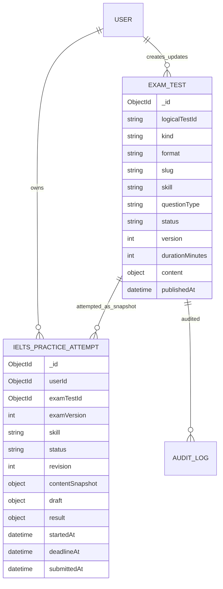
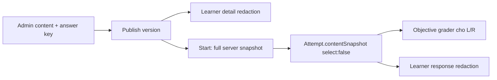

# Mô hình dữ liệu

## 1. Nguồn dữ liệu thật

| Dữ liệu | Nguồn authoritative |
|---|---|
| Nội dung/version/status đề | MongoDB `examtests` |
| Attempt/draft/submission/result | MongoDB `ieltspracticeattempts` |
| Binary image/audio | R2/Cloudinary; Mongo chỉ lưu asset id/storage key |
| UI cache | TanStack Query/local recovery cache, không authoritative |

## 2. ERD logic

MongoDB embedded objects trong sơ đồ là composition, không phải bảng quan hệ.



## 3. `ExamTest` mở rộng

### Root fields

| Field | Type | Rule |
|---|---|---|
| `_id` | ObjectId | Version record id |
| `logicalTestId` | ObjectId/UUID | Ổn định qua các version của cùng đề |
| `kind` | enum | Existing records backfill `full_exam`; MVP mới `skill_practice` |
| `format` | enum | `ielts` |
| `slug` | string | Lowercase kebab-case; unique trong active logical test |
| `name` | string | 3–200 chars; dùng làm title |
| `description` | string? | Tối đa 2000 |
| `languageId` | ObjectId | Ref Language |
| `language` | string | Denormalized code hiện có |
| `skill` | enum | Một trong bốn skill; required khi `kind=skill_practice` |
| `questionType` | enum | Phải đúng mapping ADR-001 |
| `durationMinutes` | int | >0; default theo skill |
| `content` | embedded union | Admin content; L/R gồm answer key |
| `status` | enum | draft/active/paused/archived |
| `version` | int | >=1, tăng theo logicalTestId |
| `settings` | embedded | allowRetake/cooldown hiện có |
| `publishedAt` | Date? | Set khi active lần đầu |
| `createdBy`, `updatedBy` | ObjectId | Ref User |
| timestamps | Date | UTC |

### Content discriminated union

```ts
type IeltsPracticeContent =
  | {
      questionType: 'form_completion';
      instruction: string;
      heading: string;
      audioAssetId: string;
      items: Array<{
        id: string;
        order: number;
        before: string;
        after: string;
        acceptedAnswers: string[];
        caseSensitive: boolean;
      }>;
    }
  | {
      questionType: 'true_false_not_given';
      title: string;
      passage: string[];
      instruction: string;
      statements: Array<{
        id: string;
        order: number;
        text: string;
        correctAnswer: 'TRUE' | 'FALSE' | 'NOT_GIVEN';
        explanation?: string;
      }>;
    }
  | {
      questionType: 'academic_task_1_chart';
      prompt: string;
      instruction: string;
      imageAssetId: string;
      imageAlt: string;
      minWords: 150;
    }
  | {
      questionType: 'ai_conversation';
      scenarioTitle: string;
      context: string;
      openingPrompt: string;
      expectedDurationMinutes: number;
      voice: string;
    };
```

Không dùng `strict:false` như cơ chế validation chính cho content mới; Zod và Mongoose discriminator phải cùng mô tả union.

### Indexes

```text
{ kind: 1, format: 1, skill: 1, status: 1, publishedAt: -1 }
{ logicalTestId: 1, version: -1 } unique
{ slug: 1, status: 1 }
{ languageId: 1, kind: 1, skill: 1 }
```

Partial unique index đề xuất cho một active version:

```text
{ logicalTestId: 1, status: 1 } unique where status = "active"
```

## 4. `IeltsPracticeAttempt`

| Field | Type | Rule |
|---|---|---|
| `_id` | ObjectId | attemptId |
| `userId` | ObjectId | Owner, required |
| `examTestId` | ObjectId | Version record đã start |
| `logicalTestId` | ObjectId/UUID | Hỗ trợ retake/history |
| `examVersion` | int | Pin version |
| `skill`, `questionType` | enum | Denormalized từ snapshot |
| `status` | enum | Attempt state machine |
| `revision` | int | Bắt đầu 0; +1 mỗi save thành công |
| `contentSnapshot` | embedded | Full server snapshot gồm answer key; select false mặc định |
| `draft` | embedded union | Theo skill |
| `flaggedItemIds` | string[] | Chỉ L/R |
| `startedAt` | Date | Server time |
| `deadlineAt` | Date | startedAt + duration |
| `lastSavedAt` | Date? | Autosave success |
| `submittedAt` | Date? | Immutable khi submit |
| `result` | embedded? | Chỉ có objective result cho Listening/Reading trong MVP |
| `createdAt`, `updatedAt` | Date | UTC |

### Draft union

```ts
type AttemptDraft =
  | { skill: 'listening'; answers: Record<string, string> }
  | { skill: 'reading'; answers: Record<string, 'TRUE' | 'FALSE' | 'NOT_GIVEN'> }
  | { skill: 'writing'; essay: string; wordCount: number }
  | {
      skill: 'speaking';
      transcriptSegments: Array<{
        id: string;
        speaker: 'learner' | 'coach';
        text: string;
        startedAtMs: number;
        endedAtMs?: number;
      }>;
      audioAssetIds: string[];
    };
```

`wordCount` là derived cache; server tính lại khi save/submit và không tin giá trị client.

### Result

```ts
interface ObjectiveResult {
  gradingType: 'objective';
  correct: number;
  total: number;
  normalizedScore: number; // 0..1
  itemResults: Array<{ itemId: string; correct: boolean }>;
}

```

Writing/Speaking không có `result` trong MVP; trạng thái dừng ở `submitted`. AI result và grading metadata chỉ được bổ sung bằng contract version cùng ADR mới.

### Attempt indexes

```text
{ userId: 1, createdAt: -1 }
{ examTestId: 1, status: 1 }
{ logicalTestId: 1, userId: 1, createdAt: -1 }
{ status: 1, deadlineAt: 1 }
```

Một active attempt/user/logical test dùng partial unique index:

```text
{ userId: 1, logicalTestId: 1, status: 1 }
unique where status = "in_progress"
```

## 5. Snapshot và redaction



- Snapshot copy đủ nội dung để render/chấm dù version bị archive.
- Learner API mapper dùng allowlist fields, không dùng object spread rồi xóa answer key.
- Admin preview learner DTO cũng chạy cùng mapper.

## 6. Lifecycle và cleanup

- `ExamTest` archive không xóa attempts/snapshots.
- Không hard-delete attempt/submission learner trong MVP.
- Idempotency records TTL tối thiểu 24 giờ.
- Attempt, essay, transcript và audio Speaking được lưu vĩnh viễn; không có TTL hoặc cleanup worker.
- Speaking audio không áp dụng storage lifecycle xóa tự động.

## 7. Migration

1. Backfill `kind='full_exam'` cho `examtests` hiện có.
2. Không tự biến full IELTS record hiện có thành skill practice.
3. Seed/import các card mock thành 32 logical skill-practice tests chỉ sau khi có bản quyền/content thật; không copy nội dung Cambridge không được cấp phép.
4. Thêm index sau khi backfill để tránh duplicate key.
5. Đổi default IELTS modules hiện có không thuộc migration MVP; create skill practice bắt buộc payload rõ `kind`.

## 8. Audit log

Audit events tối thiểu:

- `ielts_test.created`
- `ielts_test.updated`
- `ielts_test.published`
- `ielts_test.paused`
- `ielts_test.archived`
- `ielts_test.rollback_created`

Payload audit chứa actorId, target id/version, requestId, changed field names và timestamp; không chứa answer text, essay, transcript hoặc raw provider response.
