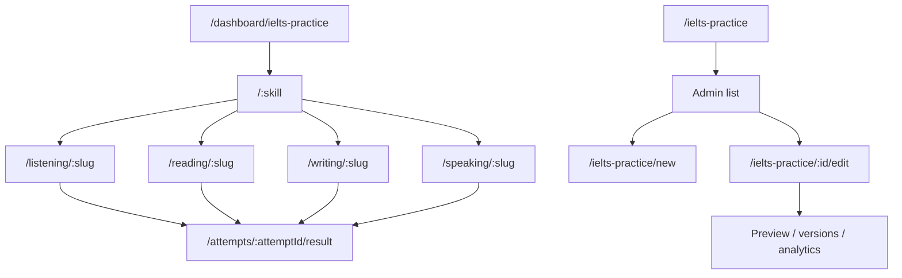

# Thiết kế UX và hệ thống

## 1. Nguyên tắc

- Giữ visual language hiện có: canvas xám nhạt, card trắng, ink gần đen, green accent IELTS, border hairline, CSS variables.
- Client learner dùng CSS Modules; server state dùng TanStack Query; Zustand không giữ test data/attempt data.
- Admin dùng Tailwind/Shadcn và pattern list/editor của admin hiện có.
- Mỗi skill có renderer riêng nhưng dùng chung shell: header, timer, exit, submit, save state và modal.
- Không render component dựa trên string tùy ý từ server; `skill + questionType` phải qua discriminated union exhaustively checked.

## 2. Information architecture



## 3. Learner screen inventory

| Screen | Current code | Desired data behavior |
|---|---|---|
| Skill hub | `IeltsPracticePage.tsx` | GET skill summary; loading/error/empty counts |
| Test list | `IeltsSkillPage.tsx` | GET paginated active tests; no mock arrays |
| Listening | `IeltsListeningTestPage.tsx` | Bind Form Completion DTO and attempt draft |
| Reading | `IeltsReadingTestPage.tsx` | Bind only TFNG; remove Note Completion production block |
| Writing | `IeltsWritingTestPage.tsx` | Bind one Task 1 DTO; server autosave replaces local-only save |
| Speaking | AI Voice capability | Add dedicated attempt route; inject fixed scenario |
| Result | New | L/R hiển thị objective score; W/S xác nhận đã nộp, chưa chấm |

## 4. Player shell wireframe

```text
┌──────────────────────────────────────────────────────────────────────┐
│ IELTS <Skill> · <Test title>        19:32       Thoát   [Nộp bài]   │
├─────────────────────────────┬───────────────────────────┬────────────┤
│ Prompt / passage / audio    │ Answer workspace          │ Tiến độ   │
│                             │                           │ 6/10      │
│ Skill-specific content      │ Skill-specific inputs     │ [1][2]... │
│                             │                           │ Legend    │
├─────────────────────────────┴───────────────────────────┴────────────┤
│ Save state: Đã lưu / Chưa đồng bộ / Xung đột                        │
└──────────────────────────────────────────────────────────────────────┘
```

- Listening có một content pane + progress aside như prototype.
- Reading giữ split passage/questions + progress aside.
- Writing giữ prompt/editor/progress; không có tab Task 1/2.
- Speaking thay answer pane bằng conversation stage, recorder status và transcript state.

## 5. UI states bắt buộc

### Hub/list

| State | Hành vi |
|---|---|
| Loading | Skeleton đúng kích thước card, không nhảy layout |
| Empty | Nêu kỹ năng chưa có đề, link quay về hub |
| Error | Message ngắn + retry; không thay bằng mock data |
| Success | Card từ API; attempt count format `vi-VN` |

### Player

| State | Hành vi |
|---|---|
| Initializing | Khóa input cho tới khi start/resume trả snapshot |
| Saving | “Đang lưu…”; không block typing |
| Saved | Hiện `savedAt`; screen reader nhận thông báo polite |
| Offline | “Chưa đồng bộ”; giữ local recovery cache và retry |
| Conflict | Modal so sánh timestamp; mặc định tải bản server an toàn |
| Expired | Khóa input, cho xem draft, CTA quay lại list |
| Submitting | Disable submit; idempotency key không đổi khi retry |
| Submitted ungraded | Writing/Speaking xác nhận đã lưu vĩnh viễn; không hiển thị spinner “đang chấm” |

## 6. Admin list

- Columns: Title, Skill, Type, Duration, Status, Version, Attempts, Updated at, Updated by, Actions.
- Filters: search title/slug; skill; status. Format/kind được cố định IELTS/skill practice trong module này.
- Actions theo status: edit/preview, create version, publish, pause, archive, versions, analytics.
- Bulk archive không thuộc MVP.

## 7. Admin editor

### Step 1 — General

- Title, slug (auto-generate nhưng editable trước publish), description.
- Skill selector; sau khi có content, đổi skill yêu cầu confirm reset content.
- Duration fixed default theo skill nhưng admin được chỉnh trong boundary đã duyệt.

### Step 2 — Content theo skill

- Listening: audio upload/reference + 10 row editor `before | blank | after | accepted answers`.
- Reading: passage editor + statement table + TRUE/FALSE/NOT_GIVEN answer.
- Writing: prompt, instruction, chart image, min words.
- Speaking: scenario title, context, opening prompt, expected duration, voice config reference.

### Step 3 — Preview & publish

- Preview dùng learner renderer với DTO redacted, nhưng có admin-only answer overlay toggle cho L/R.
- Validation summary liên kết tới field lỗi.
- Publish confirm hiển thị version và ảnh hưởng: active version cũ được archive, attempt cũ giữ snapshot.

## 8. Component boundary đề xuất

```text
client/src/features/dashboard/ielts-practice/
├── api/
├── hooks/
├── types/
├── components/
│   ├── ExamShell/
│   ├── SaveStatus/
│   ├── SubmitDialog/
│   └── renderers/
│       ├── ListeningFormCompletion.tsx
│       ├── ReadingTrueFalseNotGiven.tsx
│       ├── WritingTaskOneChart.tsx
│       └── SpeakingAiConversation.tsx
└── pages/

admin/src/features/ielts-practice/
├── api/
├── hooks/
├── types/
├── components/
│   ├── TestTable/
│   ├── GeneralForm/
│   ├── PublishValidation/
│   └── editors/
└── pages/
```

Đây là ranh giới responsibility, không phải yêu cầu tên file bắt buộc. FE có thể điều chỉnh nếu vẫn giữ feature-first và contract types.

## 9. Query/cache behavior

| Query | Key gợi ý | Invalidation |
|---|---|---|
| Hub summary | `['ielts-practice','summary']` | publish/pause/archive |
| Test list | `['ielts-practice','tests',filters]` | publish/pause/archive |
| Test detail | `['ielts-practice','test',slug]` | publish version mới |
| Attempt | `['ielts-practice','attempt',id]` | start/save/submit |
| Admin list/detail | `['admin','ielts-practice',...]` | mọi CRUD/status mutation |

Draft typing không đưa vào global Zustand. Dùng local component/form state; server draft đồng bộ qua mutation tuần tự hoặc latest-write queue.

## 10. Accessibility

- Timer có accessible label và không announce mỗi giây; chỉ announce mốc 5 phút/1 phút/hết giờ.
- Audio controls có label; progress range keyboard-operable.
- Mọi question input liên kết label với số câu.
- Color không là tín hiệu duy nhất cho answered/flagged/error.
- Modal trap focus, Escape đóng nếu chưa submitting, trả focus về trigger.
- Passage/answer panes có heading và landmark rõ ràng.

## 11. Telemetry

| Event | Thuộc tính tối thiểu |
|---|---|
| `ielts_skill_opened` | skill |
| `ielts_test_opened` | testId, version, skill |
| `ielts_attempt_started` | attemptId, testId, resumed |
| `ielts_draft_saved` | attemptId, revision, latencyMs |
| `ielts_attempt_submitted` | attemptId, durationSeconds, answeredCount |
| `ielts_objective_graded` | attemptId, skill, latencyMs |

Không gửi essay, transcript, answer text hoặc signed media URL vào analytics.
