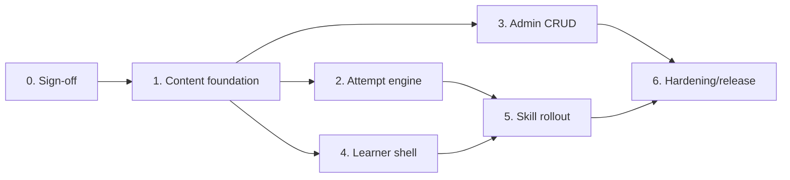

# Kế hoạch triển khai

## 1. Nguyên tắc sequencing

1. Chốt contract và model trước khi thay mock data trong client.
2. BE hoàn thành redaction/start/autosave/submit tối thiểu trước khi FE nối player.
3. Admin CRUD có thể làm song song sau khi Zod/Mongoose union ổn định.
4. Mỗi skill rollout sau contract tests chung; không ghép cả bốn vào một PR lớn.
5. Writing/Speaking grading không chặn việc lưu/nộp submission nếu product chấp nhận phase `pending_grading`.

## 2. Work breakdown

### Phase 0 — Product/contract sign-off

**Owner:** Product + BA + FE lead + BE lead  
**Depends on:** Không

- Chốt retention attempt/audio.
- Chốt AI grading MVP cho Writing/Speaking.
- Chốt quyền content creator.
- Review ADR-002 mở rộng ExamTest và mapping một dạng/skill.
- Freeze API/data contract v1.

**Exit:** README chuyển `READY FOR IMPLEMENTATION`; không còn open blocker.

### Phase 1 — Server content foundation

**Owner:** BE  
**Depends on:** Phase 0

- Backfill `ExamTest.kind=full_exam`; thêm field/index skill-practice.
- Tạo Zod + Mongoose discriminated content union.
- Mở rộng repository filters và service version/publish validation.
- Thêm create-version, validate-publish, soft-delete endpoints.
- Tạo learner redaction mapper và contract tests.
- Hoàn thiện analytics từ attempt aggregation sau Phase 2.

**Requirements:** FR-04, FR-12–FR-19  
**AC:** AC-04, AC-05, AC-16–AC-24, AC-28

### Phase 2 — Attempt engine

**Owner:** BE  
**Depends on:** Phase 1

- Tạo `IeltsPracticeAttempt` model/repository/service/controller/validation/routes.
- Start/resume với transaction + idempotency.
- Deadline, autosave revision, ownership, submit lock.
- Objective grading Listening/Reading.
- Queue adapter interface cho Writing/Speaking; chưa bật nếu ADR-008 chưa accepted.
- Structured logging, rate limit, expired attempt handling.

**Requirements:** FR-05–FR-11  
**AC:** AC-06–AC-15, AC-25–AC-30

### Phase 3 — Admin IELTS Practice

**Owner:** Admin FE + BE support  
**Depends on:** Phase 1

- Add admin routes `/ielts-practice`, `/new`, `/:id/edit`.
- List/search/filter/status/version actions.
- General form và bốn content editor cố định theo skill.
- Media upload/reference integration.
- Preview, validation summary, publish/pause/archive/rollback.
- React Query invalidation và permission states.

**Requirements:** FR-12–FR-19  
**AC:** AC-16–AC-24, AC-29, AC-31

### Phase 4 — Learner discovery và shared shell

**Owner:** Client FE  
**Depends on:** Phase 1 + learner list/detail endpoints

- Thay SKILLS/test arrays hard-code bằng summary/list/detail queries.
- Implement loading/empty/error states.
- Tạo shared ExamShell/SaveStatus/SubmitDialog.
- Attempt start/resume, deadline timer, autosave queue, local recovery/conflict flow.
- Result/pending grading screen.

**Requirements:** FR-01–FR-09  
**AC:** AC-01–AC-13, AC-25–AC-29

### Phase 5 — Skill rollout

**Owner:** Client FE + BE  
**Depends on:** Phase 2 + Phase 4

Order đề xuất theo độ rủi ro:

1. **Listening/Form Completion:** bind audio/items, answer draft, exact grading.
2. **Reading/TFNG:** bind passage/statements, bỏ Note Completion production block.
3. **Writing/Task 1:** bind prompt/image/minWords, server autosave; sửa grading adapter từ Task 2 sang Task 1 nếu bật.
4. **Speaking/AI Conversation:** route riêng, inject fixed scenario, microphone/upload/transcript, attempt integration.

Mỗi rollout có feature flag độc lập `ielts_practice_<skill>_api` và rollback về unavailable state, không quay lại mock data.

### Phase 6 — Hardening và release

**Owner:** QA + FE + BE + DevOps  
**Depends on:** Phase 3–5

- Contract, unit, integration, component và E2E tests.
- Security review redaction/ownership/media URLs.
- Load test P95; index review; queue retry/duplicate test.
- Accessibility + responsive verification.
- Seed content có quyền sử dụng; smoke test production.
- Observability dashboard và alert grading failure/autosave error.

## 3. Dependency graph

## 4. FE handoff

| Work item | Inputs | Done when |
|---|---|---|
| Hub/list integration | FR-01–04, TestSummaryDto | Không còn hard-code, đủ states |
| Attempt shell | FR-05–09, attempt API | Resume/timer/autosave/conflict/submit chạy E2E |
| Renderers | Skill DTO unions | Exhaustive switch, một type/skill |
| Admin CRUD | Admin payload/endpoints | Preview/publish/version/archive chạy theo role |
| Speaking adapter | ADR-007 | Không bắt learner chọn lại topic/level/scenario |

## 5. BE handoff

| Work item | Inputs | Done when |
|---|---|---|
| ExamTest migration | ADR-002, data-model | Backfill/index/compat tests pass |
| Content validation | Skill rules | Invalid type/cardinality/media không publish được |
| Learner mapper | DTO/redaction | Contract security suite pass |
| Attempt engine | FR-05–11 | Ownership/idempotency/revision/deadline tests pass |
| Grading | ADR-008 | Objective stable; async jobs idempotent và observable |

## 6. Test plan

### Server

- Unit: content validators, redaction mapper, answer normalization, word count, state transitions.
- Repository: partial unique indexes, revision conditional update, version queries.
- Integration: auth/role, CRUD/status/version, start duplicate, autosave conflict, submit retry, expired attempt.
- Queue: duplicate job, retry, poison job, worker restart.

### Client/Admin

- Hook tests: list/detail/start/save/submit mutation and invalidation.
- Component tests: four renderers, modal, SaveStatus, validation errors.
- E2E: one happy path per skill; offline/reload/conflict; admin create→preview→publish→learner list.
- Accessibility: axe + keyboard script for player and admin editor.

## 7. Rollout

- Seed tối thiểu một đề licensed/nội bộ cho mỗi skill ở staging.
- Internal admin/content review trước learner flag.
- Bật Listening → Reading → Writing → Speaking.
- Monitor start error, autosave error, submit error, completion rate, grading queue age.
- Rollback bằng feature flag/status pause; không hard-delete content/attempt.

## 8. Risks

| Risk | Impact | Mitigation |
|---|---|---|
| Overload `ExamTest` hiện có | Regression placement/full exam | `kind` discriminator, backfill, compatibility tests |
| Lộ answer key | Critical | Allowlist mapper + snapshot contract tests |
| Autosave race nhiều thiết bị | Mất dữ liệu | Revision conflict + recovery UI |
| Writing worker đang chấm Task 2 | Sai feedback | Adapter/rubric Task 1 riêng trước khi bật |
| Speaking flow tự do không gắn đề | Sai analytics/attempt | Dedicated route + fixed scenario injection |
| Nội dung Cambridge có bản quyền | Legal | Chỉ seed nội dung được cấp phép hoặc nội bộ |
| Chưa có retention | Privacy/storage | Block hard-delete scheduler; chốt ở Phase 0 |

## 9. Estimate framework

Không đưa số ngày khi chưa có team capacity. Team estimate theo các vertical slice:

- Slice A: content model + admin CRUD.
- Slice B: learner list/detail + Listening end-to-end.
- Slice C: Reading end-to-end.
- Slice D: Writing end-to-end + optional grading.
- Slice E: Speaking end-to-end + media/AI.
- Slice F: analytics, hardening, rollout.

Mỗi slice phải có FE, BE, test, migration/seed và observability; không estimate UI tách khỏi contract/server work.
