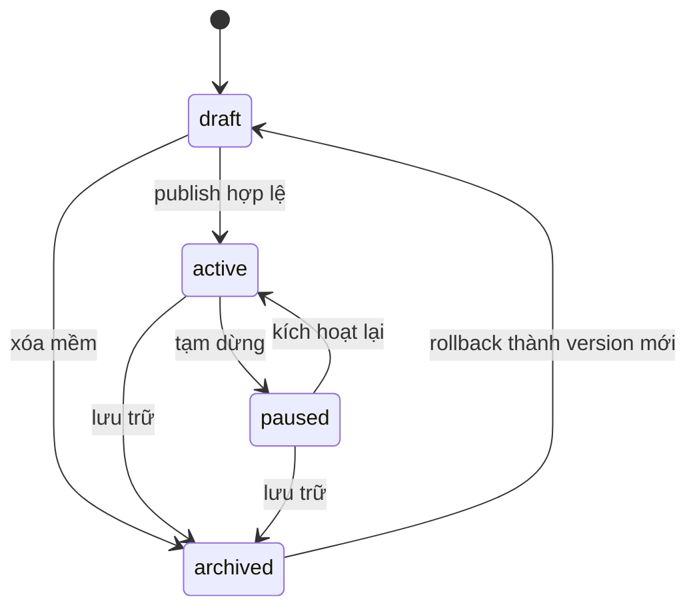
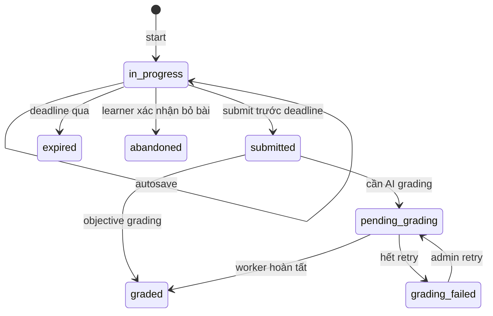

# Yêu cầu nghiệp vụ

## 1. Mục tiêu

- Thay dữ liệu IELTS hard-code bằng nguồn dữ liệu quản trị được, có version và vòng đời publish.
- Cho learner hoàn thành một bài luyện độc lập theo kỹ năng mà không mất tiến độ khi reload hoặc mất mạng ngắn hạn.
- Giới hạn MVP ở một dạng bài cho mỗi kỹ năng để FE, admin và server có hợp đồng nhỏ, kiểm thử được.
- Bảo vệ đáp án đúng và dữ liệu chấm khỏi payload learner.

## 2. Actors và quyền

| Actor | Quyền MVP |
|---|---|
| Learner đã đăng nhập | Xem đề active, start/resume, autosave, submit, xem kết quả của chính mình |
| Content creator | Xem danh sách/chi tiết/version; quyền tạo/sửa draft là `PROPOSED`, chờ xác nhận |
| Admin | Toàn bộ CRUD, publish/pause/archive/rollback, xem analytics |
| Grading worker | Đọc submission snapshot, ghi grading result theo job idempotent |

## 3. Functional requirements

| ID | Priority | Yêu cầu | Quy tắc | AC |
|---|---|---|---|---|
| FR-01 | Must | Hub hiển thị bốn kỹ năng và số đề active thật từ server. | Không hard-code số lượng. | AC-01 |
| FR-02 | Must | Learner lọc danh sách đề theo đúng một `skill`. | Chỉ trả `active`, phân trang, sắp xếp `publishedAt desc`. | AC-02, AC-03 |
| FR-03 | Must | Card đề hiển thị title, question/item count, attempt count, duration, free/availability label. | Attempt count là dữ liệu dẫn xuất, không cho client tự tăng. | AC-03 |
| FR-04 | Must | Chi tiết đề trả content đã redaction theo union của kỹ năng. | Không trả `acceptedAnswers`, `correctAnswer`, rubric bí mật hay system prompt. | AC-04, AC-05 |
| FR-05 | Must | Learner bắt đầu attempt cho một đề active. | Attempt pin `examTestId`, `examVersion`, `contentSnapshot`; một active attempt/user/test. | AC-06, AC-07 |
| FR-06 | Must | Đồng hồ dùng `deadlineAt` từ server. | Reload không reset thời gian; hết hạn chuyển `expired`. | AC-08 |
| FR-07 | Must | Autosave đáp án có revision control. | Debounce FE ≤2 giây; server trả revision mới; conflict trả `409`. | AC-09, AC-10 |
| FR-08 | Must | Learner resume attempt in-progress trên thiết bị khác. | Server là nguồn thật; localStorage chỉ là recovery cache tạm. | AC-11 |
| FR-09 | Must | Learner nộp attempt đúng một lần. | Submit idempotent; submitted/expired không sửa được. | AC-12, AC-13 |
| FR-10 | Must | Listening và Reading được chấm chính xác từ snapshot server-side. | Chuẩn hóa trim/case theo cấu hình; không chấm từ payload công khai. | AC-14 |
| FR-11 | Should | Writing/Speaking được đưa vào queue chấm bất đồng bộ. | `PROPOSED`; nếu adapter chưa sẵn sàng, trạng thái `pending_grading` vẫn phải bền vững. | AC-15 |
| FR-12 | Must | Admin xem danh sách đề với search/filter skill/status và phân trang. | Mặc định `kind=skill_practice`, `format=ielts`. | AC-16 |
| FR-13 | Must | Admin tạo đề với đúng một skill và đúng question type tương ứng. | Mapping question type là cố định theo bảng MVP. | AC-17, AC-18 |
| FR-14 | Must | Admin xem preview learner trước khi publish. | Preview dùng cùng DTO renderer nhưng không tạo learner attempt. | AC-19 |
| FR-15 | Must | Admin sửa draft; sửa đề active tạo version draft mới. | Không mutate content snapshot của attempt cũ. | AC-20 |
| FR-16 | Must | Publish chỉ thành công khi content hợp lệ và media truy cập được. | Một slug chỉ có một active version. | AC-21 |
| FR-17 | Must | Pause ẩn đề khỏi start mới; archive là soft delete. | Attempt đã start vẫn resume/submit theo snapshot. | AC-22 |
| FR-18 | Must | Admin xem version history, rollback tạo draft version mới và có audit log. | Không overwrite lịch sử. | AC-23 |
| FR-19 | Must | Media metadata được lưu; binary nằm ở storage hiện có. | Audio/image URL phải HTTPS và thuộc allowlist storage. | AC-24 |

## 4. Quy tắc nội dung theo kỹ năng

| Skill | `questionType` | Cardinality/validation | Submission |
|---|---|---|---|
| `listening` | `form_completion` | Chính xác 10 item; mỗi item có `before`, `after`, ≥1 accepted answer; có audio | `Record<itemId,string>` |
| `reading` | `true_false_not_given` | Một passage; 1–40 statement; answer enum `TRUE/FALSE/NOT_GIVEN` | `Record<itemId,enum>` |
| `writing` | `academic_task_1_chart` | Một prompt, một instruction, một image; mặc định 20 phút, min 150 từ | `{ essay:string }` |
| `speaking` | `ai_conversation` | Một scenario, opening prompt, expected duration; không có Part 1/2/3 trong MVP | transcript/audio references |

## 5. State machine

### Content

### Attempt

## 6. Validation và lỗi nghiệp vụ

- Không start đề draft/paused/archived: `404` để không lộ nội dung chưa publish.
- Không được gửi answer key trong create/update learner API.
- Item id phải ổn định trong một version; answer chứa id lạ trả `422`.
- Essay trim rỗng được autosave nhưng submit trả `422`; dưới 150 từ trả warning và vẫn cho submit theo UI hiện tại. Quyết định này cần giữ nhất quán FE/BE.
- Speaking cần quyền microphone tại action time; nếu từ chối, hiển thị recovery và không tạo media upload rỗng.
- Submit sau deadline: server tự chuyển `expired`, trả `409 ATTEMPT_EXPIRED`.
- Retry cùng `Idempotency-Key` trả cùng attempt/submission, không tạo bản ghi mới.
- Revision cũ khi autosave trả `409 REVISION_CONFLICT` kèm latest revision và server draft.

## 7. Non-functional requirements

| ID | Priority | Yêu cầu đo được | AC |
|---|---|---|---|
| NFR-01 | Must | P95 list/detail ≤500 ms, start/save/submit ≤800 ms, không tính upload/grading. | AC-25 |
| NFR-02 | Must | Autosave được ghi server trong ≤5 giây từ lần thay đổi cuối khi online. | AC-26 |
| NFR-03 | Must | Start và submit idempotent trong cửa sổ tối thiểu 24 giờ. | AC-27 |
| NFR-04 | Must | Learner API không bao giờ trả answer key trong test tự động snapshot contract. | AC-28 |
| NFR-05 | Must | UI keyboard-accessible, focus-visible, label input, contrast WCAG 2.1 AA. | AC-29 |
| NFR-06 | Must | Desktop ≥1024 px đầy đủ; 768–1023 px hai pane; mobile giữ nội dung không mất dữ liệu, dù sản phẩm có thể dùng MobileBlocker. | AC-29 |
| NFR-07 | Must | Log cấu trúc gồm requestId, userId, testId, attemptId; không log essay/transcript/audio URL có token. | AC-30 |
| NFR-08 | Must | Module quan trọng có unit/integration/component coverage ≥80%. | AC-31 |
| NFR-09 | Should | Queue grading retry exponential tối đa 3 lần; job id là attempt id + grading version. | AC-15, AC-30 |

## 8. Security, privacy, retention

- Tất cả endpoint cần JWT; admin endpoint áp dụng role middleware hiện có.
- Ownership check bắt buộc trên mọi attempt learner.
- Signed media URL có TTL; không lưu signed URL làm source of truth.
- Audio Speaking, transcript và essay là dữ liệu người học; không dùng train model nếu chưa có consent riêng.
- Retention attempt/audio chưa có quyết định sản phẩm; không triển khai hard delete scheduler trước khi chốt.
- Mọi publish/archive/rollback/retry grading ghi audit log với actor, before/after summary và timestamp UTC.
