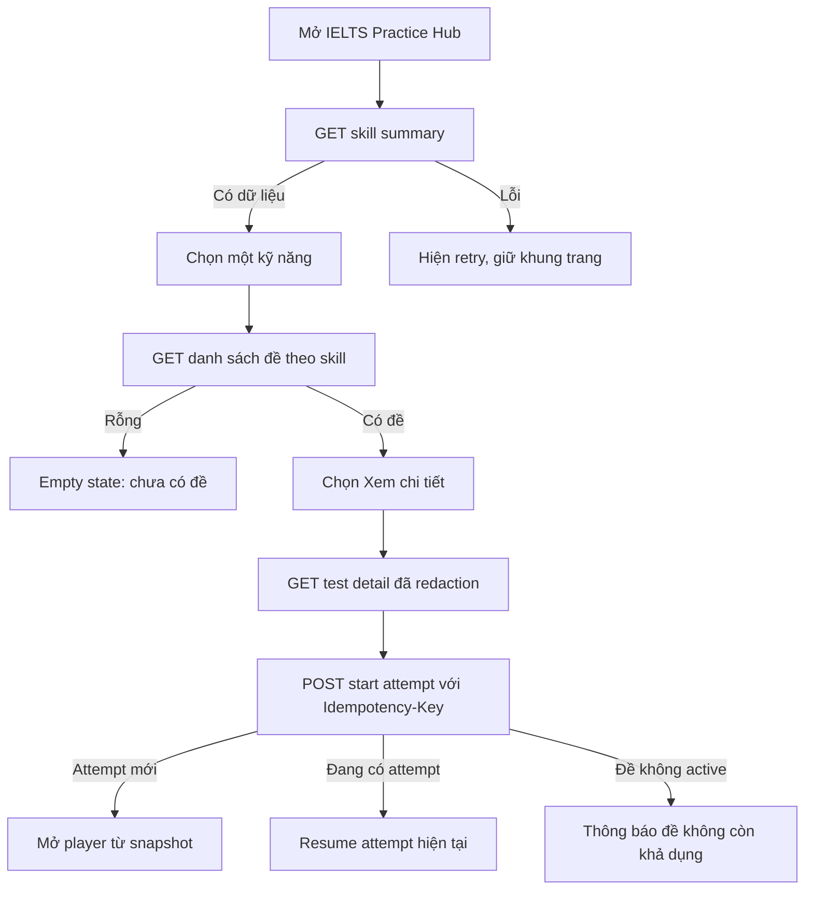
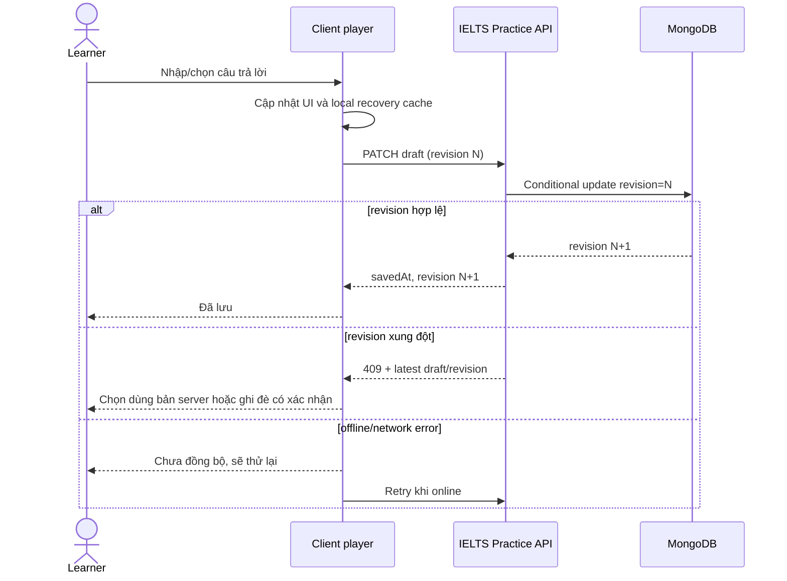
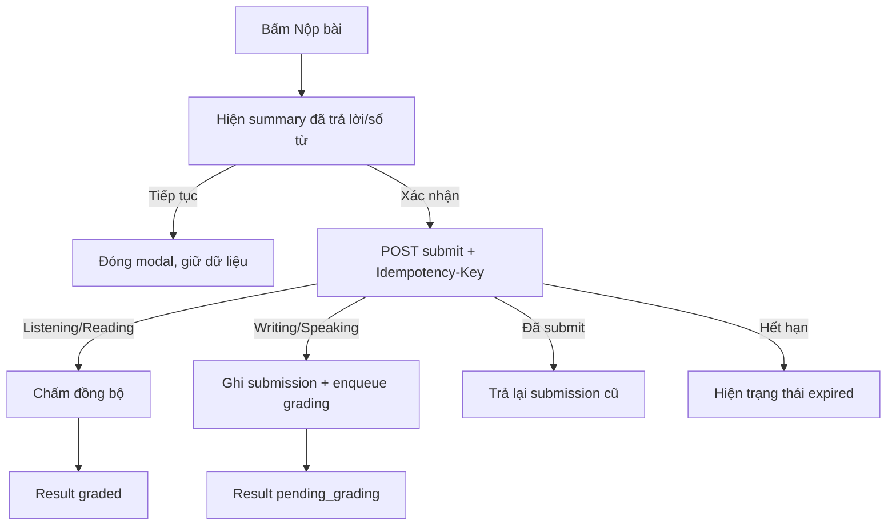
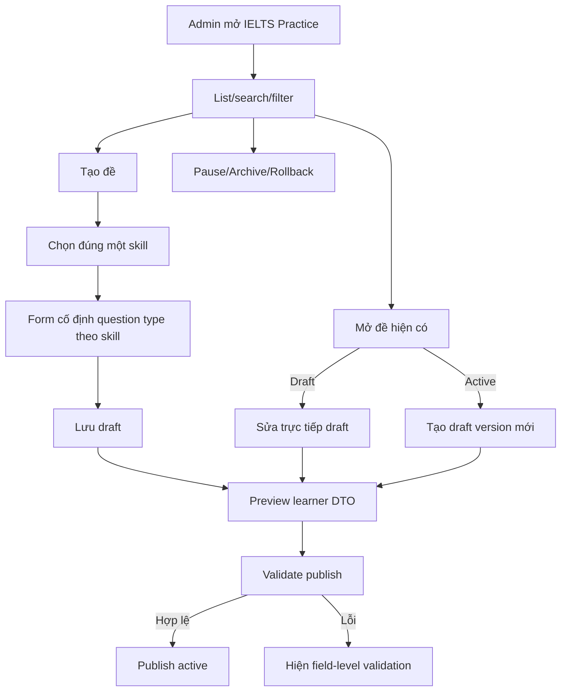

# Luồng người dùng

## 1. Learner tìm và bắt đầu đề

**Actor:** Learner đã đăng nhập  
**Precondition:** Có ít nhất một đề active.  
**Trigger:** Learner mở `/dashboard/ielts-practice`.

### Alternate/error flows

- Nếu list request lỗi, card skeleton chuyển error panel có nút Thử lại; không hiển thị 8 đề mock.
- Nếu đề bị pause giữa list và start, start trả `404 TEST_NOT_AVAILABLE`; learner quay lại list đã refresh.
- Nếu idempotent retry do timeout, server trả cùng `attemptId`.

## 2. Learner làm, autosave và resume

### Recovery

- Khi reload, FE gọi attempt detail trước; local cache chỉ được dùng nếu server unavailable và phải gắn nhãn “Bản nháp chưa đồng bộ”.
- Khi deadline qua trong lúc offline, server từ chối save/submit và chuyển attempt `expired` khi kết nối lại.
- Flag câu hỏi có thể autosave cùng draft; không ảnh hưởng scoring.

## 3. Learner nộp bài

## 4. Flow riêng từng player

### Listening — Form Completion

1. Player tải audio metadata và 10 item redacted.
2. Learner phát/tạm dừng/tua audio theo policy cấu hình.
3. Learner nhập một từ và/hoặc số cho mỗi item, có thể flag.
4. Progress là số answer trim khác rỗng trên 10.
5. Submit chấm theo accepted answers trong server snapshot.

### Reading — True/False/Not Given

1. Passage ở pane trái, statements ở pane phải.
2. Mỗi statement chỉ có một enum answer.
3. Learner có thể flag và nhảy tới statement.
4. Block Note Completion của prototype không xuất hiện trong production MVP.
5. Submit trả raw score và normalized score; band mapping nếu product dùng scoring config.

### Writing — Academic Task 1 Chart

1. Prompt, chart/image, instruction và min words ở pane trái.
2. Một textarea duy nhất ở pane phải; 20 phút mặc định; min 150 từ.
3. Word count dùng cùng một hàm chuẩn hóa FE/BE được test bằng shared fixture.
4. Dưới 150 từ: modal cảnh báo nhưng learner vẫn có thể xác nhận submit.
5. Submission chuyển pending grading nếu AI grading được bật.

### Speaking — AI Conversation

1. Từ card đề, FE start attempt rồi mở route Speaking riêng.
2. Scenario và opening prompt cố định theo content; không cho chọn lại topic/level.
3. FE xin quyền microphone ngay trước khi bắt đầu ghi âm.
4. Conversation capability tạo transcript/audio references gắn attempt.
5. Learner kết thúc → review duration/transcript availability → submit.
6. Permission denied, upload retry và disconnect đều có recovery; không tạo submission giả.

## 5. Admin CRUD

### Quy tắc delete

- Delete trong UI phải ghi “Lưu trữ đề”, không dùng copy khiến admin hiểu là xóa vật lý.
- Archive cần confirm, ghi rõ attempt cũ không bị xóa.
- Gọi lại DELETE cho record archived trả thành công idempotent.

## 6. Admin publish validation

| Skill | Điều kiện bắt buộc trước publish |
|---|---|
| Listening | 10 item; audio asset ready; mỗi item có accepted answer; không trùng item id |
| Reading | Passage khác rỗng; ≥1 statement; tất cả có correct enum |
| Writing | Prompt/instruction/image; minWords=150 theo MVP; timeLimit=20 theo MVP |
| Speaking | Scenario/opening prompt/duration; cấu hình voice capability hợp lệ |

## 7. Permission-denied flows

- Learner gọi admin API: `403 FORBIDDEN`.
- Learner đọc attempt của user khác: `404 ATTEMPT_NOT_FOUND` để tránh enumeration.
- Content creator gọi mutation khi chưa được cấp quyền: `403 FORBIDDEN`.
- Admin preview không được gọi learner submit hoặc làm tăng attempt count.
