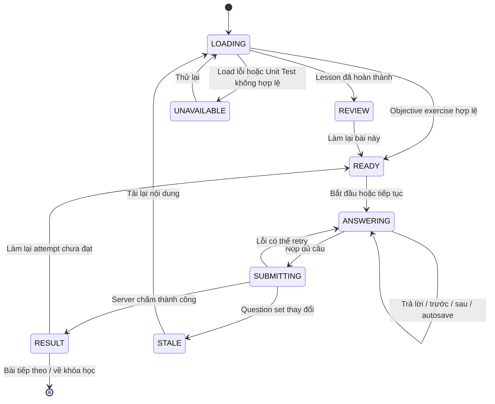

# Đặc tả thiết kế

## 1. Hiện trạng và đích đến

| Thành phần | Admin Practice Sheet hiện tại | Learner hiện tại | Thiết kế đích |
|---|---|---|---|
| Bắt đầu | Idle screen có số câu, điểm đạt, CTA | Render toàn bộ câu ngay trong Lesson | Ready screen giống nhịp Admin |
| Trình bày | Một câu/lần | Tất cả câu trên một trang | Một câu/lần |
| Thứ tự | Shuffle mỗi lần bắt đầu | Theo Server | Theo Server để resume ổn định |
| Tiến độ | `X/N`, progress bar, số câu đúng | Số câu đã trả lời/tổng | `X/N`, progress bar; không lộ số đúng |
| Phản hồi | Chấm ngay tại Client | Chấm toàn bài tại Server | Chỉ feedback sau submission |
| Kết quả | %, đúng/tổng, đạt/chưa đạt, làm lại | Result overlay | Giữ thông tin Admin, trình bày theo Client design system |
| Lưu tiến độ | Không có | Có checkpoint/autosave | Giữ checkpoint/autosave |

## 2. Nguyên tắc giao diện

- Tái sử dụng information architecture và phase của Admin, không tái sử dụng code UI.
- Client dùng CSS Modules và token trong `client/DESIGN.md`: canvas `#f5f5f5`, ink `#292524`, card trắng, border `#e7e5e4`, button pill.
- Màu xanh/đỏ chỉ xuất hiện sau submission và luôn đi kèm icon + text.
- Vùng bài tập có chiều rộng đọc tối đa 760 px, đặt trong content column hiện tại của Lesson Player.
- Không mở modal/sheet cho quá trình làm bài; result có thể giữ overlay hiện tại nếu focus trap và scroll hoạt động đúng.

## 3. State model



`phase` là state UI của FE, không được gửi như business state lên Server.

## 4. Wireframe

### 4.1 READY

```text
┌──────────────────────────────────────────────────────────────┐
│ Luyện tập                                                    │
│                                                              │
│                    [ biểu tượng ]                            │
│                    8 câu hỏi                                 │
│                    Điểm đạt: 80%                             │
│                                                              │
│                 [ Bắt đầu làm bài ]                          │
└──────────────────────────────────────────────────────────────┘
```

Nếu có checkpoint: thêm `Đã làm 3/8 câu` và CTA `Tiếp tục làm bài`. Không hiển thị ready screen giả nếu exercise chưa load xong.

### 4.2 ANSWERING

```text
┌──────────────────────────────────────────────────────────────┐
│ Câu 3 / 8                                      Đã lưu        │
│ ███████████████░░░░░░░░░░░░░░░░                             │
│                                                              │
│ [ĐIỀN TỪ]                                                    │
│ Nghe và hoàn thành câu sau.                                  │
│ [ ▶ Phát âm thanh ]                                          │
│                                                              │
│ [ Nhập câu trả lời…                                      ]   │
│                                                              │
│ [ Quay lại ]                                  [ Tiếp tục ]   │
└──────────────────────────────────────────────────────────────┘
```

- Progress bar dùng `(currentIndex + 1) / total`, không dùng answered count.
- Save indicator dùng `Đang lưu…`, `Đã lưu`, `Chưa lưu`, `Lỗi lưu`, `Xung đột`, `Không có kết nối`.
- Type badge dùng label: `Chọn đáp án`, `Điền từ`, `Đúng/Sai`, `Nối cặp`, `Sửa lỗi`.
- Không dùng label `Nghe & Chọn` cho mọi MCQ; label phải theo question type, còn audio là media tùy chọn.

### 4.3 Câu cuối và submit

```text
│ [ Quay lại ]                                  [ Nộp bài ]    │
│                          8/8 câu đã trả lời                  │
```

- Nếu checkpoint flush thất bại do mạng, learner vẫn có thể chọn retry save; submit không tự xóa dữ liệu.
- Khi nhấn `Nộp bài`: khóa toàn bộ navigation/action có thể tạo request trùng, CTA đổi thành `Đang chấm bài…`.

### 4.4 RESULT

```text
┌──────────────────────────────────────────────────────────────┐
│                         ✓                                    │
│                    Hoàn thành                                │
│                         85%                                  │
│                    7/8 câu đúng                              │
│                    Điểm đạt: 80%                             │
│                                                              │
│  Chi tiết câu hỏi                                            │
│  ✓ Câu 1 — Đúng                                              │
│  ✕ Câu 2 — Sai                                               │
│    Câu trả lời của bạn: ...                                  │
│    Đáp án đúng: ...                                          │
│    Giải thích: ...                                           │
│                                                              │
│ [ Xem lại ]                         [ Bài tiếp theo ]         │
└──────────────────────────────────────────────────────────────┘
```

- Score hiển thị theo phần trăm `0–100`; điểm đạt hiển thị cùng đơn vị, không dùng dạng `score / passingScore` vì dễ bị hiểu là phân số.
- `Chưa đạt`: primary CTA `Làm lại`; secondary `Xem chi tiết` hoặc `Về danh sách bài học`.
- `Đạt`: primary CTA `Bài tiếp theo` nếu có; secondary `Xem chi tiết` và `Về danh sách bài học`.
- Feedback list mặc định thu gọn theo câu trên bài dài; câu sai được mở sẵn. Mọi correct answer chỉ lấy từ submit response.

## 5. Thiết kế theo loại câu hỏi

### MULTIPLE_CHOICE

- Một cột option trong content column; có thể dùng hai cột chỉ khi cả bốn option ngắn và không làm thay đổi thứ tự đọc DOM.
- Dùng radio group; chọn option không tự chuyển câu.
- Selected state dùng border ink + nền neutral, không dùng xanh success.

### TRUE_FALSE

- Hai radio button `Đúng` và `Sai`, thứ tự cố định.
- Không biểu diễn boolean bằng icon đơn lẻ.

### FILL_IN_BLANK

- Input có label lấy từ stem/context; Enter tương đương `Tiếp tục` khi answer không rỗng.
- Không có nút `Kiểm tra` trước submission.

### ERROR_CORRECTION

- Hiển thị câu gốc trong khối neutral, textarea có label `Viết lại câu đúng`.
- Không highlight lỗi hoặc đáp án trước submission.

### MATCHING

- Hai cột item/target; target order dùng đúng DTO learner-safe do Server cung cấp.
- Chọn item bên trái rồi target bên phải; cặp đã tạo có cùng ký hiệu chữ/số, không dựa riêng vào màu.
- Cho phép chọn lại item để thay target. `Tiếp tục` chỉ bật khi đủ cặp và không trùng target.

## 6. Hành vi focus và bàn phím

- `Bắt đầu/tiếp tục`: focus heading `Câu X / N`.
- `Tiếp tục/Quay lại`: focus heading câu mới; không cuộn toàn trang về đầu Lesson.
- Validation: focus control chưa hoàn chỉnh đầu tiên trong câu hiện tại.
- Submit success: focus heading kết quả.
- Escape chỉ đóng result overlay nếu có một action không phá dữ liệu tương đương `Xem lại`; không được thoát và mất answer đang submit.

## 7. Error và recovery

| Trường hợp | UI bắt buộc |
|---|---|
| GET Lesson lỗi | Error state + `Thử lại`; không render player rỗng |
| Media lỗi | Text vẫn dùng được thì cho tiếp tục; nếu question không còn làm được thì chặn submit và cho retry media/load |
| Autosave lỗi mạng | Giữ answer trong memory, hiển thị `Chưa lưu`/`Không có kết nối`, retry khi online |
| Checkpoint conflict | Thông báo có tiến trình mới hơn; CTA `Tải tiến trình mới nhất` |
| Submit timeout/5xx | Giữ phase/answer, CTA `Thử nộp lại` dùng cùng `clientAttemptId` |
| Question set changed | Giữ bản local tạm thời, yêu cầu reload; không submit payload cũ |
| 401/403 | Dừng autosave, hiển thị permission state; không loop request |
| 429 | Hiển thị server message và chỉ cho retry khi hết thời gian giới hạn nếu response cung cấp `Retry-After` |

## 8. Analytics đề xuất

Không bắt buộc cho MVP. Nếu bổ sung sau, chỉ ghi event không chứa nội dung answer: `exercise_started`, `question_navigated`, `exercise_submitted`, `exercise_result_viewed`, `exercise_retry_started`, kèm lesson ID, question type, index, duration và outcome.

## 9. FE handoff

- Tách objective player thành phase container và question renderer hiện có; không đưa answer key vào state.
- `useExerciseState` tiếp tục là nguồn answer/current index; bổ sung phase và navigation bằng hook hoặc reducer có test.
- Không import component/Tailwind class từ `admin/`.
- Result score phải thống nhất đơn vị phần trăm.
- Test matrix tối thiểu: 5 question types, resume giữa bài, back/edit, incomplete match, submit loading/error/success, retry, review, keyboard focus.

## 10. BE handoff

- Không cần endpoint mới.
- Duy trì learner-safe DTO, validation đủ toàn bộ question set, optimistic checkpoint version và idempotent submit.
- Bảo đảm feedback response đủ `learnerAnswer`, `correctAnswer`, `correct`, `explanation` để FE render result sau submission.
