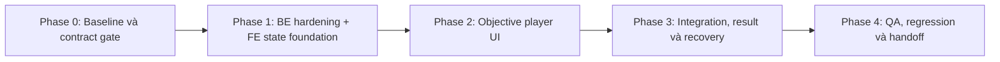

# Kế hoạch triển khai BE/FE

## 1. Mục tiêu và nguyên tắc thực thi

Triển khai Learner Exercise Player theo interaction model của Admin: `READY → ANSWERING → SUBMITTING → RESULT/REVIEW`, hiển thị một câu tại một thời điểm, giữ chấm điểm phía Server và không thay đổi API/data model đã thống nhất.

Kế hoạch này dành cho hai vai trò:

- **BE:** làm theo `.opencode/agents/BE.md`, chỉ sửa `server/` và test backend.
- **FE:** làm theo `.opencode/agents/FE.md`, chỉ sửa `client/` và test frontend.

Các nguyên tắc bắt buộc:

1. `api-contract.md` là contract chung; không tự đổi path, field, enum, status hoặc error semantics.
2. Không đưa answer key vào Client và không chấm đúng/sai trước submission.
3. Không import component, Tailwind hoặc Shadcn từ `admin/` sang `client/`.
4. Giữ nguyên thứ tự question do Server trả về; không shuffle ở Client.
5. Không thêm endpoint, collection, migration hoặc dependency nếu audit không chứng minh contract hiện tại thiếu. Audit runtime đã xác nhận cần backfill trạng thái cho Question legacy đã gắn vào Lesson.
6. Workspace đang có thay đổi dở dang ở `client/` và `server/`; mỗi bên phải kiểm tra `git status`, đọc diff liên quan và không reset/ghi đè thay đổi không thuộc task.

## 2. Phân chia trách nhiệm

| Hạng mục | BE | FE |
|---|---|---|
| Learner-safe question DTO | Owner | Consumer/verification |
| Checkpoint validation và optimistic version | Owner | Gửi payload, conflict UX |
| Submission, grading, idempotency | Owner | Điều phối request và retry UX |
| Phase/state của player | Không sở hữu | Owner |
| Renderer năm question types | Contract support | Owner |
| Result/review UI | Cung cấp feedback contract | Owner |
| Auth, ownership, rate limit, structured logs | Owner | Hiển thị error state |
| Accessibility, CSS Modules, responsive desktop | Không sở hữu | Owner |
| Contract/integration verification | Joint | Joint |

## 3. Thứ tự phase



- Phase 0 phải hoàn tất trước khi chỉnh contract-facing code.
- Trong Phase 1, BE và FE có thể làm song song sau khi contract gate được chốt.
- Phase 2 chủ yếu là FE; BE chỉ xử lý defect contract được chứng minh bằng test.
- Phase 3 cần cả hai phía cùng chạy integration matrix.
- Không bắt đầu Phase 4 khi còn mismatch contract hoặc acceptance criterion Must chưa có test/verification.

---

## Phase 0 — Baseline và contract gate

### Mục tiêu

Xác nhận hiện trạng code, phân biệt thay đổi đang có với phần cần bổ sung, và khóa contract để hai phía không triển khai theo giả định khác nhau.

### BE tasks

#### BE-00 — Audit vertical slice hiện tại

- Đọc route → validation → controller → service → repository/model cho:
  - `GET /api/learning/lessons/:lessonId`
  - `PATCH /api/learning/lessons/:lessonId/checkpoint`
  - `POST /api/learning/lessons/:lessonId/submit`
  - `POST /api/learning/lessons/:lessonId/restart`
- Đối chiếu learner-safe DTO trong `learner-exercise.service.ts` với `api-contract.md`.
- Đối chiếu error data qua `AppError` và error middleware, đặc biệt `409 CHECKPOINT_CONFLICT` và `409 QUESTION_SET_CHANGED`.
- Kiểm tra auth, enrollment, Lesson ancestry và ownership không dựa vào `userId` từ Client.
- Ghi nhận contract gap dưới dạng blocker cụ thể; không tự thay tài liệu BA.

**Traceability:** FR-07 đến FR-11, NFR-01, NFR-05; AC-09, AC-14 đến AC-18, AC-22.

#### BE-01 — Chạy baseline backend

Từ `server/`:

```bash
npm run build
node --test --import tsx test/**/*.test.ts
```

- Ghi rõ failure nào có trước task, failure nào thuộc exercise contract.
- Không dùng `npm test` vì script hiện tại chỉ trả lỗi placeholder.

### FE tasks

#### FE-00 — Audit feature hiện tại

- Đọc `LessonPlayerPage`, `LessonRenderer`, `PracticeArea`, năm renderer, `ResultPanel`, `useExerciseState`, `useAutosave`, API functions và Query hooks.
- Xác định phần code đang sửa dở trong worktree trước khi refactor.
- Lập gap list tối thiểu:
  - hiện đang render toàn bộ question thay vì một câu;
  - chưa có ready/continue phase rõ ràng;
  - restore `currentQuestionIndex` và dirty tracking khi đổi answer/index;
  - result score phải dùng cùng đơn vị phần trăm;
  - conflict, stale content, permission và rate-limit UX.

#### FE-01 — Chạy baseline frontend

Từ `client/`:

```bash
npm run build
npm run lint
npx vitest run
```

- Chụp lại failure hiện có; không mở rộng scope để sửa lỗi không liên quan.
- Xác nhận Axios helpers unwrap đúng một lần và error type giữ được HTTP status/data cần cho recovery.

### Deliverables

- Contract matrix `endpoint → request → success → business errors → FE behavior` được hai phía xác nhận trong handoff/comment triển khai.
- Danh sách baseline failures và WIP files cần bảo toàn.
- Kết luận rõ: không cần API/data model mới, hoặc blocker cụ thể phải quay lại BA.

### Exit criteria

- Không có mismatch chưa xử lý giữa code backend và `api-contract.md`.
- FE có thể xây state/UI bằng type thật, không cần mock production contract.
- AC-14 có test backend hiện hữu hoặc task bổ sung rõ trong Phase 1.

---

## Phase 1 — BE hardening và FE state foundation

### Mục tiêu

Hoàn thiện nền contract phía Server và state machine/pure logic phía Client trước khi xây giao diện.

### BE tasks

#### BE-02 — Hardening learner-safe delivery

- Bảo đảm mapper allowlist riêng theo question type, chỉ trả field learner cần.
- Verify không trả `isCorrect`, `correctAnswers`, `correctText`, matching mapping hoặc `explanation` trước submission.
- Giữ đúng hành vi:
  - content Lesson không có valid question → `COMPLETION`;
  - `UNIT_TEST` không có valid question → `422`;
  - `DYNAMIC` → `422` trong scope hiện tại.
- Bổ sung/điều chỉnh test contract nếu audit Phase 0 phát hiện thiếu.

**Files dự kiến:** `server/src/services/learner-exercise.service.ts`, `server/src/utils/lesson-practice-config.ts`, test learner exercise/lesson.  
**Traceability:** FR-10, NFR-01; AC-14 đến AC-16.

#### BE-03 — Hardening checkpoint

- Validate checkpoint kind theo Lesson exercise kind.
- Validate answer ID/version/type; từ chối unknown/stale/mismatch.
- Duy trì optimistic `checkpointVersion`; conflict phải trả latest checkpoint/version qua error envelope hiện có.
- Bảo đảm request retry không cộng active time hai lần nếu cùng thao tác được replay theo cơ chế hiện có.
- Không log answer content.

**Files dự kiến:** `server/src/validations/learning.validation.ts`, `server/src/services/learning.service.ts`, `server/src/middlewares/error.middleware.ts`, checkpoint tests.  
**Traceability:** FR-07, FR-11, NFR-05; AC-09, AC-10, AC-17, AC-22.

#### BE-04 — Hardening submit/retry/review

- Validate đúng một answer cho mỗi returned question, không thiếu/thừa/trùng/sai version/type.
- Cùng `clientAttemptId` trả cùng immutable result; request đang xử lý trả business conflict đúng contract.
- Feedback sau submit đủ `questionId`, `correct`, `learnerAnswer`, `correctAnswer`, `explanation`.
- Retry mới không làm giảm best score hoặc đảo completion đã đạt.
- Restart reset checkpoint attempt mới nhưng giữ attempt history/best score.

**Files dự kiến:** `server/src/services/learning.service.ts`, `server/src/services/lesson-grader.service.ts`, attempt repository/model và submit/retry tests.  
**Traceability:** FR-06, FR-08, FR-09; AC-08, AC-11 đến AC-13, AC-18.

### FE tasks

#### FE-02 — Chuẩn hóa state model

- Tạo phase type/reducer hoặc hook cho `READY`, `ANSWERING`, `SUBMITTING`, `RESULT`, `REVIEW`, `ERROR/STALE`.
- Phase phải được suy ra có kiểm soát từ Lesson/progress/submission state; không mirror Query data vào Zustand.
- Định nghĩa transition hợp lệ và chặn double-submit/transition khi mutation pending.
- Viết unit test cho transition trước khi nối UI.

**Traceability:** FR-01, FR-02, FR-06, FR-08; AC-01 đến AC-03, AC-08, AC-11 đến AC-13.

#### FE-03 — Hoàn thiện exercise state và pure helpers

- Restore cả answers và `currentQuestionIndex`; clamp index trong phạm vi question hiện tại.
- Báo được số answer bị loại vì ID/version/type không tương thích.
- Xác định `isCurrentAnswerComplete` theo từng loại:
  - text trim khác rỗng;
  - boolean `false` vẫn là answer hợp lệ;
  - matching đủ item và target không trùng.
- Cho matching thay/gỡ cặp thay vì chỉ merge không thể xóa.
- Dirty state phải thay đổi khi nội dung answer đổi, kể cả answered count không đổi, và khi current index đổi.
- Giữ submission answers theo thứ tự Server.
- Viết unit tests cho năm type, restore, stale answer, clamp index, back/edit và matching completeness.

**Files dự kiến:** `client/src/features/dashboard/learning/hooks/use-exercise-state.ts`, practice answer utils/types và test mới.  
**Traceability:** FR-02 đến FR-04, FR-07; AC-02 đến AC-06, AC-09, AC-10.

#### FE-04 — Ổn định autosave orchestration

- Giữ debounce 2 giây và throttle 20 giây.
- Flush checkpoint trước submit và trước navigation rời Lesson khi an toàn.
- Không tạo request chỉ do component rerender.
- Phân biệt `saved`, `saving`, `unsaved`, `error`, `offline`, `conflict`.
- Dừng retry loop khi 401/403; conflict không tự ghi đè Server state.
- Viết fake-timer tests cho debounce/throttle/flush và cleanup khi unmount.

**Traceability:** FR-07, FR-11; AC-09, AC-17, AC-21.

### Parallelization

- BE-02/03/04 và FE-02/03/04 có thể chạy song song sau Phase 0.
- FE dùng contract hiện tại; nếu BE cần đổi contract, dừng phần phụ thuộc và gửi delta về BA trước khi tiếp tục.

### Exit criteria

- Backend build và exercise-related tests pass.
- State transition và answer helpers có unit tests pass.
- FE có thể render một current question từ state mà chưa cần hoàn tất styling.
- Không có answer key trong fixture/type/runtime Client pre-submit.

---

## Phase 2 — Objective player UI

### Mục tiêu

Xây player một câu tại một thời điểm theo `design-spec.md`, dùng CSS Modules và giữ nguyên Lesson content flow.

### FE tasks

#### FE-05 — READY/CONTINUE screen

- Hiển thị số câu, passing score và CTA `Bắt đầu làm bài`.
- Nếu có checkpoint hợp lệ, hiển thị tiến độ đã lưu và CTA `Tiếp tục làm bài`.
- Khi CTA được kích hoạt, scroll/focus heading của current question.
- Không render question trước khi learner bắt đầu, trừ REVIEW mode.

**Traceability:** FR-01, FR-12; AC-01, AC-02, AC-19.

#### FE-06 — Objective player shell

- Chỉ truyền/render current question thay vì map toàn bộ question set.
- Header có `Câu X / N`, progress bar và save status.
- Footer có `Quay lại`, `Tiếp tục` hoặc `Nộp bài` ở câu cuối.
- `Tiếp tục/Nộp bài` disabled nếu current answer chưa hoàn chỉnh.
- Chuyển câu dưới 100 ms và không phát request chỉ vì navigation.
- Không hiển thị correct count hoặc semantic success/error trước submit.

**Files dự kiến:** component player mới hoặc refactor `PracticeArea`, `LessonRenderer`, `LessonPlayerPage`.  
**Traceability:** FR-02, FR-04, FR-05, NFR-03; AC-03, AC-05 đến AC-07, AC-21.

#### FE-07 — Renderer cho năm question types

- `MULTIPLE_CHOICE`, `TRUE_FALSE`: semantic radio group, đổi selection được.
- `FILL_IN_BLANK`: input có label; Enter chuyển tiếp khi hợp lệ.
- `ERROR_CORRECTION`: câu gốc + textarea `Viết lại câu đúng`.
- `MATCHING`: keyboard-operable, đủ cặp, target không trùng, cho đổi/gỡ cặp; ký hiệu không phụ thuộc màu.
- Stem audio/image có accessible control/alt; media lỗi có fallback theo design spec.
- Không có nút `Kiểm tra` hoặc feedback đúng/sai trước submit.

**Traceability:** FR-03, FR-05, NFR-02; AC-04, AC-05, AC-07, AC-19.

#### FE-08 — Styling và layout

- Dùng CSS Modules và variables/token Client; không dùng Tailwind.
- Player nằm sau Lesson content, max width và spacing theo design spec.
- Button primary dùng ink-pill; progress/selected state dùng neutral ink, không dùng success color trước submit.
- Không horizontal overflow từ 1025 px; matching/text dài wrap đúng; footer không che CTA.
- Không thay đổi `MobileBlocker`.

**Traceability:** FR-12, NFR-04; AC-20.

### BE tasks

#### BE-05 — Contract fixtures và defect support

- Cung cấp/duy trì test fixtures learner-safe cho đủ năm type để FE kiểm tra mapper.
- Chỉ sửa BE nếu integration chứng minh response không đúng contract; không thêm endpoint phục vụ UI state.
- Xác nhận audio/image URL là learner-usable và không chứa provider credential.

### Tests trong phase

- Component tests: ready/continue, một question/lần, next/back, disabled action, năm renderer, focus.
- Kiểm tra DOM không chứa correct answer/explanation trước submit.
- Test không gọi checkpoint/submit API chỉ khi chuyển câu.

### Exit criteria

- AC-01 đến AC-07, AC-19 đến AC-21 pass ở unit/component level.
- Player hoạt động với đủ năm type bằng response contract thật hoặc deterministic fixture cùng type.
- Visual review không phát hiện overflow ở 1025, 1280 và 1440 px.

---

## Phase 3 — Integration, result và recovery

### Mục tiêu

Nối player với API thật, hoàn thiện kết quả/review/retry và toàn bộ error/recovery path.

### BE tasks

#### BE-06 — Route/service integration coverage

- Cover auth, enrollment/ownership, invalid ObjectId/body, inactive/unavailable Lesson.
- Cover `409 CHECKPOINT_CONFLICT`, `409 QUESTION_SET_CHANGED`, duplicate/in-progress attempt, `422`, `429` nếu rate limiter nằm trong test scope.
- Assert response envelope/status và side effect: không tạo attempt khi validation/stale fail; progress chỉ cập nhật một lần.
- Assert structured logs không chứa answer text/correct answer/recording URL.

**Traceability:** FR-09 đến FR-11, NFR-01, NFR-05; AC-14 đến AC-18, AC-22.

#### BE-07 — Backend verification gate

```bash
cd server
npm run build
node --test --import tsx test/**/*.test.ts
```

- Nếu có test cần MongoDB/Redis thật chưa chạy được, ghi rõ tên test và rủi ro; không tuyên bố pass toàn bộ.
- Chạy migration idempotent `publish-linked-lesson-questions.ts` cho Question đã liên kết nhưng có status missing/null/draft; không thay đổi `in_review` hoặc `archived`.

### FE tasks

#### FE-09 — Submit orchestration

- Validate toàn bài trước submit; nếu state bất thường, đưa learner tới câu thiếu đầu tiên.
- Flush checkpoint, tạo/giữ `clientAttemptId`, khóa action và hiển thị `Đang chấm bài…`.
- Retry timeout/5xx dùng lại ID; deliberate retry tạo ID mới.
- Invalidate lesson/roadmap/dashboard đúng thời điểm, tránh GET/start/invalidate loop.

**Traceability:** FR-06, FR-09; AC-06, AC-08, AC-12, AC-18.

#### FE-10 — Result và review

- Hiển thị score và passing score cùng đơn vị `%`, đúng/tổng, đạt/chưa đạt.
- Feedback chỉ render từ submit/attempt response sau submission.
- Câu sai mở sẵn; feedback dài có thể thu gọn nhưng vẫn keyboard-accessible.
- Failed: `Làm lại`; passed: `Bài tiếp theo`; completed review: `Làm lại bài này` gọi restart trước attempt mới.
- Giữ best/latest score semantics; không dựng result giả thiếu feedback nếu API có attempt review phù hợp.

**Traceability:** FR-06, FR-08; AC-08, AC-11 đến AC-13.

#### FE-11 — Error và recovery UI

- GET lỗi: retry state, không render player rỗng.
- `COMPLETION`: không render objective player.
- `422 UNIT_TEST`: unavailable + retry, không auto-complete.
- Checkpoint conflict: giữ local state và CTA tải bản Server mới nhất.
- Question set changed: khóa resubmit payload cũ, reload và chỉ restore compatible answers.
- 401/403: permission state, dừng autosave loop.
- 429: giữ answer; tôn trọng `Retry-After` nếu có.
- Submit error không xóa answer hoặc current index.

**Traceability:** FR-09 đến FR-11; AC-15 đến AC-18.

#### FE-12 — Frontend integration tests

- Mock ở network boundary với response envelope thật, không mock bỏ qua API function.
- Cover: resume → edit → autosave → submit pass/fail → retry → review.
- Cover stale version, checkpoint conflict, duplicate retry ID, unavailable Unit Test và permission error.
- Assert focus và `aria-live` cho validation/result/error.

### Joint integration matrix

| Scenario | Expected BE result | Expected FE result |
|---|---|---|
| Valid first attempt đạt | Một immutable attempt, progress complete | Result đạt + next action |
| Valid first attempt chưa đạt | Attempt lưu, Lesson còn in-progress | Result chưa đạt + làm lại |
| Retry thấp hơn best score | Best score không giảm | Hiển thị latest/best đúng |
| Duplicate `clientAttemptId` | Trả original result, không double count | Không tạo result/attempt thứ hai |
| Stale question version | `409`, không tạo attempt | Giữ local answer, yêu cầu reload |
| Checkpoint version conflict | `409` + latest state/version | Conflict recovery CTA |
| Content Lesson rỗng | `COMPLETION` | Không render objective player |
| Unit Test rỗng | `422` | Unavailable + retry |
| Không sở hữu Lesson | `403` | Permission state, dừng autosave |

### Exit criteria

- AC-08 đến AC-18 và AC-22 pass bằng BE test + FE integration test phù hợp.
- Không còn contract mismatch.
- Network retry không gây duplicate attempt hoặc mất answer.

---

## Phase 4 — QA, regression và handoff

### Mục tiêu

Chạy quality gate đầy đủ, kiểm tra trực quan và bàn giao với bằng chứng rõ ràng.

### BE tasks

#### BE-08 — Final backend regression

- Chạy build và toàn bộ `node:test` suite.
- Review diff để loại `any` mới, mass assignment, answer logging, debug log và contract-breaking changes.
- Xác nhận không có schema/index/cache/job impact và migration publish legacy đã chạy idempotent.
- Nếu chạy e2e learning flow, dùng môi trường test và ghi rõ dữ liệu/phụ thuộc cần thiết.

### FE tasks

#### FE-13 — Final frontend quality gate

```bash
cd client
npm run build
npm run lint
npx vitest run
```

- Coverage business logic mới tối thiểu 80%.
- Không suppress TypeScript/lint nếu không có lý do được ghi nhận.
- Review cleanup timer/media/listener và mutation pending state.

#### FE-14 — Visual và accessibility QA

- Chạy app và kiểm tra viewport 1025, 1280, 1440 px.
- Keyboard-only flow cho cả năm question type.
- Kiểm tra focus sau start, next/back, validation, submit và result.
- Kiểm tra contrast, zoom 200%, long text, audio/image lỗi, prefers-reduced-motion nếu có animation.
- Xác nhận không có answer/correctness/explanation trong UI/DOM/network trước submit.

### Joint tasks

#### JOINT-01 — Acceptance sign-off

- Đánh dấu AC-01 đến AC-23 bằng một trong ba trạng thái: `PASS`, `FAIL`, `NOT RUN`.
- Mỗi `PASS` phải trỏ tới test hoặc bước manual verification.
- `FAIL`/`NOT RUN` phải có owner, mức rủi ro và blocker cụ thể.

#### JOINT-02 — Completion handoff

BE report:

- endpoint/service/test đã thay đổi;
- contract/migration impact (`none` nếu đúng phạm vi);
- command thực sự đã chạy và kết quả;
- residual infrastructure risk.

FE report:

- screen/flow/component đã thay đổi;
- endpoint đã tích hợp;
- build/lint/test/visual verification thực sự đã chạy;
- contract mismatch hoặc residual UX/accessibility risk.

### Exit criteria / Definition of Done

- AC-01 đến AC-23 đều `PASS`, hoặc phần chưa pass được user chấp thuận rõ ràng.
- Backend và frontend build pass; relevant test suites pass.
- FE lint pass hoặc chỉ còn failure có trước task được ghi rõ.
- Không lộ answer key trước submission.
- Retry/checkpoint conflict/question-set change không làm mất dữ liệu ngoài hành vi đã mô tả.
- Không sửa Admin, không thêm API/data model/dependency ngoài scope.
- Không có thay đổi unrelated bị ghi đè hoặc đưa vào handoff.

## 4. File impact dự kiến

Danh sách này là định hướng, không phải yêu cầu phải sửa mọi file.

### Backend

- `server/src/services/learner-exercise.service.ts`
- `server/src/services/learning.service.ts`
- `server/src/services/lesson-grader.service.ts`
- `server/src/validations/learning.validation.ts`
- `server/src/middlewares/error.middleware.ts`
- `server/src/repositories/mongo/learner-lesson-attempt.mongo.repository.ts`
- `server/src/models/mongo/learner-lesson-attempt.model.ts`
- `server/test/learner-exercise.test.ts`
- `server/test/learning-checkpoint.test.ts`
- `server/test/learning-submit-validation.test.ts`
- `server/test/learning-retry-review.test.ts`

### Frontend

- `client/src/features/dashboard/learning/pages/LessonPlayerPage/`
- `client/src/features/dashboard/learning/components/renderers/LessonRenderer.tsx`
- `client/src/features/dashboard/learning/components/renderers/practice/`
- `client/src/features/dashboard/learning/components/result/`
- `client/src/features/dashboard/learning/hooks/use-exercise-state.ts`
- `client/src/features/dashboard/learning/hooks/use-autosave.ts`
- `client/src/features/dashboard/learning/hooks/use-lesson.ts`
- `client/src/features/dashboard/learning/api/`
- `client/src/features/dashboard/learning/types/learning.types.ts`

## 5. Rủi ro và biện pháp kiểm soát

| Rủi ro | Mức độ | Kiểm soát |
|---|---|---|
| Ghi đè WIP hiện có trong dirty worktree | Cao | Audit diff Phase 0; sửa nhỏ theo file; không reset/checkout |
| FE vô tình chấm ngay như Admin | Cao | Learner-safe contract + DOM/network assertion AC-14 |
| Autosave bỏ sót khi đổi answer nhưng answered count không đổi | Cao | Dirty tracking theo answer revision, test back/edit AC-09 |
| Matching bị coi hoàn chỉnh khi thiếu/trùng target | Cao | Pure completeness helper + unit/component test AC-05 |
| Submit timeout tạo duplicate attempt | Cao | Stable `clientAttemptId` + BE idempotency test AC-18 |
| Restore sai câu sau content update | Trung bình | ID/version/type filter + index clamp + stale UX AC-10 |
| Result hiển thị sai đơn vị score | Trung bình | Chuẩn hóa `%` và contract/component test AC-08 |
| Query invalidation gây load/start loop | Trung bình | Test mutation invalidation và giữ start idempotent |
| Layout matching overflow ở 1025 px | Trung bình | Visual regression/manual QA AC-20 |

## 6. Không nằm trong kế hoạch

- Thay đổi Admin Practice Sheet hoặc Question CRUD.
- Endpoint check-answer theo từng câu.
- Dynamic generation, timer exam, hint AI, offline submission.
- Mobile redesign dưới/equal 1024 px.
- Analytics events đề xuất trong design spec.
