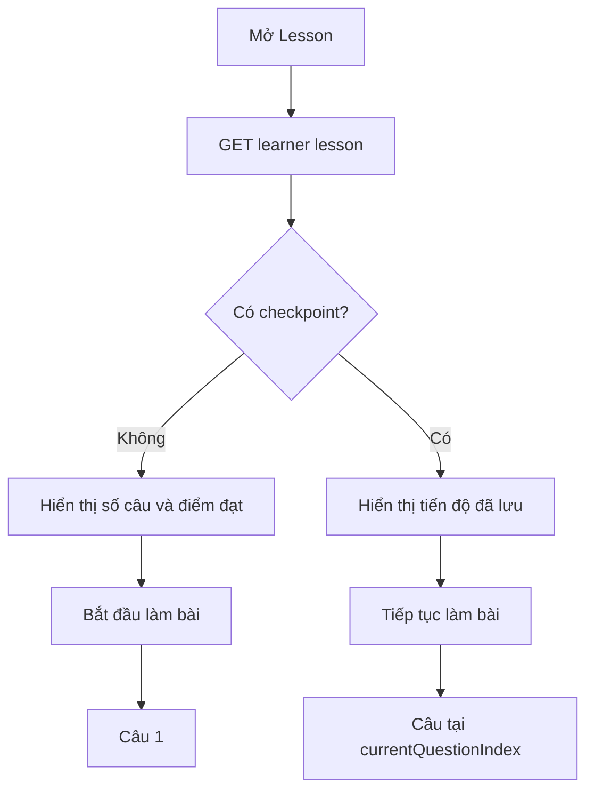
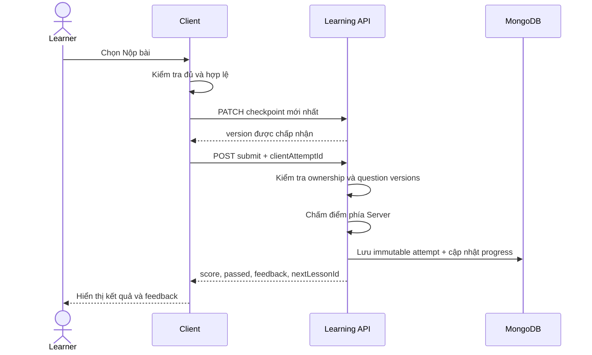

# Luồng người dùng

## UF-01 — Bắt đầu bài mới

**Actor:** Learner đã đăng nhập và ghi danh.  
**Tiền điều kiện:** Lesson khả dụng, objective exercise có question set hợp lệ.  
**Trigger:** Learner mở Lesson.

**Alternate:** Lesson đã completed thì vào `REVIEW`, không tự khởi tạo attempt mới.  
**Error:** Load lỗi hiển thị retry; `UNIT_TEST` không hợp lệ hiển thị unavailable.

## UF-02 — Làm và lưu từng câu

**Main flow:**

1. Learner chọn/nhập answer cho câu hiện tại.
2. FE đánh dấu answer đã thay đổi và bật `Tiếp tục` khi answer hoàn chỉnh.
3. Autosave gửi answers hiện có và `currentQuestionIndex` sau debounce.
4. Learner chuyển câu trước/sau; FE không gọi API chỉ vì chuyển câu.
5. Khi chuyển câu, current index mới được đưa vào lần checkpoint kế tiếp.

**Alternate:** Learner quay lại và sửa answer; checkpoint ghi đè bằng version mới.  
**Error:** Autosave lỗi giữ dữ liệu local; conflict yêu cầu tải bản Server thay vì âm thầm ghi đè.

## UF-03 — Nộp và xem kết quả

**Alternate:** Bài chưa đạt, learner chọn `Làm lại`; FE tạo attempt mới và trở về READY/ANSWERING.  
**Recovery:** Timeout dùng lại `clientAttemptId`; duplicate response phải trả cùng attempt result.

## UF-04 — Question set thay đổi

1. Learner đang làm bản question version cũ.
2. Admin cập nhật/xuất bản lại question.
3. Submit trả `409 QUESTION_SET_CHANGED` và không tạo attempt.
4. FE giữ answer local để learner không mất dữ liệu ngay lập tức, hiển thị thông báo nội dung đã thay đổi.
5. Learner tải lại Lesson.
6. FE chỉ khôi phục answer có ID/version/type còn tương thích; answer không tương thích bị loại và được thông báo.

## UF-05 — Review và làm lại Lesson đã hoàn thành

1. Learner mở Lesson có progress `COMPLETED`.
2. FE hiển thị review/best score, không tự reset checkpoint hoặc completion.
3. Learner chọn `Làm lại bài này`.
4. FE gọi restart endpoint.
5. Server reset checkpoint của attempt mới, giữ best score và completion history.
6. FE hiển thị READY; lần submit sau dùng `clientAttemptId` mới.
