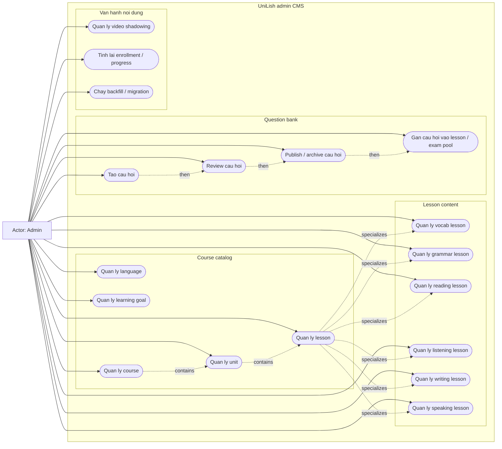

# UniLish - Admin/CMS use case

```mermaid
flowchart LR
    Admin["Actor: Admin"]

    subgraph System["UniLish admin CMS"]
        subgraph Catalog["Course catalog"]
            UC_Language(["Quan ly language"])
            UC_LearningGoal(["Quan ly learning goal"])
            UC_Course(["Quan ly course"])
            UC_Unit(["Quan ly unit"])
            UC_Lesson(["Quan ly lesson"])
        end

        subgraph LessonContent["Lesson content"]
            UC_Vocab(["Quan ly vocab lesson"])
            UC_Grammar(["Quan ly grammar lesson"])
            UC_Reading(["Quan ly reading lesson"])
            UC_Listening(["Quan ly listening lesson"])
            UC_Writing(["Quan ly writing lesson"])
            UC_Speaking(["Quan ly speaking lesson"])
        end

        subgraph QuestionBank["Question bank"]
            UC_CreateQuestion(["Tao cau hoi"])
            UC_ReviewQuestion(["Review cau hoi"])
            UC_PublishQuestion(["Publish / archive cau hoi"])
            UC_LinkQuestion(["Gan cau hoi vao lesson / exam pool"])
        end

        subgraph Operations["Van hanh noi dung"]
            UC_ShadowingVideo(["Quan ly video shadowing"])
            UC_Recalculate(["Tinh lai enrollment / progress"])
            UC_Backfill(["Chay backfill / migration"])
        end
    end

    Admin --> UC_Language
    Admin --> UC_LearningGoal
    Admin --> UC_Course
    Admin --> UC_Unit
    Admin --> UC_Lesson
    Admin --> UC_Vocab
    Admin --> UC_Grammar
    Admin --> UC_Reading
    Admin --> UC_Listening
    Admin --> UC_Writing
    Admin --> UC_Speaking
    Admin --> UC_CreateQuestion
    Admin --> UC_ReviewQuestion
    Admin --> UC_PublishQuestion
    Admin --> UC_LinkQuestion
    Admin --> UC_ShadowingVideo
    Admin --> UC_Recalculate
    Admin --> UC_Backfill

    UC_Course -. "contains" .-> UC_Unit
    UC_Unit -. "contains" .-> UC_Lesson
    UC_Lesson -. "specializes" .-> UC_Vocab
    UC_Lesson -. "specializes" .-> UC_Grammar
    UC_Lesson -. "specializes" .-> UC_Reading
    UC_Lesson -. "specializes" .-> UC_Listening
    UC_Lesson -. "specializes" .-> UC_Writing
    UC_Lesson -. "specializes" .-> UC_Speaking
    UC_CreateQuestion -. "then" .-> UC_ReviewQuestion
    UC_ReviewQuestion -. "then" .-> UC_PublishQuestion
    UC_PublishQuestion -. "then" .-> UC_LinkQuestion
```
