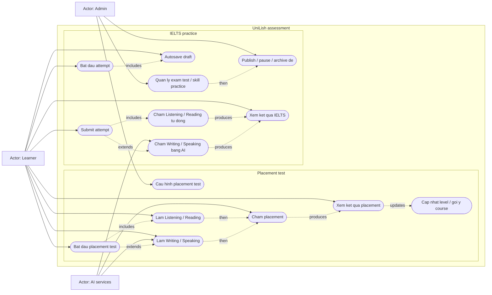

# UniLish - Assessment use case

```mermaid
flowchart LR
    Learner["Actor: Learner"]
    Admin["Actor: Admin"]
    AI["Actor: AI services"]

    subgraph System["UniLish assessment"]
        subgraph Placement["Placement test"]
            UC_ConfigPlacement(["Cau hinh placement test"])
            UC_StartPlacement(["Bat dau placement test"])
            UC_DoLR(["Lam Listening / Reading"])
            UC_DoWritingSpeaking(["Lam Writing / Speaking"])
            UC_GradePlacement(["Cham placement"])
            UC_PlacementResult(["Xem ket qua placement"])
            UC_UpdateLevel(["Cap nhat level / goi y course"])
        end

        subgraph Ielts["IELTS practice"]
            UC_ExamCms(["Quan ly exam test / skill practice"])
            UC_PublishExam(["Publish / pause / archive de"])
            UC_StartAttempt(["Bat dau attempt"])
            UC_Autosave(["Autosave draft"])
            UC_SubmitAttempt(["Submit attempt"])
            UC_GradeObjective(["Cham Listening / Reading tu dong"])
            UC_GradeAI(["Cham Writing / Speaking bang AI"])
            UC_IeltsResult(["Xem ket qua IELTS"])
        end
    end

    Admin --> UC_ConfigPlacement
    Admin --> UC_ExamCms
    Admin --> UC_PublishExam

    Learner --> UC_StartPlacement
    Learner --> UC_DoLR
    Learner --> UC_DoWritingSpeaking
    Learner --> UC_PlacementResult
    Learner --> UC_StartAttempt
    Learner --> UC_Autosave
    Learner --> UC_SubmitAttempt
    Learner --> UC_IeltsResult

    AI --> UC_DoWritingSpeaking
    AI --> UC_GradePlacement
    AI --> UC_GradeAI

    UC_StartPlacement -. "includes" .-> UC_DoLR
    UC_StartPlacement -. "extends" .-> UC_DoWritingSpeaking
    UC_DoLR -. "then" .-> UC_GradePlacement
    UC_DoWritingSpeaking -. "then" .-> UC_GradePlacement
    UC_GradePlacement -. "produces" .-> UC_PlacementResult
    UC_PlacementResult -. "updates" .-> UC_UpdateLevel

    UC_ExamCms -. "then" .-> UC_PublishExam
    UC_StartAttempt -. "includes" .-> UC_Autosave
    UC_SubmitAttempt -. "includes" .-> UC_GradeObjective
    UC_SubmitAttempt -. "extends" .-> UC_GradeAI
    UC_GradeObjective -. "produces" .-> UC_IeltsResult
    UC_GradeAI -. "produces" .-> UC_IeltsResult
```
