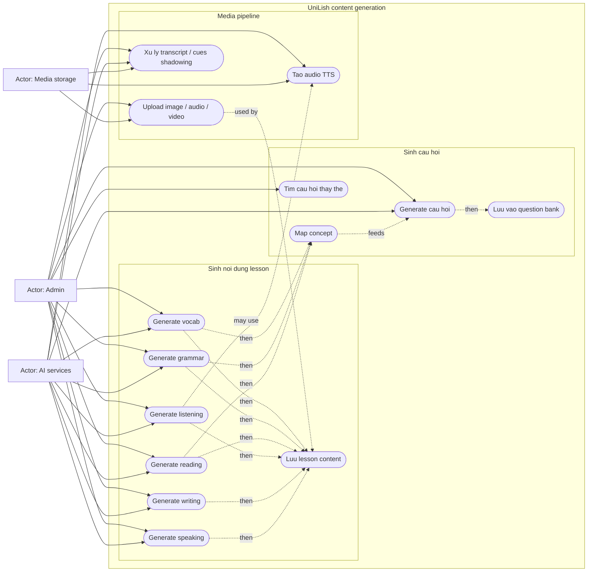

# UniLish - Content/AI use case

```mermaid
flowchart LR
    Admin["Actor: Admin"]
    AI["Actor: AI services"]
    Storage["Actor: Media storage"]

    subgraph System["UniLish content generation"]
        subgraph GenerateLesson["Sinh noi dung lesson"]
            UC_GenVocab(["Generate vocab"])
            UC_GenGrammar(["Generate grammar"])
            UC_GenReading(["Generate reading"])
            UC_GenListening(["Generate listening"])
            UC_GenWriting(["Generate writing"])
            UC_GenSpeaking(["Generate speaking"])
            UC_SaveLesson(["Luu lesson content"])
        end

        subgraph QuestionGeneration["Sinh cau hoi"]
            UC_MapConcept(["Map concept"])
            UC_GenQuestion(["Generate cau hoi"])
            UC_SaveQuestion(["Luu vao question bank"])
            UC_FindAlternative(["Tim cau hoi thay the"])
        end

        subgraph Media["Media pipeline"]
            UC_Tts(["Tao audio TTS"])
            UC_UploadAsset(["Upload image / audio / video"])
            UC_ProcessShadowing(["Xu ly transcript / cues shadowing"])
        end
    end

    Admin --> UC_GenVocab
    Admin --> UC_GenGrammar
    Admin --> UC_GenReading
    Admin --> UC_GenListening
    Admin --> UC_GenWriting
    Admin --> UC_GenSpeaking
    Admin --> UC_GenQuestion
    Admin --> UC_FindAlternative
    Admin --> UC_UploadAsset
    Admin --> UC_ProcessShadowing

    AI --> UC_GenVocab
    AI --> UC_GenGrammar
    AI --> UC_GenReading
    AI --> UC_GenListening
    AI --> UC_GenWriting
    AI --> UC_GenSpeaking
    AI --> UC_GenQuestion
    AI --> UC_Tts
    AI --> UC_ProcessShadowing

    Storage --> UC_UploadAsset
    Storage --> UC_Tts
    Storage --> UC_ProcessShadowing

    UC_GenVocab -. "then" .-> UC_MapConcept
    UC_GenGrammar -. "then" .-> UC_MapConcept
    UC_GenReading -. "then" .-> UC_MapConcept
    UC_MapConcept -. "feeds" .-> UC_GenQuestion
    UC_GenQuestion -. "then" .-> UC_SaveQuestion
    UC_GenListening -. "may use" .-> UC_Tts
    UC_UploadAsset -. "used by" .-> UC_SaveLesson
    UC_GenVocab -. "then" .-> UC_SaveLesson
    UC_GenGrammar -. "then" .-> UC_SaveLesson
    UC_GenReading -. "then" .-> UC_SaveLesson
    UC_GenListening -. "then" .-> UC_SaveLesson
    UC_GenWriting -. "then" .-> UC_SaveLesson
    UC_GenSpeaking -. "then" .-> UC_SaveLesson
```
