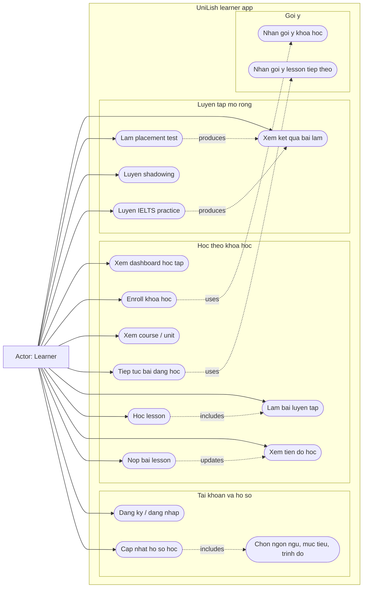

# UniLish - Learner use case

```mermaid
flowchart LR
    Learner["Actor: Learner"]

    subgraph System["UniLish learner app"]
        subgraph Account["Tai khoan va ho so"]
            UC_Login(["Dang ky / dang nhap"])
            UC_Profile(["Cap nhat ho so hoc"])
            UC_Goal(["Chon ngon ngu, muc tieu, trinh do"])
        end

        subgraph Learning["Hoc theo khoa hoc"]
            UC_Dashboard(["Xem dashboard hoc tap"])
            UC_Enroll(["Enroll khoa hoc"])
            UC_ViewCourse(["Xem course / unit"])
            UC_ViewLesson(["Hoc lesson"])
            UC_Practice(["Lam bai luyen tap"])
            UC_SubmitLesson(["Nop bai lesson"])
            UC_Progress(["Xem tien do hoc"])
            UC_Resume(["Tiep tuc bai dang hoc"])
        end

        subgraph Practice["Luyen tap mo rong"]
            UC_Placement(["Lam placement test"])
            UC_Ielts(["Luyen IELTS practice"])
            UC_Shadowing(["Luyen shadowing"])
            UC_Result(["Xem ket qua bai lam"])
        end

        subgraph Suggestion["Goi y"]
            UC_RecommendCourse(["Nhan goi y khoa hoc"])
            UC_RecommendLesson(["Nhan goi y lesson tiep theo"])
        end
    end

    Learner --> UC_Login
    Learner --> UC_Profile
    Learner --> UC_Dashboard
    Learner --> UC_Enroll
    Learner --> UC_ViewCourse
    Learner --> UC_ViewLesson
    Learner --> UC_Practice
    Learner --> UC_SubmitLesson
    Learner --> UC_Progress
    Learner --> UC_Resume
    Learner --> UC_Placement
    Learner --> UC_Ielts
    Learner --> UC_Shadowing
    Learner --> UC_Result

    UC_Profile -. "includes" .-> UC_Goal
    UC_Enroll -. "uses" .-> UC_RecommendCourse
    UC_Resume -. "uses" .-> UC_RecommendLesson
    UC_ViewLesson -. "includes" .-> UC_Practice
    UC_SubmitLesson -. "updates" .-> UC_Progress
    UC_Placement -. "produces" .-> UC_Result
    UC_Ielts -. "produces" .-> UC_Result
```
