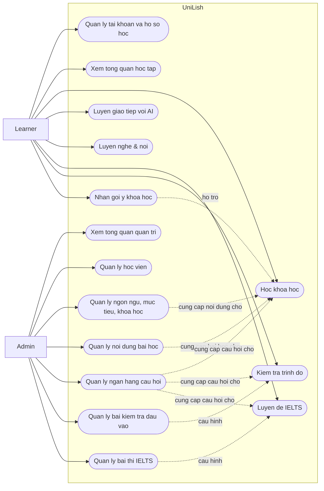

# UniLish - Use case tong quat

So do tong quat nay duoc rut ra tu menu web hien tai cua Learner app va Admin
Panel. Muc tieu la giu don gian: chi gom hai actor chinh va cac nhom tinh nang
lon, khong di vao tung flow con.

## Tinh nang tren web

### Learner app

- Trang chu: xem tong quan hoc tap, tien do va hoat dong gan day.
- Luyen giao tiep voi AI: luyen noi/chat voice theo chu de.
- Luyen nghe & noi: shadowing, dictation, luyen theo video/cue.
- Luyen de IELTS: xem bai luyen, lam attempt theo skill, xem ket qua.
- Khoa hoc de xuat: nhan goi y khoa hoc phu hop.
- Tat ca khoa hoc: tim/l loc va vao hoc course.
- Kiem tra trinh do: lam placement test va xem ket qua.
- Ho so/onboarding: chon ngon ngu, muc tieu, level va cap nhat profile.

### Admin panel

- Tong quan: xem dashboard quan tri.
- Ngon ngu: quan ly languages va cau hinh lien quan.
- Muc tieu & chien luoc: quan ly learning goals va skill weights.
- Khoa hoc: quan ly course, unit, lesson va lesson studio.
- Ngan hang cau hoi: tao, sua, review, publish/archive cau hoi.
- Bai kiem tra dau vao: tao/sua/publish placement test.
- Bai thi IELTS: tao/sua/publish de IELTS va skill practice.
- Nguoi dung: quan ly hoc vien.

## Use case tong quat

